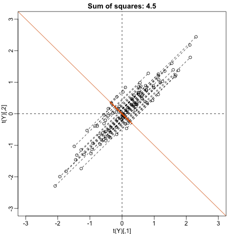
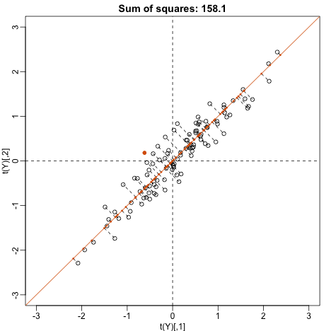
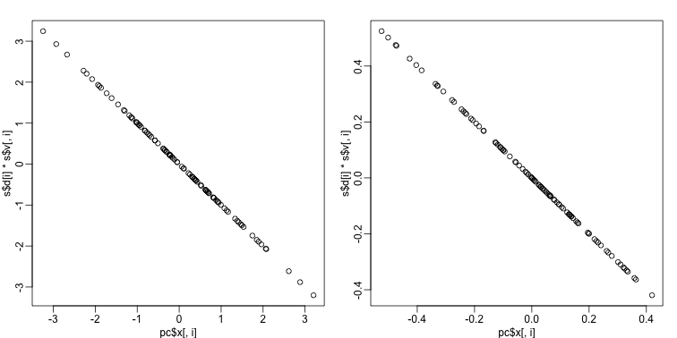

## Principal Component Analysis 

The R markdown document for this section is available [here](https://github.com/genomicsclass/labs/tree/master/highdim/PCA.Rmd).

We have already mentioned principal component analysis (PCA) above and noted its relation to the SVD. Here we provide further mathematical details. 

#### Example: Twin heights

We started the motivation for dimension reduction with a simulated example and showed a rotation that is very much related to PCA.


 

Here we explain specifically what are the principal components (PCs).

Let {$$}\mathbf{Y}{/$$} be {$$}2 \times N{/$$} matrix representing our data. The analogy is that we measure expression from 2 genes and each column is a sample. Suppose we are given the task of finding a  {$$}2 \times 1{/$$} vector {$$}\mathbf{u}_1{/$$} such that {$$}\mathbf{u}_1^\top \mathbf{v}_1 = 1{/$$}
and it maximizes {$$}(\mathbf{u}_1^\top\mathbf{Y})^\top (\mathbf{u}_1^\top\mathbf{Y}){/$$}. This can be viewed as a projection of each sample or column of {$$}\mathbf{Y}{/$$} into the subspace spanned by {$$}\mathbf{u}_1{/$$}. So we are looking for a transformation in which the coordinates show high variability.

Let's try {$$}\mathbf{u}=(1,0)^\top{/$$}. This projection simply gives us the height of twin 1 shown in orange below. The sum of squares is shown in the title.


```r
mypar(1,1)
plot(t(Y), xlim=thelim, ylim=thelim,
     main=paste("Sum of squares :",round(crossprod(Y[,1]),1)))
abline(h=0)
apply(Y,2,function(y) segments(y[1],0,y[1],y[2],lty=2))
```

```
## NULL
```

```r
points(Y[1,],rep(0,ncol(Y)),col=2,pch=16,cex=0.75)
```


Can we find a direction with higher variability? How about:

{$$}\mathbf{u} =\begin{pmatrix}1\\-1\end{pmatrix}{/$$} ? This does not satisfy {$$}\mathbf{u}^\top\mathbf{u}= 1{/$$} so let's instead try
{$$}\mathbf{u} =\begin{pmatrix}1/\sqrt{2}\\-1/\sqrt{2}\end{pmatrix}{/$$} 


```r
u <- matrix(c(1,-1)/sqrt(2),ncol=1)
w=t(u)%*%Y
mypar(1,1)
plot(t(Y),
     main=paste("Sum of squares:",round(tcrossprod(w),1)),xlim=thelim,ylim=thelim)
abline(h=0,lty=2)
abline(v=0,lty=2)
abline(0,-1,col=2)
Z = u%*%w
for(i in seq(along=w))
  segments(Z[1,i],Z[2,i],Y[1,i],Y[2,i],lty=2)
points(t(Z), col=2, pch=16, cex=0.5)
```

 

This relates to the difference between twins, which we know is small. The sum of squares confirms this.

Finally, let's try:

{$$}\mathbf{u} =\begin{pmatrix}1/\sqrt{2}\\1/\sqrt{2}\end{pmatrix}{/$$} 


```r
u <- matrix(c(1,1)/sqrt(2),ncol=1)
w=t(u)%*%Y
mypar()
plot(t(Y), main=paste("Sum of squares:",round(tcrossprod(w),1)),
     xlim=thelim, ylim=thelim)
abline(h=0,lty=2)
abline(v=0,lty=2)
abline(0,1,col=2)
points(u%*%w, col=2, pch=16, cex=1)
Z = u%*%w
for(i in seq(along=w))
  segments(Z[1,i], Z[2,i], Y[1,i], Y[2,i], lty=2)
points(t(Z),col=2,pch=16,cex=0.5)
```

 

This is a re-scaled average height, which has higher sum of squares. There is a mathematical procedure for determining which {$$}\mathbf{v}{/$$} maximizes the sum of squares and the SVD provides it for us.

#### The principal components

The orthogonal vector that maximizes the sum of squares:

{$$}(\mathbf{u}_1^\top\mathbf{Y})^\top(\mathbf{u}_1^\top\mathbf{Y}){/$$} 

{$$}\mathbf{u}_1^\top\mathbf{Y}{/$$} is referred to as the first PC. The _weights_ {$$}\mathbf{u}{/$$} used to obtain this PC are referred to as the _loadings_. Using  the language of rotations, it is also referred to as the _direction_ of the first PC, which are the new coordinates.

To obtain the second PC, we repeat the exercise above, but for the residuals:

{$$}\mathbf{r} = \mathbf{Y} - \mathbf{u}_1^\top \mathbf{Yv}_1 {/$$}

The second PC is the vector with the following properties: 

{$$} \mathbf{v}_2^\top \mathbf{v}_2=1{/$$}

{$$} \mathbf{v}_2^\top \mathbf{v}_1=0{/$$} 

and maximizes  {$$}(\mathbf{rv}_2)^\top \mathbf{rv}_2{/$$}.

When {$$}Y{/$$} is {$$}N \times m{/$$} we repeat to find 3rd, 4th, ..., m-th PCs.

#### `prcomp`

We have shown how to obtain PCs using the SVD. However, R has a function specifically designed to find the principal components. In this case, the data is centered by default. The following function: 


```r
pc <- prcomp( t(Y) )
```

produces the same results as the SVD up to arbitrary sign flips:


```r
s <- svd( Y - rowMeans(Y) )
mypar(1,2)
for(i in 1:nrow(Y) ){
  plot(pc$x[,i], s$d[i]*s$v[,i])
}
```

 

The loadings can be found this way:

```r
pc$rotation
```

```
##            PC1        PC2
## [1,] 0.7072304  0.7069831
## [2,] 0.7069831 -0.7072304
```
which are equivalent (up to a sign flip) to:

```r
s$u
```

```
##            [,1]       [,2]
## [1,] -0.7072304 -0.7069831
## [2,] -0.7069831  0.7072304
```
The equivalent of the variance explained is included in the: 

```r
pc$sdev
```

```
## [1] 1.2542672 0.2141882
```
component.


We take the transpose of `Y` because `prcomp` assumes the previously discussed ordering: units/samples in row and features in columns.


