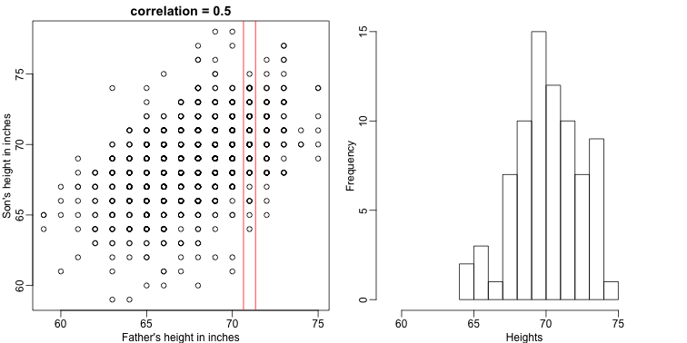

## Conditional Probabilities and Expectations

The R markdown document for this section is available [here](https://github.com/genomicsclass/labs/tree/master/ml/conditional_expectation.Rmd).

Prediction problems can be divided into categorical and continuous outcomes. However, many of the algorithms can be applied to both due to the connection between conditional probabilities and conditional expectations. 

In categorical problems, for example binary outcome, if we know the probability of {$$}Y{/$$} being a 1 for any set of predictors {$$}X=(X_1,\dots,X_p)^\top{/$$}, we can optimize our predictions. We write this probability like this: {$$}f(x)=\mbox{Pr}(Y=1 \mid X=x){/$$}. Note that {$$}Y{/$$} is a random variable which implies that we are not guaranteed a perfect prediction (unless these probabilities are 1 or 0). You can think of this probability as the proportion of 1s in the stratum of the population with covariates {$$}X=x{/$$}.

Now, given that the expectation is the average of all the values of {$$}Y{/$$}, the averate is equivalent to the proportion of 1s which we can interpret as the probability. So for this case, {$$}f(x) \equiv \mbox{E}(Y \mid X=x)=\mbox{Pr}(Y=1 \mid X=x){/$$}. The expected value has another attractive mathematical property and it is that it minimized the expected distance between the predictor {$$}\hat{Y}{/$$} and {$$}Y{/$$}: {$$}\mbox{E}\{ (\hat{Y} - Y)^2  \mid  X=x \}{/$$}. 

Here, we start by describing linear regression in the context of prediction. We use the son and father height example to illustrate. In our example we are trying to predict the son's height {$$}Y{/$$} based on the father's {$$}X{/$$}. Here we have only one predictor. Note that if we were asked to predict the height of a randomly selected son, we   would go with the mean:


```r
library(rafalib)
mypar(1,1)
library(UsingR)
data("father.son")
x=round(father.son$fheight) ##round to nearest inch
y=round(father.son$sheight)
hist(y,breaks=seq(min(y),max(y)))
abline(v=mean(y),col="red",lwd=2)
```

 

In this case, we can also approximate the distribution of {$$}Y{/$$} as normal, which implies the mean maximizes the probability density. 

Now imagine that we are given more information. We are told the father of this randomly selected son has a height of 71 inches (1.25 SDs taller than the average). What is our prediction now? 


```r
mypar(1,2)
plot(x,y,xlab="Father's height in inches",ylab="Son's height in inches",main=paste("correlation =",signif(cor(x,y),2)))
abline(v=c(-0.35,0.35)+71,col="red")
hist(y[x==71],xlab="Heights",nc=8,main="",xlim=range(y))
```

 

<a name="regression"></a>

## Stratification

The R markdown document for this section is available [here](https://github.com/genomicsclass/labs/tree/master/ml/conditional_expectation.Rmd).

The best guess is still the expectation, but our strata has changed from all the data, to only the {$$}Y{/$$} with {$$}X=71{/$$}. So we can stratify and take the average which is the conditional expectation. Our prediction for any {$$}x{/$$} is therefore:

{$$}
f(x) = E(Y \mid X=x)
{/$$}

It turns out that because this data is approximated by a bivariate normal distribution we can, using calculus, show that: 

{$$}
f(x) = \mu_Y + \rho \frac{\sigma_Y}{\sigma_X} (X-\mu_X)
{/$$}

and if we estimate these five parameters from the sample we get the regression line:


```r
mypar(1,2)
plot(x,y,xlab="Father's height in inches",ylab="Son's height in inches",main=paste("correlation =",signif(cor(x,y),2)))
abline(v=c(-0.35,0.35)+71,col="red")

fit <- lm(y~x)
abline(fit,col=1)

hist(y[x==71],xlab="Heights",nc=8,main="",xlim=range(y))
abline(v = fit$coef[1] + fit$coef[2]*71, col=1)
```

 

In this particular case the regression line provides an optimal prediction function for {$$}Y{/$$}. But this is not generally true.

