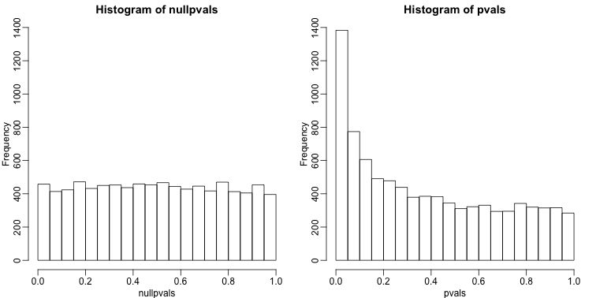
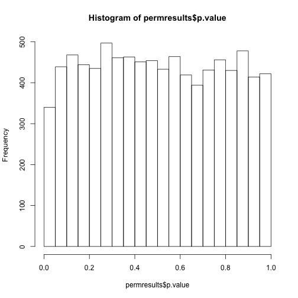
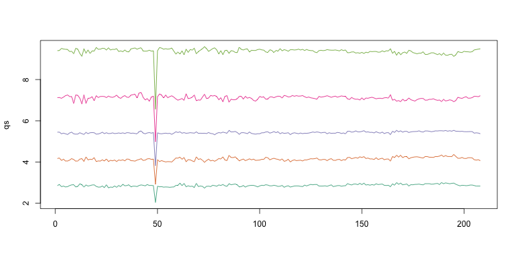
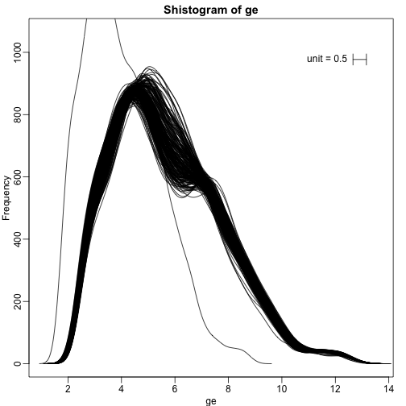

```r
library(rafalib)
```

## Basic Exploratory Data Analysis 

The R markdown document for this section is available [here](https://github.com/genomicsclass/labs/tree/master/advinference/eda_for_highthroughput.Rmd).

An under-appreciated advantage of working with high-throughput data is that problems with the data are sometimes more easily exposed than with low-throughput data. The fact that we have thousands of measurements permits us to see problems that are not apparent when only a few measurements are available. A powerful way to detect these problems is with exploratory data analysis (EDA). Here we review some of the plots that allow us to detect quality problems.
We will use the results obtained from applying t-test to data from a gene expression dataset:


```r
library(genefilter)
library(GSE5859Subset)
data(GSE5859Subset)
g <- factor(sampleInfo$group)
results <- rowttests(geneExpression,g)
pvals <- results$p.value
```

And we also generate p-values from a dataset for which we know the null is true:


```r
m <- nrow(geneExpression)
n <- ncol(geneExpression)
randomData <- matrix(rnorm(n*m),m,n)
nullpvals <- rowttests(randomData,g)$p.value
```

#### Volcano Plots

As we described above, reporting only p-values is a mistake when we can also report effect sizes. With high-throughput data, we can visualize the results by making a plot. The idea behind a _volcano plot_ is to show these for all features. In the y-axis we plot -log (base 10) p-values and on the x-axis we plot the effect size. By using - log (base 10), the "highly significant" features appear at the top of the plot. Using log also permits us to better distinguish between small and very small p-values, for example 0.01 and {$$}10^6{/$$}.  Here is the volcano plot for our results above:


```r
plot(results$dm,-log10(results$p.value),
     xlab="Effect size",ylab="- log (base 10) p-values")
```


Many features with very small p-values, but small effect sizes as we see here, are sometimes indicative of problematic data.

#### p-value Histograms

Another plot we can create to get an overall idea of the results is to make histograms of p-values. When we generate completely null data the histogram follows a uniform distribution (we will say more about this later). With our original data set we see a higher frequency of smaller p-values. 


```r
mypar(1,2)
hist(nullpvals,ylim=c(0,1400))
hist(pvals,ylim=c(0,1400))
```

 

When we expect most hypothesis to be null and don't see a uniform p-value distribution, it might be indicative of unexpected properties, such as correlated samples. 

If we permute the outcomes and calculate p-values then, if the samples are independent, we should see a uniform distribution. With these data we do not:


```r
permg <- sample(g)
permresults <- rowttests(geneExpression,permg)
hist(permresults$p.value)
```

 

#### Data Boxplots and Histograms

With high-throughput data we have thousands of measurements for each experimental unit. As mentioned earlier, this can help us detect quality issues. For example, if one sample has a completely different distribution than the rest, we might suspect there are problems. Although a complete change in distribution could be due to real biological differences, more often than not it is due to a technical problem. Here we load a large gene expression experiment available from Bioconductor. We "accidentally" use log instead of log2 on one of the samples.


```r
library(Biobase)
library(GSE5859) 
data(GSE5859) 
ge <- exprs(e) ##ge for gene expression
ge[,49] <- ge[,49]/log2(exp(1)) ##immitate error
```

A quick look at a summary of the distribution using boxplots immediately highlights the mistake:


```r
library(rafalib)
mypar(1,1)
boxplot(ge,range=0,names=1:ncol(e),col=ifelse(1:ncol(ge)==49,1,2))
```

 

Note that the number of samples is a bit too large here making it hard to see the boxes. One can instead simply show the boxplot summaries without (cite Karl Broman):


```r
qs <- t(apply(ge,2,quantile,prob=c(0.05,0.25,0.5,0.75,0.95)))
matplot(qs,type="l",lty=1)
```

 

We can also plot all the histograms. Because we have so much data we create histograms using small bins, then smooth the heights of the bars and then plot _smooth histograms_. We re-calibrate the height of these smooth curves so that if a bar is made with base of size "unit" and height given by the curve at {$$}x_0{/$$}, the area approximates the number of points in region of size "unit" centered at {$$}x_0{/$$}:


```r
mypar(1,1)
shist(ge,unit=0.5)
```

 

#### MA Plot

Scatterplots and correlation are not the best tools to detect replication problems. Note, for example, that 1,2,3,4 and 100,200,300,400 are two lists with very different values yet have perfect correlation. A better measure of replication can be obtained from examining the differences between the values that should be the same. Therefore, a better plot is a rotation of the scatterplot containing the differences on the y-axis and the averages on the x-axis. This plot was originally named a Bland-Altman plot, but in the genomics world it is commonly referred to as an MA-plot. The name MA comes from plots of red log intensity minus (M) green intensities versus average (A) log intensities used with microarrays (MA) data.


```r
x <- ge[,1]
y <- ge[,2]
mypar(1,2)
plot(x,y)
plot((x+y)/2,x-y)
```

 

Note that once we rotate the plot, the fact that these data have differences of about:


```r
sd(y-x)
```

```
## [1] 0.2025465
```

becomes immediate. The scatterplot shows very strong correlation, which is not necessarily informative here.

We will later introduce dendograms, heatmaps, and multi-dimensional scaling plots.

