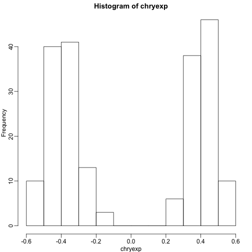
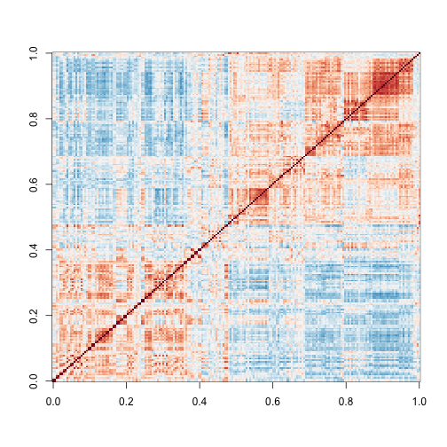
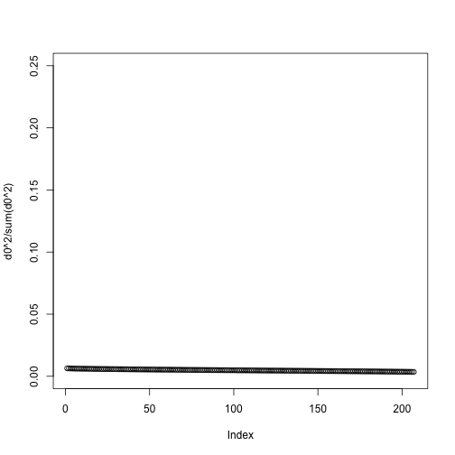
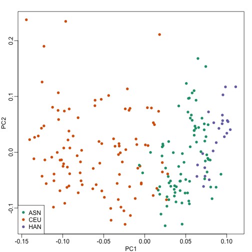
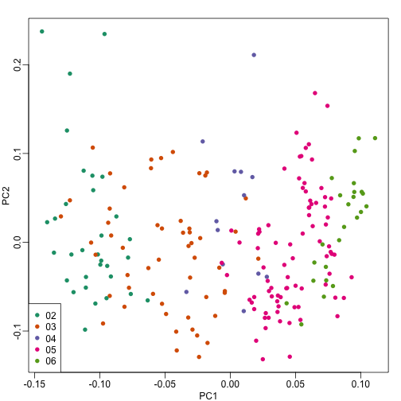
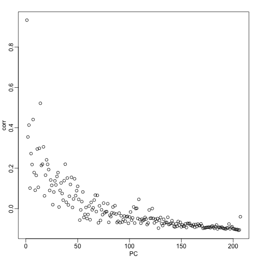
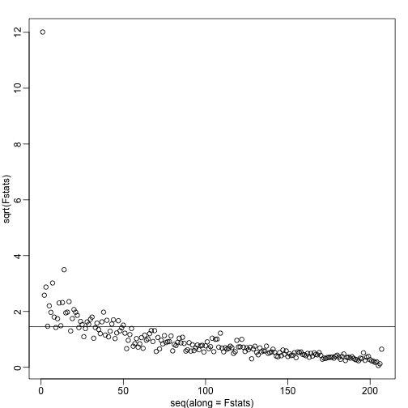

##  Discovering Batch Effects with EDA 

The R markdown document for this section is available [here](https://github.com/genomicsclass/labs/tree/master/batch/eda_with_pca.Rmd).

Now that we understand PCA, we are going to demonstrate how we use it in practice with an emphasis on exploratory data analysis. To illustrate we will go through an actual dataset that has not be sanitized for teaching purposes. We start with the raw data as it was provided in the public repository. The only step we did for you is to preprocess these data and create an R package with a preformed Bioconductor object.

## Gene Expression Data

The R markdown document for this section is available [here](https://github.com/genomicsclass/labs/tree/master/batch/eda_with_pca.Rmd).

Start by loading the data:

```r
library(rafalib)
library(Biobase)
library(GSE5859) ##Available from GitHub
data(GSE5859)
```

We start by exploring the sample correlation matrix and noting that one pair has a correlation of 1. This must mean that the same sample was uploaded twice to the public repository, but given different names. The following code identifies this sample and removes it.

```r
cors <- cor(exprs(e))
Pairs=which(abs(cors)>0.9999,arr.ind=TRUE)
out = Pairs[which(Pairs[,1]<Pairs[,2]),,drop=FALSE]
if(length(out[,2])>0) e=e[,-out[2]]
```

We also remove control probes from the analysis:


```r
out <- grep("AFFX",featureNames(e))
e <- e[-out,]
```


Now we are ready to proceed. We will create a detrended gene expression data matrix and extract the dates and outcome of interest from the sample annotation table. 

```r
y <- exprs(e)-rowMeans(exprs(e))
dates <- pData(e)$date
eth <- pData(e)$ethnicity
```

The original dataset did not include sex in the sample information. We did this for you in the subset dataset we provided for illustrative purposes. In the code below we show how we predict the sex of each sample. The basic idea is to look at the median gene expression levels on Y chromosome genes. Males should have much higher values. We need to upload an annotation package that provides information for the features of the platform used in this experiment:


```r
annotation(e)
```

```
## [1] "hgfocus"
```

We need to download and install the `hgfocus.db` package and then extract the chromosome location information.


```r
library(hgfocus.db) ##install from Bioconductor
annot <- select(hgfocus.db, keys=featureNames(e), keytype="PROBEID",columns=c("CHR"))
##for genes with multiples, pick on
annot <-annot[match(featureNames(e),annot$PROBEID),]
annot$CHR <- ifelse(is.na(annot$CHR),NA,paste0("chr",annot$CHR))
chryexp<- colMeans(y[which(annot$CHR=="chrY"),])
```

You can clearly see two modes which must be females and males:

```r
mypar()
hist(chryexp)
```

 

So we can predict sex this way:

```r
sex <- factor(ifelse(chryexp<0,"F","M"))
```

#### Calculating the PCs

We have shown how we can compute principal components using: 


```r
s <- svd(y)
dim(s$v)
```

```
## [1] 207 207
```

But we can also use `prcomp` which creates an object with just the PCs and also demeans by default. Note `svd` keeps {$$}U{/$$} which is as large as `y` while `prcomp` does not. However, they provide practically the same principal components:


```r
pc <- prcomp(y)
```

For the rest of the code shown here we use `s`.

#### Variance Explained

A first step in determining how much sample correlation induced_structure_ there is in the data. 


```r
library(RColorBrewer)
cols=colorRampPalette(rev(brewer.pal(11,"RdBu")))(100)
image ( cor(y) ,col=cols,zlim=c(-1,1))
```

 

Here we are using the term _structure_ to refer to the deviation from what one would see if the samples were in fact independent from each other. 

One simple exploratory plot we make to determine how many principal components we need to describe this _structure_ is the variance-explained plot. This is what the variance explained for the PCs would look like:


```r
y0 <- matrix( rnorm( nrow(y)*ncol(y) ) , nrow(y), ncol(y) )
d0 <- svd(y0)$d
plot(d0^2/sum(d0^2),ylim=c(0,.25))
```

 

Instead we see this:


```r
plot(s$d^2/sum(s$d^2))
```

 

At least 20 or so PCs appear to be higher than what we would expect with independent data. A next step is to try to explain these PCs with measured variables. Is this driven by ethnicity? Sex? Date? Or something else?

#### MDS plot

As previously shown, we can make MDS plots to start exploring the data to answer these questions. One way to explore the relationship
between variables of interest and PCs is to use color to denote these variables. For example, here are the first two PCs with color representing ethnicity:


```r
cols = as.numeric(eth)
mypar()
plot(s$v[,1],s$v[,2],col=cols,pch=16,
     xlab="PC1",ylab="PC2")
legend("bottomleft",levels(eth),col=seq(along=levels(eth)),pch=16)
```

 

There is a very clear association between the first PC and ethnicity. However, we also see that for the orange points there are sub-clusters. We know from previous analyses that ethnicity and preprocessing date are correlated:


```r
year = factor(format(dates,"%y"))
table(year,eth)
```

```
##     eth
## year ASN CEU HAN
##   02   0  32   0
##   03   0  54   0
##   04   0  13   0
##   05  80   3   0
##   06   2   0  23
```

Here is the same plot, but now with color representing year:


```r
cols = as.numeric(year)
mypar()
plot(s$v[,1],s$v[,2],col=cols,pch=16,
     xlab="PC1",ylab="PC2")
legend("bottomleft",levels(year),col=seq(along=levels(year)),pch=16)
```

 

Year is also very correlated with the first PC. So which variable is driving this? Given the high level of confounding, it is not easy to parse out. Nonetheless, in the assessment questions and below we provide some further exploratory approaches.

#### Boxplot of PCs

The structure seen in the plot of the between sample correlations shows a complex structure that seems to have more than 5 factors (one for each year). It certainly has more complexity than what would be explained by ethnicity. We can also explore the correlation with months. 


```r
month <- format(dates,"%y%m")
length( unique(month))
```

```
## [1] 21
```

Because there are so many months (21), it becomes complicated to use color. Instead we can stratify by month and look at boxplots of our PCs:


```r
variable <- as.numeric(month)
mypar(2,2)
for(i in 1:4){
  boxplot(split(s$v[,i],variable),las=2,range=0)
  stripchart(split(s$v[,i],variable),add=TRUE,vertical=TRUE,pch=1,cex=.5,col=1)
  }
```

 

Here we see that month has a very strong correlation with the first PC, as well as some of the others. In cases such as these, in which we have many samples, we can use an analysis of variance to see which PCs correlate with month:


```r
corr <- sapply(1:ncol(s$v),function(i){
  fit <- lm(s$v[,i]~as.factor(month))
  return( summary(fit)$adj.r.squared  )
  })
mypar()
plot(seq(along=corr), corr, xlab="PC")
```

 

We see a very strong correlation with the first PC and relatively strong correlations for the first 20 or so PCs.
We can also compute F-statistics comparing within month to across month variability:


```r
Fstats<- sapply(1:ncol(s$v),function(i){
   fit <- lm(s$v[,i]~as.factor(month))
   Fstat <- summary(aov(fit))[[1]][1,4]
   return(Fstat)
  })
mypar()
plot(seq(along=Fstats),sqrt(Fstats))
p <- length(unique(month))
abline(h=sqrt(qf(0.995,p-1,ncol(s$v)-1)))
```

 

In the assessments we will see how we can use the PCs as estimates in factor analysis to improve model estimates.


