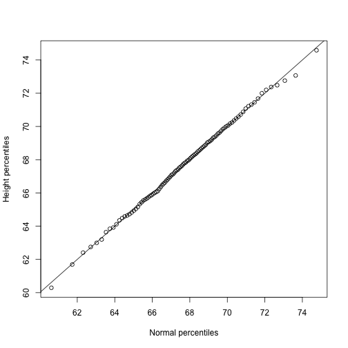
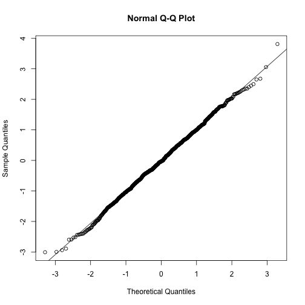
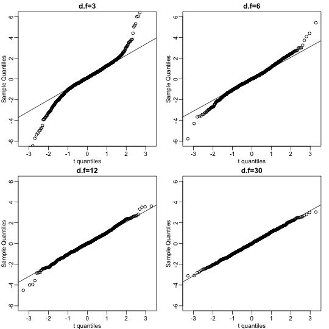
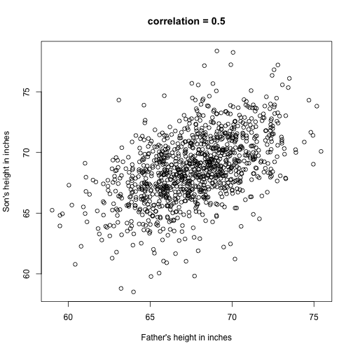

# Exploratory Data Analysis

Biases, systematic errors and unexpected variability are common in
data from the life sciences. Failure to discover these problems often
leads to flawed analyses and false discoveries. As an example,
consider that experiments sometimes fail and not all data processing
pipelines, such as the `t.test` function in R, are designed to detect
these. Yet, these pipelines still give you an answer. Furthermore, it
may be hard or impossible to notice an error was made just from the
reported results. 

Graphing data is a powerful approach to detecting these problems. We
refer to this as _exploratory data analysis_ (EDA). Many important
methodological contributions to existing data analysis techniques in
data analysis were initiated by discoveries made via EDA.
In addition, EDA can lead to interesting biological discoveries which
would otherwise be missed through simply subjecting the data to a
battery of hypothesis tests.
Through this book we make use of exploratory plots to motivate the analyses we
choose. Here we present a general introduction to EDA using height
data.

We have already introduced some EDA approaches for _univariate_ data,
namely the histograms. Here we describe the QQ-plot in more detail and
how some EDA and summary statistics for paired data. We also give a
demonstration of commonly used figures that we recommend against. 

## Quantile Quantile Plots

R markdown document for this section available [here](https://github.com/genomicsclass/labs/tree/master/course1/exploratory_data_analysis.Rmd).

To corroborate that the normal distribution is in fact a good
approximation, we can use quantile-quantile plots
(QQ-plots). Quantiles are best understood by considering the special
case of percentiles. The p-th percentile of a list of a distribution
is defined as the number q that is bigger than p% of numbers. For
example, the median 50-th percentile is the median (so the inverse of
the cumulative distribution function we defined earlier).
We can compute the percentiles for our list of heights:


```r
library(UsingR) ##available from CRAN
library(rafalib)
x <- father.son$fheight
```

and for the normal distribution:


```r
ps <- seq(0, 1, length=101)
qs <- quantile(x, ps)
normalqs <- qnorm(ps, mean(x), popsd(x))
plot(normalqs,qs,xlab="Normal percentiles",ylab="Height percentiles")
abline(0,1) ##identity line
```

 

Note how close these values are. Also, note that we can see these
QQ-plots with less code (this plot has more points than the one we
constructed manually, and so tail-behavior can be seen more clearly).


```r
qqnorm(x)
qqline(x) 
```

 

However, the `qqnorm` function plots against a standard normal distribution. This is why the line has slope `popsd(x)` and intercept `mean(x)`.

In the example above, the points match the line very well. In fact, we can run Monte Carlo simulations to see that we see plots like this for data known to be normally distributed.


```r
n <-1000
x <- rnorm(n)
qqnorm(x)
qqline(x)
```

 

We can also get a sense for how non-normally distributed data will
look in a QQ-plot. Here we generate data from the t-distribution with
different degrees of freedom. Note that the smaller the degrees of
freedom, the fatter the tails. We call these "fat tails" because if we
plotted an empirical density or histogram, the density at the extremes would be
higher than the theoretical curve. In the QQ-plot this can be seen in
that the curve is lower than the identity line on the left
side and higher on the right side. This means that there are more
extreme values than predicted by the theoretical density plotted on
the x-axis.


```r
dfs <- c(3,6,12,30)
mypar(2,2)
for(df in dfs){
  x <- rt(1000,df)
  qqnorm(x,xlab="t quantiles",main=paste0("d.f=",df),ylim=c(-6,6))
  qqline(x)
}
```

 

<a name="boxplots"></a>

### Boxplots

Data is not always normally distributed. Income is widely cited
example. In these cases the average and standard deviation are not
necessarily informative since one can't infer the distribution from
just these two numbers. The properties described above are specific to
the normal. For example, the normal distribution does not seem to be a
good approximation for the direct compensation for 199 United States
CEOs in the year 2000.


```r
mypar(1,2)
hist(exec.pay) ##in UsingR package
qqnorm(exec.pay)
qqline(exec.pay)
```

 

In addition to QQ-plots, a practical summary of data is to compute 3
percentiles: 25-th, 50-th (the median) and the 75-th. A boxplot shows
these 3 values along with a 
range of the points within median {$$}\pm{/$$} 1.5 (75-th percentile -
25th-percentile). Values outside this range are shown as points and
sometimes refereed to as _outliers_. Here we show just one boxplot,
however one of the great benefits of boxplots is that we could easily
show many distributions in one plot, by lining them up, side by side.


```r
boxplot(exec.pay, ylab="10,000s of dollars", ylim=c(0,400))
```

 

<a name="scatterplots"></a>

## Scatterplots And Correlation

R markdown document for this section available [here](https://github.com/genomicsclass/labs/tree/master/course1/exploratory_data_analysis.Rmd).

The methods described above relate to _univariate_ variables. In the
biomedical sciences, it is common to be interested in the relationship
between two or more variables. A classic examples is the father/son
height data used by
[Francis Galton](https://en.wikipedia.org/wiki/Francis_Galton) to
understand heredity. If we were to summarize these data, we could use
the two averages and two standard deviations as both distributions are
well approximated by the normal distribution. This summary, however,
fails to describe an important characteristic of the data. 


```r
library(UsingR)
data("father.son")
x=father.son$fheight
y=father.son$sheight
plot(x,y,xlab="Father's height in inches",ylab="Son's height in inches",main=paste("correlation =",signif(cor(x,y),2)))
```

 

The scatter plot shows a general trend: the taller the father, the
taller the son. A summary of this trend is the correlation coefficient
which in this cases is 0.5. We will motivate this statistic by trying to
predict the son's height using the father's height.

## Stratification

R markdown document for this section available [here](https://github.com/genomicsclass/labs/tree/master/course1/exploratory_data_analysis.Rmd).

Suppose we are asked to guess the height of randomly select sons. The
average height, 68.7 inches, is the value with the highest proportion
(see histogram) and would be our prediction. But what if we are told
that the father is 72 inches tall, do we sill guess 68.7? 

Note that the father is taller than average. Specifically, he is 1.7
standard deviations taller than the average father. So should we
predict that the son is also 1.75 standard deviations taller? It turns
out this would be an overestimate. To see this we look at all the sons
with fathers who are about 72 inches. We do this by _stratifying_ the
father heights. 


```r
groups <- split(y,round(x)) 
boxplot(groups)
```

 

```r
print(mean(y[ round(x) == 72]))
```

```
## [1] 70.67719
```
Stratification followed by boxplots lets us see the distribution of
each group. The average height of sons with fathers that are 72 inches
tall is 70.7 inches. We also see that the *medians* of the strata appear
to follow a straight line (remember the middle line in the boxplot
shows the median not the mean). This line is similar to the *regression
line* with a slope that is related to the correlation, as we will learn
below. 

## Bi-variate Normal Distribution

R markdown document for this section available [here](https://github.com/genomicsclass/labs/tree/master/course1/exploratory_data_analysis.Rmd).

A pair of random variables {$$}(X,y){/$$} is considered to be approximated by
bivariate normal when the proportion of values below, for example, {$$}x{/$$}
and {$$}y{/$$} is approximated by this expression: 

{$$} 
Pr(X<a,Y<b) = 
{/$$}

{$$}
\int_{-\infty}^{a} \int_{-\infty}^{b} \frac{1}{2\pi\sigma_x\sigma_y\sqrt{1-\rho^2}}
\exp{ \left(
\frac{1}{2(1-\rho^2)}
\left[\left(\frac{x-\mu_x}{\sigma_x}\right)^2 -  
2\rho\left(\frac{x-\mu_x}{\sigma_x}\right)\left(\frac{y-\mu_y}{\sigma_y}\right)+
\left(\frac{y-\mu_y}{\sigma_y}\right)^2
\right]
\right)
}
{/$$}

A definition that is more intuitive is the following: fix a value {$$}x{/$$}
and look at all the pairs {$$}(X,Y){/$$} for which {$$}X=x{/$$}. Generally, in
statistics we call this exercise _conditioning_. We are conditioning
{$$}Y{/$$} on {$$}X{/$$}. If a pair of random variables is approximated by a
bivariate normal distribution, then the distribution of {$$}Y{/$$} condition
on {$$}X=x{/$$} is approximated with a normal distribution for all {$$}x{/$$}. Let's
see if this happens here. We take 4 different strata to demonstrate
this: 


```r
groups <- split(y,round(x)) 
mypar(2,2)
for(i in c(5,8,11,14)){
  qqnorm(groups[[i]],main=paste0("X=",names(groups)[i]," strata"),
         ylim=range(y),xlim=c(-2.5,2.5))
  qqline(groups[[i]])
}
```

 


Now we come back to defining correlation. Mathematical statistics tells us that when two variables follow a bivariate normal distribution, then for any given value of {$$}x{/$$}, the average of the {$$}Y{/$$} in pairs for which {$$}X=x{/$$} is:

{$$} 
\mu_Y +  r \frac{X-\mu_X}{\sigma_X}\sigma_Y
{/$$}

Note that this is a line with slope {$$}r \frac{\sigma_Y}{\sigma_X}{/$$}. This is referred to as the _regression line_. If the SDs are the same, then the slope of the regression line is the correlation {$$}r{/$$}. Therefore, if we standardize {$$}X{/$$} and {$$}Y{/$$}, the correlation is the slope of the regression line.

Another way to see this is, to form a prediction {$$}\hat{Y}{/$$}, for every SD away from the mean in {$$}x{/$$}, we predict {$$}r{/$$} SDs away for {$$}Y{/$$}: 

{$$}
\frac{\hat{Y} - \mu_Y}{\sigma_Y} = r \frac{x-\mu_X}{\sigma_X}
{/$$}

with the {$$}\mu{/$$} representing the averages, {$$}\sigma{/$$} the standard deviations, and {$$}r{/$$} the correlation. So, if there is perfect correlation, we predict the same number of SDs. If there is 0 correlation, then we don't use {$$}x{/$$} at all.  For values between 0 and 1, the prediction is somewhere in between. For negative values, we simply predict in the opposite direction.


To confirm that the above approximations hold in this case, let's compare the mean of each strata to the identity line and the regression line:


```r
x=(x-mean(x))/sd(x)
y=(y-mean(y))/sd(y)
means=tapply(y,round(x*4)/4,mean)
fatherheights=as.numeric(names(means))
mypar(1,1)
plot(fatherheights,means,ylab="average of strata of son heights",ylim=range(fatherheights))
abline(0,cor(x,y))
```

 
