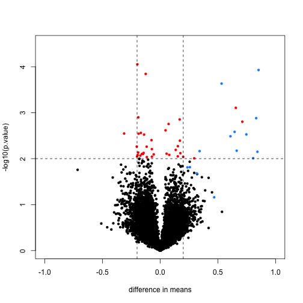
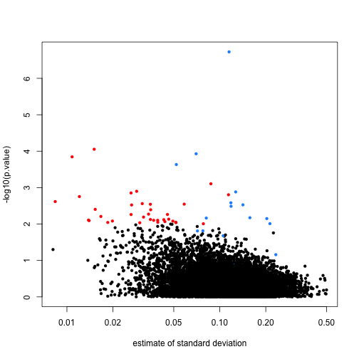
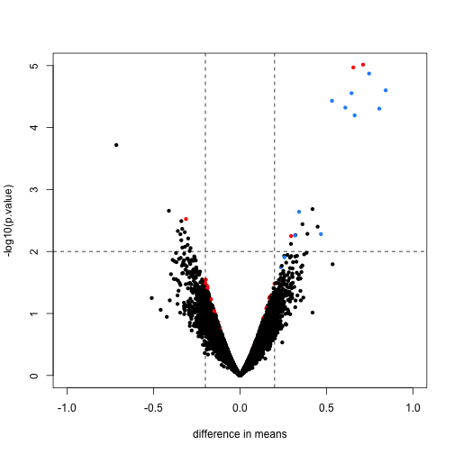

## Hierarchical Models

R markdown document for this section available [here](https://github.com/genomicsclass/labs/tree/master/course3/hierarchical_models.Rmd).

In this section we use the mathematical theory which describes an approach that has become widely applied in the analysis of high-throughput data. The general idea is to build a _hierachichal model_ with two levels. One level describes variability across samples/units, and the other describes variability across features. The first level of variation is accounted for my all the models and approaches we have described here, for example the model that leads to the t-test. The second level provides power by permitting us to "borrow" information from all features to inform the inference performed on each one. 

Here we describe on specific case that is currently the most widely used approach to inference with gene expression data. It is the model implemented by the `limma` Bioconductor package. This idea has been adapted to develop methods for other data types such as RNAseq CITE.
This package provides an alternative to the t-test that greatly improves power by modeling the variance. We motivate and demonstrate the approach with an example.

Here is a volcano showing effect sizes and p-value from applying a t-test to data from an experiment running six replicated sample with 16 genes artificially made to be different in two groups of three genes. These genes are the only genes for which the null hypothesis is true. In the plot they are shown in blue.


```r
library(SpikeInSubset) ##Available from Bioconductor
data(rma95)
library(genefilter)
fac <- factor(rep(1:2,each=3))
tt <- rowttests(exprs(rma95),fac)
smallp <- with(tt, p.value < .01)
spike <- rownames(rma95) %in% colnames(pData(rma95))
cols <- ifelse(spike,"dodgerblue",ifelse(smallp,"red","black"))

with(tt, plot(-dm, -log10(p.value), cex=.8, pch=16,
     xlim=c(-1,1), ylim=c(0,4.5),
     xlab="difference in means",
     col=cols))
abline(h=2,v=c(-.2,.2), lty=2)
```

 

Note that we cut-off the range of the y-axis at 4.5 but there is one blue point with a p-value smaller than {$$}10^{-6}{/$$}. Two finding stand out from this plot. The first is that only one of the positives would be found to be significant with a standard 5% FDR cutoff:


```r
sum( p.adjust(tt$p.value,method = "BH")[spike] < 0.05)
```

```
## [1] 1
```

This of course has to do with the low power associated with a sample size of three in each group. The second finding is that if we forget about inference and simple rank the genes based on p-value we obtain many false positives. For example, six of the smallest 10 p-values are false positives. 


```r
table( top50=rank(tt$p.value)<= 10, spike) 
```

```
##        spike
## top50   FALSE  TRUE
##   FALSE 12604    12
##   TRUE      6     4
```

In the plot we notice that these are mostly genes for which the effect size is relatively small implying that the estimated standard error is small. We can confirm this with a plot:


```r
tt$s <- apply(exprs(rma95), 1, function(row) sqrt(.5 * (var(row[1:3]) + var(row[4:6]))))
with(tt, plot(s, -log10(p.value), cex=.8, pch=16,
              log="x",xlab="estimate of standard deviation",
              col=cols))
```

 

Here is where a hierarchical model can be useful. If we can make an assumption about the distribution of these variances across genes, then we can improve estimate by "adjusting" estimates that are "too small" according to this distribution. In a previous section we described how the F-distribution provides approximates the distribution of the observed variances.

{$$}
s^2 \sim s_0^2 F_{d,d_0}
{/$$}

Because we have thousands of data points, we can actually check this assumption and also estimate the parameters {$$}s_0{/$$} and {$$}d_0{/$$}. This particular approach is referred to as empirical Bayes because it can be described as using data (empirical) to build the prior distribution (Bayesian approach). 

Now we apply what we learned with the Baseball example to the standard error estimates. As before we have an observed value for each gene {$$}s_g{/$$}, a sampling distribution as a-prior distribution. We can therefore compute a posterior distribution for the variance {$$}\sigma^2_g{/$$} and obtain the posterior mean. You can see the details of the derivation [CITE Smyth 2004]

{$$}
\mbox{E}[\sigma^2_g \mid s_g] = \frac{d_0 s_0^2 + d s^2_g}{d_0 + d}
{/$$}

Note that as before, the posterior mean _shrinks_ the observed variance {$$}s_g^2{/$$} towards the global variance {$$}s_0^2{/$$} and the weights depend on the sample size through the degrees of freedom {$$}d{/$$}, and in this case, the shape of the prior distribution through {$$}d_0{/$$}. 

In the plot above we can see how the variance estimate _shrink_ for 40 genes:


```r
library(limma)
fit <- lmFit(rma95, model.matrix(~ fac))
ebfit <- ebayes(fit)

n <- 40
qs <- seq(from=0,to=.2,length=n)
idx <- sapply(seq_len(n),function(i) which(as.integer(cut(tt$s^2,qs)) == i)[1])
idx <- idx[!is.na(idx)]
par(mar=c(5,5,2,2))
plot(1,1,xlim=c(0,.21),ylim=c(0,1),type="n",
     xlab="variance estimates",ylab="",yaxt="n")
axis(2,at=c(.1,.9),c("before","after"),las=2)
segments((tt$s^2)[idx],rep(.1,n),
         ebfit$s2.post[idx],rep(.9,n))
```

 

An important aspect of this adjustment is that genes having a very small sample deviation close to 0 are no longer close to 0. We can now create a version of the t-test that instead of the sample standard deviation uses this posterior mean or "shrunken" estimate of the variance. We refer to these are _moderated_ t-tests. Once we do this, the improvements can be seen clearly in the volcano plot


```r
limmares <- data.frame(dm=coef(fit)[,"fac2"], p.value=ebfit$p.value[,"fac2"])
with(limmares, plot(dm, -log10(p.value),cex=.8, pch=16,
     col=cols,xlab="difference in means",
     xlim=c(-1,1), ylim=c(0,5)))
abline(h=2,v=c(-.2,.2), lty=2)
```

 

The number of false positives in the top 10 is now reduced to 2. 


```r
table( top50=rank(limmares$p.value)<= 10, spike) 
```

```
##        spike
## top50   FALSE  TRUE
##   FALSE 12608     8
##   TRUE      2     8
```
