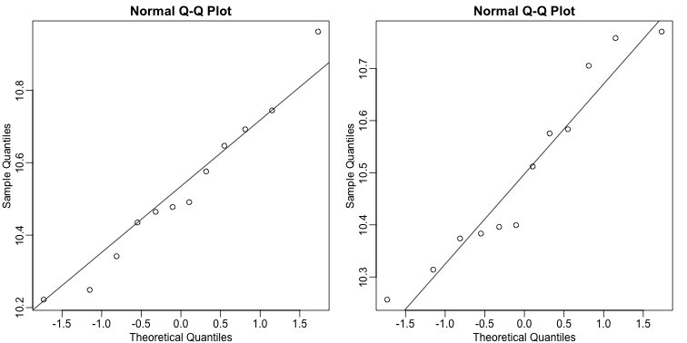

```r
library(rafalib)
```


## Inference in Practice

R markdown document for this section available [here](https://github.com/genomicsclass/labs/tree/master/course3/inference_for_highthroughput.Rmd).

Suppose we were given high-throughput gene expression data that was measured for several individuals in two populations. We are asked to report which genes have different average expression levels in the two populations. If instead thousands of genes we were handed data from just one gene, we could simply apply the inference techniques that we have learned before. We could, for example, use a t-test or some other test. Here we review what changes when we consider high-throughput data.

#### p-values are random variables

An important concept to remember in order to understand the concepts presented in this chapter is that p-values are random variables. To see this  consider the example in which we define a p-value from a t-test with a large enough sample size to use the CLT approximation. Then our p-value is defined as the probability that a normally distributed random variable than the observed t-test, call it {$$}Z{/$$}. So for a two sided test: 

{$$}
p = 2 \{ 1 - \Phi(Z)\}
{/$$}

In R we write:

```r
2*(1-pnorm(Z))
```

Now because {$$}Z{/$$} is a random variable ({$$}\Phi{/$$} is simply a deterministic
function), {$$}p{/$$} is also a random variable. We will create a Monte Carlo
simulation showing how the values of {$$}p{/$$} change.

First we download the `femaleControlsPopulation.csv` file:


```r
library(downloader)
url <- "https://raw.githubusercontent.com/genomicsclass/dagdata/master/inst/extd\ ata/femaleControlsPopulation.csv"
filename <- "femaleControlsPopulation.csv"
if (!file.exists(filename)) download(url,destfile=filename)
```

Now, we read in the data, and use `replicate` to repeatedly create p-values.


```r
set.seed(1)
population = unlist( read.csv("femaleControlsPopulation.csv") )
```

```
## Warning in read.table(file = file, header = header, sep = sep,
## quote = quote, : incomplete final line found by readTableHeader on
## 'femaleControlsPopulation.csv'
```

```r
N <- 12
B <- 10000
pvals <- replicate(B,{
  control = sample(population,N)
  treatment = sample(population,N)
  t.test(treatment,control)$p.val 
  })
```

```
## Error in sample.int(length(x), size, replace, prob): invalid first argument
```

```r
hist(pvals)
```

```
## Error in hist(pvals): object 'pvals' not found
```

As implied by the histogram, in this case the distribution of the p-value is uniformly distributed. In fact, we can show theoretically that when the null hypothesis is true, this is always the case. For the case in which we use the CLT, we have that the null hypothesis {$$}H_0{/$$} implies that our test statistic {$$}Z{/$$}  follows a normal distribution with mean 0 and SD 1 thus:

{$$}
p_a = \mbox{Pr}(Z < a \mid H_0) = \Phi(a)
{/$$}

This implies that:

{$$}
\begin{align*}
\mbox{Pr}(p < p_a) &= \mbox{Pr}[ \Phi(p) < \Phi(p_a) ] \\
  & = \mbox{Pr}(Z < a) = p_a
\end{align*}
{/$$}

which is the definition of a uniform distribution.

#### Thousands of tests

In this data we have two groups denoted with 0 and 1:

```r
library(GSE5859Subset)
data(GSE5859Subset)
g <- sampleInfo$group
g
```

```
##  [1] 1 1 1 1 1 1 1 1 1 1 1 1 0 0 0 0 0 0 0 0 0 0 0 0
```

If we were interested in a particular gene, let's arbitrarily pick the one on the 25th row, we would simply compute a t-test. Assuming the data is well approximated by normal:


```r
e <- geneExpression[25,]
mypar(1,2)

qqnorm(e[g==1])
qqline(e[g==1])

qqnorm(e[g==0])
qqline(e[g==0])
```

 

The qq-plots show that the data is well approximated by the normal approximation so apply a t-test. The t-test does not find this gene to be statistically significant:


```r
t.test(e[g==1],e[g==0])
```

```
## 
## 	Welch Two Sample t-test
## 
## data:  e[g == 1] and e[g == 0]
## t = 0.28382, df = 21.217, p-value = 0.7793
## alternative hypothesis: true difference in means is not equal to 0
## 95 percent confidence interval:
##  -0.1431452  0.1884244
## sample estimates:
## mean of x mean of y 
##  10.52505  10.50241
```

To answer the question for each gene, we simply do this for every gene. Here we will define our own function and use `apply`:


```r
myttest <- function(x) t.test(x[g==1],x[g==0],var.equal=TRUE)$p.value
pvals <- apply(geneExpression,1,myttest)
```

We can now see which genes have p-values less than, say, 0.05. For example, right away we see that:


```r
sum(pvals<0.05)
```

```
## [1] 1383
```

genes had p-values less than 0.05.

However, as we will describe in more detail below, we have to be careful in interpreting this result because we have performed over 8,000 tests. If we performed the same procedure on random data, for which the null hypothesis is true for all features, we obtain the following results:


```r
set.seed(1)
m <- nrow(geneExpression)
n <- ncol(geneExpression)
randomData <- matrix(rnorm(n*m),m,n)
nullpvals <- apply(randomData,1,myttest)
sum(nullpvals<0.05)
```

```
## [1] 419
```

As we will explain later in the chapter, this is to be expected. 419 is roughly 0.05*8192 and we will describe the theory that tells us why this prediction works.

#### Faster t-test implementation

Before we continue, we should point out that the above implementation is very inefficient. There are several faster implementations that perform t-test for high-throughput data. For example:


```r
library(genefilter)
results <- rowttests(geneExpression,factor(g))
max(abs(pvals-results$p))
```

```
## [1] 6.528111e-14
```

`genefilter` is available from the Bioconductor projects. In a later section we will say more about this project, but here is how to install it:
 

```r
source("http://www.bioconductor.org/biocLite.R")
biocLite("genefilter")
```

Note that we get practically the same answer and much faster performance.


