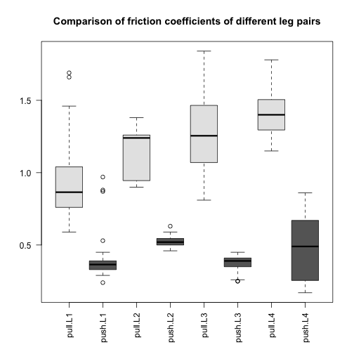
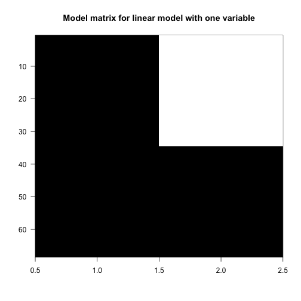
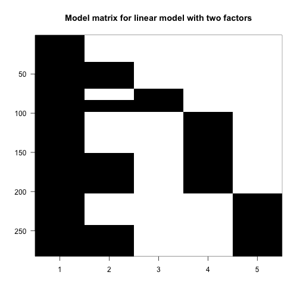
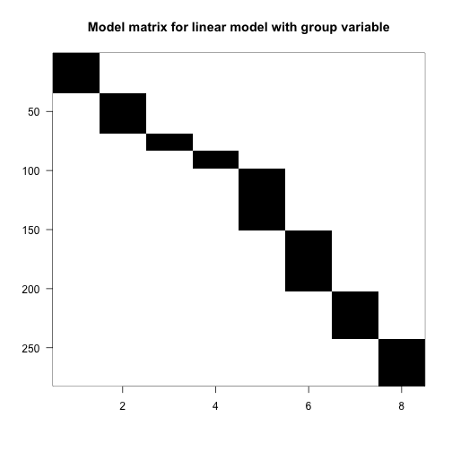
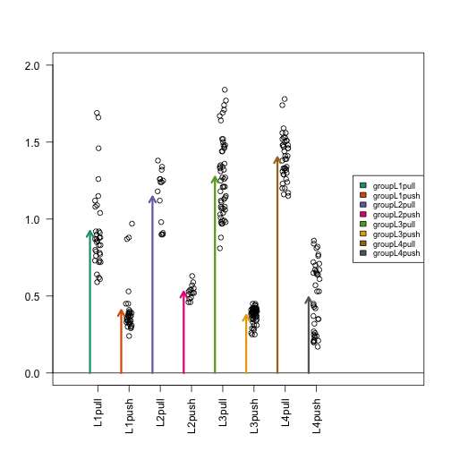

## Interactions and Contrasts

R markdown document for this section available [here](https://github.com/genomicsclass/labs/tree/master/course2/interactions_and_contrasts.Rmd).

As a running example to learn about more complex linear models, we will be using a dataset which compares the different frictional coefficients on the different legs of a spider. Specifically, we will be determining whether more friction comes from a pushing or pulling motion of the leg. The original paper from which the data was provided is:

Jonas O. Wolff  & Stanislav N. Gorb, [Radial arrangement of Janus-like setae permits friction control in spiders](http://dx.doi.org/10.1038/srep01101), Scientific Reports, 22 January 2013.

The abstract of the paper says, 

> The hunting spider Cupiennius salei (Arachnida, Ctenidae) possesses hairy attachment pads (claw tufts) at its distal legs, consisting of directional branched setae... Friction of claw tufts on smooth glass was measured to reveal the functional effect of seta arrangement within the pad.

Figure 1 includes some pretty cool electron microscope images of the tufts. We are interested in the comparisons in Figure 4, where the pulling and pushing motions are compared for different leg pairs (for an example of pushing and pulling see the top of Figure 3). We can recreate Figure 4 of the paper by loading the data and calling `boxplot`:


```r
url <- "https://raw.githubusercontent.com/genomicsclass/dagdata/master/inst/extdata/spider_wolff_gorb_2013.csv"
filename <- "spider_wolff_gorb_2013.csv"
library(downloader)
if (!file.exists(filename)) download(url, filename)
spider <- read.csv(filename, skip=1)
boxplot(spider$friction ~ spider$type * spider$leg, 
        col=c("grey90","grey40"), las=2, 
        main="Comparison of friction coefficients of different leg pairs ")
```

 

#### Initial visual inspection of the data

What we can immediately see are two trends: 

* The pulling motion has a higher frictional coefficient than the pushing motion.
* The leg pairs to the back of the spider (L4 being the last) generally have higher pulling frictional coefficients.

Another thing to notice is that the groups have different spread, what we call *within-group variance*. This is somewhat of a problem for the kinds of linear models we will explore below, since we will be assuming that around the fitted values {$$}\hat{Y}_i{/$$}, the errors {$$}\varepsilon_i{/$$} are distributed identically, meaning the same variance within each group. The consequence of ignoring the different variance is that comparisons between the groups with small variances will be overly "conservative" (because the overall estimate of variance is larger than these groups), and comparisons between the groups with large variances will be overly confident.

If the spread is related to the location, such that groups with large values also have larger spread, a possibility is to transform the data with a function such as the `log` or `sqrt`. This looks like it could be useful here, since three of the four push groups (L1, L2, L3) have the smallest values and also the smallest spread.

Alternative tests for comparing groups without transforming the values first are: t-tests without the equal variance assumption, using a "Welch" or "Satterthwaite approximation", or a test of a shift in distribution, such as the Mann-Whitney-Wilcoxon test.

However, we will continue and show the different kinds of linear models using this dataset, setting aside the issue of different within-group variances.

#### A linear model with one variable

Just to remind ourselves about the simple two-group linear model, let's subset to the L1 leg pair, and run `lm`:


```r
spider.sub <- spider[spider$leg == "L1",]
fit <- lm(friction ~ type, data=spider.sub)
summary(fit)
```

```
## 
## Call:
## lm(formula = friction ~ type, data = spider.sub)
## 
## Residuals:
##      Min       1Q   Median       3Q      Max 
## -0.33147 -0.10735 -0.04941 -0.00147  0.76853 
## 
## Coefficients:
##             Estimate Std. Error t value Pr(>|t|)    
## (Intercept)  0.92147    0.03827  24.078  < 2e-16 ***
## typepush    -0.51412    0.05412  -9.499  5.7e-14 ***
## ---
## Signif. codes:  0 '***' 0.001 '**' 0.01 '*' 0.05 '.' 0.1 ' ' 1
## 
## Residual standard error: 0.2232 on 66 degrees of freedom
## Multiple R-squared:  0.5776,	Adjusted R-squared:  0.5711 
## F-statistic: 90.23 on 1 and 66 DF,  p-value: 5.698e-14
```

```r
(coefs <- coef(fit))
```

```
## (Intercept)    typepush 
##   0.9214706  -0.5141176
```

Keep in mind that the coefficients are just the mean of the pull observations, and the difference between the means of the two groups:


```r
s <- split(spider.sub$friction, spider.sub$type)
mean(s[["pull"]])
```

```
## [1] 0.9214706
```

```r
mean(s[["push"]]) - mean(s[["pull"]])
```

```
## [1] -0.5141176
```

We can form the design matrix, which was used internally to `lm`:


```r
X <- model.matrix(~ type, data=spider.sub)
colnames(X)
```

```
## [1] "(Intercept)" "typepush"
```

```r
head(X)
```

```
##   (Intercept) typepush
## 1           1        0
## 2           1        0
## 3           1        0
## 4           1        0
## 5           1        0
## 6           1        0
```

```r
tail(X)
```

```
##    (Intercept) typepush
## 63           1        1
## 64           1        1
## 65           1        1
## 66           1        1
## 67           1        1
## 68           1        1
```

Now we'll make a plot of the `X` matrix by putting a black block for the 1's in the design matrix and a white block for the 0's. This plot will be more interesting for the linear models later on in this script. Along the y-axis is the sample number (the row number of the `data`) and along the x-axis is the column of the design matrix {$$}\mathbf{X}{/$$}. If you have installed the *rafalib* library, you can make this plot with the `imagemat` function:


```r
library(rafalib)
imagemat(X, main="Model matrix for linear model with one variable")
```

 

#### Examining the coefficients

Now we will use a big chunk of code just to show how the coefficients from the linear model can be drawn as arrows. You wouldn't necessarily use this code in your daily practice, but it's helpful for visualizing what's going on in the linear model in your head.


```r
stripchart(split(spider.sub$friction, spider.sub$type), 
           vertical=TRUE, pch=1, method="jitter", las=2, xlim=c(0,3), ylim=c(0,2))
a <- -0.25
lgth <- .1
library(RColorBrewer)
cols <- brewer.pal(3,"Dark2")
abline(h=0)
arrows(1+a,0,1+a,coefs[1],lwd=3,col=cols[1],length=lgth)
abline(h=coefs[1],col=cols[1])
arrows(2+a,coefs[1],2+a,coefs[1]+coefs[2],lwd=3,col=cols[2],length=lgth)
abline(h=coefs[1]+coefs[2],col=cols[2])
legend("right",names(coefs),fill=cols,cex=.75,bg="white")
```

 

#### A linear model with two variables

Now we'll continue and examine the full dataset, including the observations from all leg pairs. In order to model both the leg pair differences and the push vs. pull difference, we need to include both terms in the formula. Let's see what kind of design matrix will be formed with two variables in the formula:


```r
X <- model.matrix(~ type + leg, data=spider)
colnames(X)
```

```
## [1] "(Intercept)" "typepush"    "legL2"       "legL3"       "legL4"
```

```r
head(X)
```

```
##   (Intercept) typepush legL2 legL3 legL4
## 1           1        0     0     0     0
## 2           1        0     0     0     0
## 3           1        0     0     0     0
## 4           1        0     0     0     0
## 5           1        0     0     0     0
## 6           1        0     0     0     0
```

```r
imagemat(X, main="Model matrix for linear model with two factors")
```

 

The first column is the intercept, and so it has 1's for all samples. The second column has 1's for the push samples, and we can see that there are four groups of them. Finally, the third, fourth and fifth columns have 1's for the L2, L3 and L4 samples. The L1 samples do not have a column, because *L1* is the reference level for `leg`, as is *pull* for the `type` variable.

To run this model, we use `lm` with the formula `~ type + leg`. We'll save the linear model to `fitTL` standing for a fit with Type and Leg.


```r
fitTL <- lm(friction ~ type + leg, data=spider)
summary(fitTL)
```

```
## 
## Call:
## lm(formula = friction ~ type + leg, data = spider)
## 
## Residuals:
##      Min       1Q   Median       3Q      Max 
## -0.46392 -0.13441 -0.00525  0.10547  0.69509 
## 
## Coefficients:
##             Estimate Std. Error t value Pr(>|t|)    
## (Intercept)  1.05392    0.02816  37.426  < 2e-16 ***
## typepush    -0.77901    0.02482 -31.380  < 2e-16 ***
## legL2        0.17192    0.04569   3.763 0.000205 ***
## legL3        0.16049    0.03251   4.937 1.37e-06 ***
## legL4        0.28134    0.03438   8.183 1.01e-14 ***
## ---
## Signif. codes:  0 '***' 0.001 '**' 0.01 '*' 0.05 '.' 0.1 ' ' 1
## 
## Residual standard error: 0.2084 on 277 degrees of freedom
## Multiple R-squared:  0.7916,	Adjusted R-squared:  0.7886 
## F-statistic:   263 on 4 and 277 DF,  p-value: < 2.2e-16
```

```r
(coefs <- coef(fitTL))
```

```
## (Intercept)    typepush       legL2       legL3       legL4 
##   1.0539153  -0.7790071   0.1719216   0.1604921   0.2813382
```

#### Matrix algebra reminder

We can do some quick matrix algebra to remind ourselves that the coefficients returned by `lm` are obtained with the following formula:

{$$} \hat{\boldsymbol{\beta}} = (\mathbf{X}^\top \mathbf{X})^{-1} \mathbf{X}^\top \mathbf{Y} {/$$}


```r
Y <- spider$friction
X <- model.matrix(~ type + leg, data=spider)
beta <- solve(t(X) %*% X) %*% t(X) %*% Y
t(beta)
```

```
##      (Intercept)   typepush     legL2     legL3     legL4
## [1,]    1.053915 -0.7790071 0.1719216 0.1604921 0.2813382
```

```r
coefs
```

```
## (Intercept)    typepush       legL2       legL3       legL4 
##   1.0539153  -0.7790071   0.1719216   0.1604921   0.2813382
```

#### Examining the coefficients

We can make the same plot as before, with arrows for each of the coefficients in the model. 


```r
spider$group <- factor(paste0(spider$leg, spider$type))
stripchart(split(spider$friction, spider$group), 
           vertical=TRUE, pch=1, method="jitter", las=2, xlim=c(0,11), ylim=c(0,2))
cols <- brewer.pal(5,"Dark2")
abline(h=0)
arrows(1+a,0,1+a,coefs[1],lwd=3,col=cols[1],length=lgth)
abline(h=coefs[1],col=cols[1])
arrows(3+a,coefs[1],3+a,coefs[1]+coefs[3],lwd=3,col=cols[3],length=lgth)
arrows(5+a,coefs[1],5+a,coefs[1]+coefs[4],lwd=3,col=cols[4],length=lgth)
arrows(7+a,coefs[1],7+a,coefs[1]+coefs[5],lwd=3,col=cols[5],length=lgth)
arrows(2+a,coefs[1],2+a,coefs[1]+coefs[2],lwd=3,col=cols[2],length=lgth)
segments(3+a,coefs[1]+coefs[3],4+a,coefs[1]+coefs[3],lwd=3,col=cols[3])
arrows(4+a,coefs[1]+coefs[3],4+a,coefs[1]+coefs[3]+coefs[2],lwd=3,col=cols[2],length=lgth)
segments(5+a,coefs[1]+coefs[4],6+a,coefs[1]+coefs[4],lwd=3,col=cols[4])
arrows(6+a,coefs[1]+coefs[4],6+a,coefs[1]+coefs[4]+coefs[2],lwd=3,col=cols[2],length=lgth)
segments(7+a,coefs[1]+coefs[5],8+a,coefs[1]+coefs[5],lwd=3,col=cols[5])
arrows(8+a,coefs[1]+coefs[5],8+a,coefs[1]+coefs[5]+coefs[2],lwd=3,col=cols[2],length=lgth)
legend("right",names(coefs),fill=cols,cex=.75,bg="white")
```

 

Because we have 8 groups and only 5 coefficients, the fitted means (the tips of the arrows) do not line up exactly with the mean of each group, like they did for the previous example of a two group linear model.


```r
s <- split(spider$friction, spider$group)
mean(s[["L1pull"]])
```

```
## [1] 0.9214706
```

```r
coefs[1]
```

```
## (Intercept) 
##    1.053915
```

```r
mean(s[["L1push"]])
```

```
## [1] 0.4073529
```

```r
coefs[1] + coefs[2]
```

```
## (Intercept) 
##   0.2749082
```

However, we can demonstrate that the push vs. pull coefficient, `coefs[2]`, is now a weighted mean of the difference of means for each group. Furthermore, the weighting is determined by the sample size of each group. The math works out so simply here because the sample size is equal for the push and pull subgroups within each leg pair. If the sample sizes were not equal for push and pull within each leg pair, the weighting is uniquely determined by a formula involving the sample size of each subgroup, the total sample size, and the number of coefficients. This can be worked out from {$$}(\mathbf{X}^\top \mathbf{X})^{-1} \mathbf{X}^\top{/$$}.


```r
means <- sapply(s, mean)
##the sample size of push or pull groups for each leg pair
ns <- sapply(s, length)[c(1,3,5,7)]
(w <- ns/sum(ns))
```

```
##    L1pull    L2pull    L3pull    L4pull 
## 0.2411348 0.1063830 0.3687943 0.2836879
```

```r
sum(w * (means[c(2,4,6,8)] - means[c(1,3,5,7)]))
```

```
## [1] -0.7790071
```

```r
coefs[2]
```

```
##   typepush 
## -0.7790071
```

#### Contrasting coefficients

To introduce the concept of *contrasts*, first consider the comparisons which we can read off from the linear model summary:


```r
coefs
```

```
## (Intercept)    typepush       legL2       legL3       legL4 
##   1.0539153  -0.7790071   0.1719216   0.1604921   0.2813382
```

We have the push vs. pull effect across all leg pairs, and the L2 vs. L1 effect, the L3 vs. L1 effect, and the L4 vs. L1 effect. What if we want to compare two groups and one of those groups is not L1? The solution to this question is to use *contrasts*. 

A *contrast* is a combination of coefficients: {$$}\mathbf{c^\top} \hat{\boldsymbol{\beta}}{/$$}, where {$$}\mathbf{c}{/$$} is a column vector with as many rows as the number of coefficients in the linear model. If {$$}\mathbf{c}{/$$} has a 0, then the coefficients are not involved in the contrast.

If we want to compare L3 and L2, this is equivalent to contrasting two coefficients from the linear model because, in this contrast, the comparison to the reference level *L1* cancels out:

{$$} (L3 - L1) - (L2 - L1) = L3 - L2 {/$$}

An easy way to make these contrasts of two groups is to use the `contrast` function from the *contrast* package. We just need to specify which groups we want to compare. We have to pick one of *pull* or *push* types, although the answer will not differ, as we see below.


```r
library(contrast) #Available from CRAN
```

```
## Loading required package: rms
## Loading required package: Hmisc
## Loading required package: methods
## Loading required package: grid
## Loading required package: lattice
## Loading required package: survival
## Loading required package: Formula
## Loading required package: ggplot2
## 
## Attaching package: 'Hmisc'
## 
## The following objects are masked from 'package:base':
## 
##     format.pval, round.POSIXt, trunc.POSIXt, units
## 
## Loading required package: SparseM
## 
## Attaching package: 'SparseM'
## 
## The following object is masked from 'package:base':
## 
##     backsolve
```

```r
L3vsL2 <- contrast(fitTL,list(leg="L3",type="pull"),list(leg="L2",type="pull"))
L3vsL2
```

```
## lm model parameter contrast
## 
##     Contrast       S.E.      Lower      Upper     t  df Pr(>|t|)
##  -0.01142949 0.04319685 -0.0964653 0.07360632 -0.26 277   0.7915
```

We can show that the effect size estimate is just the difference between two coefficients. The contrast vector used by `contrast` is stored as `X` within the resulting object:


```r
coefs[4] - coefs[3]
```

```
##       legL3 
## -0.01142949
```

```r
(cT <- L3vsL2$X)
```

```
##   (Intercept) typepush legL2 legL3 legL4
## 1           0        0    -1     1     0
## attr(,"assign")
## [1] 0 1 2 2 2
## attr(,"contrasts")
## attr(,"contrasts")$type
## [1] "contr.treatment"
## 
## attr(,"contrasts")$leg
## [1] "contr.treatment"
```

```r
cT %*% beta
```

```
##          [,1]
## 1 -0.01142949
```

What about the standard error and t-statistic? As before, the t-statistic is the estimate (`Contrast`) divided by the standard error (`S.E.`). The standard error of the contrast estimate is formed by multiplying the contrast vector {$$}\mathbf{c}{/$$} on either side of the estimated covariance matrix, {$$}\Sigma \equiv \mathrm{Var}(\hat{\boldsymbol{\beta}}){/$$}:

{$$} \sqrt{\mathbf{c^\top} \mathbf{\Sigma} \mathbf{c}} {/$$}

where we saw the covariance of the coefficients earlier:

{$$} \mathbf{\Sigma} = \hat{\sigma}^2 (\mathbf{X}^\top \mathbf{X})^{-1}{/$$}


```r
(Sigma <- sum(fitTL$residuals^2)/(nrow(X) - ncol(X)) * solve(t(X) %*% X))
```

```
##               (Intercept)      typepush         legL2         legL3
## (Intercept)  0.0007929832 -3.081306e-04 -0.0006389179 -0.0006389179
## typepush    -0.0003081306  6.162612e-04  0.0000000000  0.0000000000
## legL2       -0.0006389179 -6.439411e-20  0.0020871318  0.0006389179
## legL3       -0.0006389179 -6.439411e-20  0.0006389179  0.0010566719
## legL4       -0.0006389179 -1.191291e-19  0.0006389179  0.0006389179
##                     legL4
## (Intercept) -0.0006389179
## typepush     0.0000000000
## legL2        0.0006389179
## legL3        0.0006389179
## legL4        0.0011819981
```

```r
sqrt(cT %*% Sigma %*% t(cT))
```

```
##            1
## 1 0.04319685
```

```r
L3vsL2$SE
```

```
## [1] 0.04319685
```

Again, to show it doesn't matter if we had picked `type="push"`. The reason it does not change the contrast is because it leads to addition of the `typepush` effect on both sides of the difference, which cancels out.


```r
L3vsL2.equiv <- contrast(fitTL,list(leg="L3",type="push"),list(leg="L2",type="push"))
L3vsL2.equiv$X
```

```
##   (Intercept) typepush legL2 legL3 legL4
## 1           0        0    -1     1     0
## attr(,"assign")
## [1] 0 1 2 2 2
## attr(,"contrasts")
## attr(,"contrasts")$type
## [1] "contr.treatment"
## 
## attr(,"contrasts")$leg
## [1] "contr.treatment"
```

## A Linear Model with Interactions

R markdown document for this section available [here](https://github.com/genomicsclass/labs/tree/master/course2/interactions_and_contrasts.Rmd).

As we saw in the previous linear model, we assumed that the push vs. pull effect was the same for all of the leg pairs (the same orange arrow). You can easily see that this does not capture the data that well; that is, the tips of the arrows did not line up perfectly with the group averages. For the L1 leg pair, the push vs. pull coefficient overshot, and for the L3 leg pair, the push vs. pull coefficient was too small.

*Interaction* terms will help us overcome this problem by introducing additional terms to compensate for differences in the push vs. pull effect across the 4 groups. As we already have a push vs. pull term in the model, we only need to add three more terms to have the freedom to find leg-pair-specific push vs. pull differences. Interaction terms are added to the design matrix simply by multiplying the columns of the design matrix representing existing terms. 

We can see this by building our model with an *interaction* between `type` and `leg`, by including an extra term in the formula `type:leg`. An equivalent way to specify this model is `~ type*leg` which will expand to the formula shown below, with main effects for `type`, `leg` and an interaction of `type:leg`.


```r
X <- model.matrix(~ type + leg + type:leg, data=spider)
colnames(X)
```

```
## [1] "(Intercept)"    "typepush"       "legL2"          "legL3"         
## [5] "legL4"          "typepush:legL2" "typepush:legL3" "typepush:legL4"
```

```r
head(X)
```

```
##   (Intercept) typepush legL2 legL3 legL4 typepush:legL2 typepush:legL3
## 1           1        0     0     0     0              0              0
## 2           1        0     0     0     0              0              0
## 3           1        0     0     0     0              0              0
## 4           1        0     0     0     0              0              0
## 5           1        0     0     0     0              0              0
## 6           1        0     0     0     0              0              0
##   typepush:legL4
## 1              0
## 2              0
## 3              0
## 4              0
## 5              0
## 6              0
```

```r
imagemat(X, main="Model matrix for linear model with interactions")
```

 

Columns 6-8 (`typepush:legL2`, `typepush:legL3`, and `typepush:legL4`) are the product of the 2nd column (`typepush`) and the 3-5 columns (the three `leg` columns). Looking at the last column, for example, the `typepush:legL4` column will give an extra term {$$}\beta_{\textrm{push,L4}}{/$$} to those samples which are both push samples and leg pair L4 samples. This will account for when the mean samples in the L4-push group are not simply the addition of the main push coefficient and the main L4 coefficient.

We can run the linear model using the same code as before:


```r
fitX <- lm(friction ~ type + leg + type:leg, data=spider)
summary(fitX)
```

```
## 
## Call:
## lm(formula = friction ~ type + leg + type:leg, data = spider)
## 
## Residuals:
##      Min       1Q   Median       3Q      Max 
## -0.46385 -0.10735 -0.01111  0.07848  0.76853 
## 
## Coefficients:
##                Estimate Std. Error t value Pr(>|t|)    
## (Intercept)     0.92147    0.03266  28.215  < 2e-16 ***
## typepush       -0.51412    0.04619 -11.131  < 2e-16 ***
## legL2           0.22386    0.05903   3.792 0.000184 ***
## legL3           0.35238    0.04200   8.390 2.62e-15 ***
## legL4           0.47928    0.04442  10.789  < 2e-16 ***
## typepush:legL2 -0.10388    0.08348  -1.244 0.214409    
## typepush:legL3 -0.38377    0.05940  -6.461 4.73e-10 ***
## typepush:legL4 -0.39588    0.06282  -6.302 1.17e-09 ***
## ---
## Signif. codes:  0 '***' 0.001 '**' 0.01 '*' 0.05 '.' 0.1 ' ' 1
## 
## Residual standard error: 0.1904 on 274 degrees of freedom
## Multiple R-squared:  0.8279,	Adjusted R-squared:  0.8235 
## F-statistic: 188.3 on 7 and 274 DF,  p-value: < 2.2e-16
```

```r
coefs <- coef(fitX)
```

#### Examining the coefficients

Here is where the plot with arrows help us see what is going on with the interaction terms. The interaction terms (the yellow, brown and silver arrows), are extra terms which help us fit leg-pair-specific differences in the push vs. pull difference. The orange arrow now represents the push vs. pull difference for the reference leg pair, which is L1. If the interaction term is large, this means that the push vs. pull difference for that group is different than the push vs. pull difference in the reference leg pair.

Now, as we have eight terms in the model and 8 parameters, you can check that the tips of the arrowheads are exactly equal to the group means.


```r
stripchart(split(spider$friction, spider$group), 
           vertical=TRUE, pch=1, method="jitter", las=2, xlim=c(0,11), ylim=c(0,2))
cols <- brewer.pal(8,"Dark2")
abline(h=0)
arrows(1+a,0,1+a,coefs[1],lwd=3,col=cols[1],length=lgth)
abline(h=coefs[1],col=cols[1])
arrows(2+a,coefs[1],2+a,coefs[1]+coefs[2],lwd=3,col=cols[2],length=lgth)
arrows(3+a,coefs[1],3+a,coefs[1]+coefs[3],lwd=3,col=cols[3],length=lgth)
arrows(5+a,coefs[1],5+a,coefs[1]+coefs[4],lwd=3,col=cols[4],length=lgth)
arrows(7+a,coefs[1],7+a,coefs[1]+coefs[5],lwd=3,col=cols[5],length=lgth)
#now the interactions:
segments(3+a,coefs[1]+coefs[3],4+a,coefs[1]+coefs[3],lwd=3,col=cols[3])
arrows(4+a,coefs[1]+coefs[3],4+a,coefs[1]+coefs[3]+coefs[2],lwd=3,col=cols[2],length=lgth)
arrows(4+a,coefs[1]+coefs[2]+coefs[3],4+a,coefs[1]+coefs[2]+coefs[3]+coefs[6],lwd=3,col=cols[6],length=lgth)

segments(5+a,coefs[1]+coefs[4],6+a,coefs[1]+coefs[4],lwd=3,col=cols[4])
arrows(6+a,coefs[1]+coefs[4],6+a,coefs[1]+coefs[4]+coefs[2],lwd=3,col=cols[2],length=lgth)
arrows(6+a,coefs[1]+coefs[4]+coefs[2],6+a,coefs[1]+coefs[4]+coefs[2]+coefs[7],lwd=3,col=cols[7],length=lgth)

segments(7+a,coefs[1]+coefs[5],8+a,coefs[1]+coefs[5],lwd=3,col=cols[5])
arrows(8+a,coefs[1]+coefs[5],8+a,coefs[1]+coefs[5]+coefs[2],lwd=3,col=cols[2],length=lgth)
arrows(8+a,coefs[1]+coefs[5]+coefs[2],8+a,coefs[1]+coefs[5]+coefs[2]+coefs[8],lwd=3,col=cols[8],length=lgth)
legend("right",names(coefs),fill=cols,cex=.75,bg="white")
```

 

#### Contrasts

Again we will show how to combine coefficients from the model using *contrasts*. For some simple cases, we can use the contrast package. Suppose we want to know the push vs. pull effect for the L2 leg pair samples. We can see from the arrow plot that this is the orange arrow plus the yellow arrow. We can also specify this comparison with the `contrast` function:


```r
library(contrast) ##Available from CRAN
L2push.vs.pull <- contrast(fitX,
                   list(leg="L2", type = "push"), 
                   list(leg="L2", type = "pull"))
L2push.vs.pull
```

```
## lm model parameter contrast
## 
##  Contrast      S.E.      Lower      Upper     t  df Pr(>|t|)
##    -0.618 0.0695372 -0.7548951 -0.4811049 -8.89 274        0
```

```r
coefs[2] + coefs[6]
```

```
## typepush 
##   -0.618
```


#### Differences of differences

As we mentioned above, the question of whether the push vs. pull difference is *different* in L2 compared to L1, is answered by a single term in the model: the `typepush:legL2` term corresponding to the yellow arrow in the plot. Similarly, we can test the L3 vs. L1 and L4 vs. L1 differences, straight from the summary table of the linear model:


```r
summary(fitX)
```

```
## 
## Call:
## lm(formula = friction ~ type + leg + type:leg, data = spider)
## 
## Residuals:
##      Min       1Q   Median       3Q      Max 
## -0.46385 -0.10735 -0.01111  0.07848  0.76853 
## 
## Coefficients:
##                Estimate Std. Error t value Pr(>|t|)    
## (Intercept)     0.92147    0.03266  28.215  < 2e-16 ***
## typepush       -0.51412    0.04619 -11.131  < 2e-16 ***
## legL2           0.22386    0.05903   3.792 0.000184 ***
## legL3           0.35238    0.04200   8.390 2.62e-15 ***
## legL4           0.47928    0.04442  10.789  < 2e-16 ***
## typepush:legL2 -0.10388    0.08348  -1.244 0.214409    
## typepush:legL3 -0.38377    0.05940  -6.461 4.73e-10 ***
## typepush:legL4 -0.39588    0.06282  -6.302 1.17e-09 ***
## ---
## Signif. codes:  0 '***' 0.001 '**' 0.01 '*' 0.05 '.' 0.1 ' ' 1
## 
## Residual standard error: 0.1904 on 274 degrees of freedom
## Multiple R-squared:  0.8279,	Adjusted R-squared:  0.8235 
## F-statistic: 188.3 on 7 and 274 DF,  p-value: < 2.2e-16
```

#### Difference of differences not involving the reference level

Suppose we want to know if the push vs. pull difference is *different* for the L3 leg pair vs. the L2 leg pair. Considering the arrows in the plot, the push vs. pull difference for a leg pair other then L1 is the `typepush` arrow plus the interaction term for that group.

If we work out the math for comparing across two non-reference leg pairs, this is:

{$$} (typepush + typepush:legL3) - (typepush + typepush:legL2) {/$$} 

{$$} = typepush:legL3 - typepush:legL2 {/$$}

We can't make this contrast using the `contrast` function shown before, but we can make this comparison using the `glht` (for "general linear hypothesis test") function from the *multcomp* package. All we need to do is form a 1-row matrix which has a -1 for the `typepush:legL2` effect and a +1 for the `typepush:legL3` effect. We provide this matrix to the `linfct` (linear function) argument, and obtain a summary table for this contrast alone.

*Note*: there are other ways to perform contrasts using base R, but in my opinion this function is simpler to use.


```r
library(multcomp) ##Available from CRAN
```

```
## Loading required package: mvtnorm
## Loading required package: TH.data
```

```r
C <- matrix(c(0,0,0,0,0,-1,1,0), 1)
L3vsL2interaction <- glht(fitX, linfct=C)
summary(L3vsL2interaction)
```

```
## 
## 	 Simultaneous Tests for General Linear Hypotheses
## 
## Fit: lm(formula = friction ~ type + leg + type:leg, data = spider)
## 
## Linear Hypotheses:
##        Estimate Std. Error t value Pr(>|t|)    
## 1 == 0 -0.27988    0.07893  -3.546  0.00046 ***
## ---
## Signif. codes:  0 '***' 0.001 '**' 0.01 '*' 0.05 '.' 0.1 ' ' 1
## (Adjusted p values reported -- single-step method)
```

```r
coefs[7] - coefs[6]
```

```
## typepush:legL3 
##     -0.2798846
```

#### Testing all differences of differences: Analysis of variance

Finally, suppose that we want to know if the push vs. pull difference is *different* across leg pairs in general. Here we are not comparing any two leg pairs in particular, but rather want to know if the three interaction terms which represent differences in the push vs. pull difference are larger than we would expect them to be. We want to determine if the push vs pull difference was actually constant across the leg pairs.

In statistics, such a question can be answered by an "analysis of variance", which is often abbreviated as *ANOVA*. The `anova` adds terms to the model in the sequence provided in the formula. With each additional term or set of terms, the function calculates the reduction in the sum of squares of the residuals. Let's first print this table and then examine the results in detail:


```r
anova(fitX)
```

```
## Analysis of Variance Table
## 
## Response: friction
##            Df Sum Sq Mean Sq  F value    Pr(>F)    
## type        1 42.783  42.783 1179.713 < 2.2e-16 ***
## leg         3  2.921   0.974   26.847 2.972e-15 ***
## type:leg    3  2.098   0.699   19.282 2.256e-11 ***
## Residuals 274  9.937   0.036                       
## ---
## Signif. codes:  0 '***' 0.001 '**' 0.01 '*' 0.05 '.' 0.1 ' ' 1
```

If we consider the first line, it says that from a model with only an intercept, adding the information about which observations were push and which were pull reduced the sum of squares by 42.783. We can reproduce this number in R by examining the sum of squares from a model with only an intercept (the mean of all observations) and the sum of squares from a model which groups by type:


```r
mu0 <- mean(spider$friction)
initial.ss <- sum((spider$friction - mu0)^2)
s <- split(spider$friction, spider$type)
after.type.ss <- sum(sapply(s, function(x) sum((x - mean(x))^2)))
(type.ss <- initial.ss - after.type.ss)
```

```
## [1] 42.78307
```

Through [simple arithmetic](http://en.wikipedia.org/wiki/Partition_of_sums_of_squares#Proof), this can be shown to be equivalent to the sum of squares of the fitted values from the model using the type information to the fitted values from the model with only an intercept:


```r
sum(sapply(s, length) * (sapply(s, mean) - mu0)^2)
```

```
## [1] 42.78307
```

Keep in mind that the order of terms in the formula, and therefore rows in the ANOVA table is important: each row considers the reduction in the sum of squares after adding information to the model in the previous row.

The other columns in the ANOVA table show the "degrees of freedom" with each row. As the `type` variable introduced only one term in the model, the `Df` column has a 1. Because the `leg` variable introduced three terms in the model (`legL2`, `legL3` and `legL4`), the `Df` column has a 3.

Finally, there is a column which lists the *F value*. The F value is the *mean of squares* for the inclusion of the terms of interest (the sum of squares divided by the degrees of freedom) divided by the mean squared residuals (from the bottom row):

{$$} r_i = Y_i - \hat{Y}_i {/$$}

{$$} \mbox{Mean Sq Residuals} = \frac{1}{N - p} \sum_{i=1}^N r_i^2 {/$$}

where {$$}p{/$$} is the sum of all the terms in the model (here 8, including the intercept term).

Under the null hypothesis that the true value of the additional terms is 0, we have a theoretical result for what the distribution of the F value will be for each row. As an example let's take the last row: the three interaction terms. Under the null hypothesis that the true value for these three additional terms is actually 0, e.g. {$$}\beta_{\textrm{push,L2}} = 0, \beta_{\textrm{push,L3}} = 0, \beta_{\textrm{push,L4}} = 0{/$$}, then we can calculate the chance of seeing such a large F value for this row of the ANOVA table. Remember that we are only concerned with large values here, because we have a ratio of sum of squares, the F value can only be positive. 

The p-value in the last column for the `type:leg` row can be interpreted as following: under the null hypothesis that there are no differences in the push vs. pull difference across leg pair, this is the probability of the interaction terms explaining so much of the observed variance. If this p-value is small, we would consider rejecting the null hypothesis that the push vs. pull difference is the same across leg pairs.

The [F distribution](http://en.wikipedia.org/wiki/F-distribution) has two parameters: one for the degrees of freedom of the numerator (the terms of interest) and one for the denominator (the residuals). In the case of the interactions row, this is 3, the number of interaction terms divided by 274, the number of samples minus the total number of coefficients.

#### A different specification of the same model

In this last section, we show an alternate way to specify the model where we suppose that each group has its own mean (that the push vs. pull effect is not the same for each leg pair). This specification is in some ways simpler, but it does not allow us to build the ANOVA table as above, because it does not split interaction terms out in the same way. Here we simply include a term for each unique combination of `type` and `leg`. We include a `0 +` in the formula because we do not want to include an intercept:


```r
##earlier, we defined the 'group' column:
spider$group <- factor(paste0(spider$leg, spider$type))
X <- model.matrix(~ 0 + group, data=spider)
colnames(X)
```

```
## [1] "groupL1pull" "groupL1push" "groupL2pull" "groupL2push" "groupL3pull"
## [6] "groupL3push" "groupL4pull" "groupL4push"
```

```r
head(X)
```

```
##   groupL1pull groupL1push groupL2pull groupL2push groupL3pull groupL3push
## 1           1           0           0           0           0           0
## 2           1           0           0           0           0           0
## 3           1           0           0           0           0           0
## 4           1           0           0           0           0           0
## 5           1           0           0           0           0           0
## 6           1           0           0           0           0           0
##   groupL4pull groupL4push
## 1           0           0
## 2           0           0
## 3           0           0
## 4           0           0
## 5           0           0
## 6           0           0
```

```r
imagemat(X, main="Model matrix for linear model with group variable")
```

 

We can run the linear model with the familiar call:


```r
fitG <- lm(friction ~ 0 + group, data=spider)
summary(fitG)
```

```
## 
## Call:
## lm(formula = friction ~ 0 + group, data = spider)
## 
## Residuals:
##      Min       1Q   Median       3Q      Max 
## -0.46385 -0.10735 -0.01111  0.07848  0.76853 
## 
## Coefficients:
##             Estimate Std. Error t value Pr(>|t|)    
## groupL1pull  0.92147    0.03266   28.21   <2e-16 ***
## groupL1push  0.40735    0.03266   12.47   <2e-16 ***
## groupL2pull  1.14533    0.04917   23.29   <2e-16 ***
## groupL2push  0.52733    0.04917   10.72   <2e-16 ***
## groupL3pull  1.27385    0.02641   48.24   <2e-16 ***
## groupL3push  0.37596    0.02641   14.24   <2e-16 ***
## groupL4pull  1.40075    0.03011   46.52   <2e-16 ***
## groupL4push  0.49075    0.03011   16.30   <2e-16 ***
## ---
## Signif. codes:  0 '***' 0.001 '**' 0.01 '*' 0.05 '.' 0.1 ' ' 1
## 
## Residual standard error: 0.1904 on 274 degrees of freedom
## Multiple R-squared:   0.96,	Adjusted R-squared:  0.9588 
## F-statistic:   821 on 8 and 274 DF,  p-value: < 2.2e-16
```

```r
coefs <- coef(fitG)
```

#### Examining the coefficients

Now we have eight arrows, one for each group. The arrow tips align directly with the mean of each group:


```r
stripchart(split(spider$friction, spider$group), 
           vertical=TRUE, pch=1, method="jitter", las=2, xlim=c(0,11), ylim=c(0,2))
cols <- brewer.pal(8,"Dark2")
abline(h=0)
for (i in 1:8) {
  arrows(i+a,0,i+a,coefs[i],lwd=3,col=cols[i],length=lgth)
}
legend("right",names(coefs),fill=cols,cex=.75,bg="white")
```

 

#### Simple contrasts using the contrast package

While we cannot perform an F test with this formulation, we can easily contrast individual groups using the `contrast` function:


```r
groupL2push.vs.pull <- contrast(fitG,
                                list(group = "L2push"), 
                                list(group = "L2pull"))
groupL2push.vs.pull
```

```
## lm model parameter contrast
## 
##   Contrast      S.E.      Lower      Upper     t  df Pr(>|t|)
## 1   -0.618 0.0695372 -0.7548951 -0.4811049 -8.89 274        0
```

```r
coefs[4] - coefs[3]
```

```
## groupL2push 
##      -0.618
```

#### Differences of differences when there is no intercept

We can also make pair-wise comparisons of the push vs. pull difference. For example, if we want to compare the push vs. pull difference in leg pair L3 vs. leg pair L2:

{$$} (\mbox{L3push} - \mbox{L3pull}) - (\mbox{L2push} - \mbox{L2pull}) {/$$}

{$$} = \mbox{L3 push} + \mbox{L2pull} - \mbox{L3pull} - \mbox{L2push} {/$$}


```r
C <- matrix(c(0,0,1,-1,-1,1,0,0), 1)
groupL3vsL2interaction <- glht(fitG, linfct=C)
summary(groupL3vsL2interaction)
```

```
## 
## 	 Simultaneous Tests for General Linear Hypotheses
## 
## Fit: lm(formula = friction ~ 0 + group, data = spider)
## 
## Linear Hypotheses:
##        Estimate Std. Error t value Pr(>|t|)    
## 1 == 0 -0.27988    0.07893  -3.546  0.00046 ***
## ---
## Signif. codes:  0 '***' 0.001 '**' 0.01 '*' 0.05 '.' 0.1 ' ' 1
## (Adjusted p values reported -- single-step method)
```

```r
names(coefs)
```

```
## [1] "groupL1pull" "groupL1push" "groupL2pull" "groupL2push" "groupL3pull"
## [6] "groupL3push" "groupL4pull" "groupL4push"
```

```r
(coefs[6] - coefs[5]) - (coefs[4] - coefs[3])
```

```
## groupL3push 
##  -0.2798846
```

