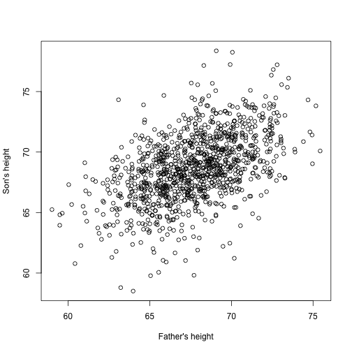
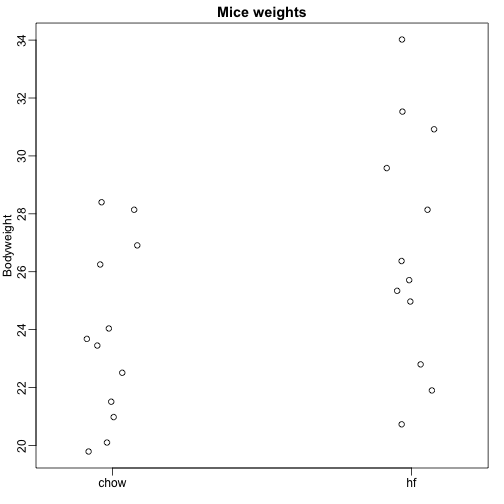
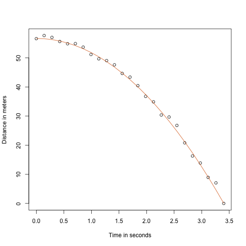
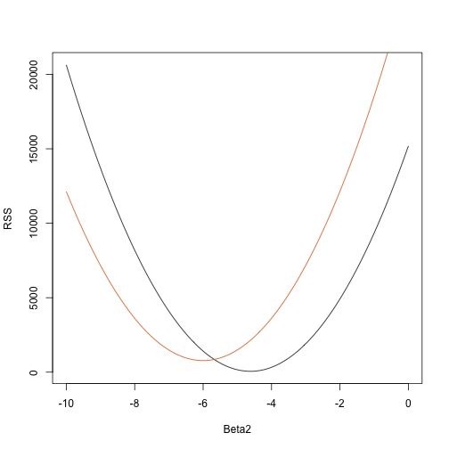

# Matrix Algebra

We are going to describe three examples from the life sciences: one from physics, one related to genetics, and one from a mouse experiment. They are very different, yet we end up using the same statistical technique: fitting linear models. Linear models are typically taught and described in the language of matrix algebra. 


```r
library(rafalib)
```
## Motivating Examples

R markdown document for this section available [here](https://github.com/genomicsclass/labs/tree/master/course2/intro_using_regression.Rmd).

### Objects Falling

Imagine you are Galileo in the 16th century trying to describe the velocity of a falling object. An assistant climbs the Tower of Pisa and drops a ball, while several others record the position at different times. Let's simulate some data using the equations we know today and adding some measurement error:


```r
set.seed(1)
g <- 9.8 ##meters per second
n <- 25
tt <- seq(0,3.4,len=n) ##time in secs, note: t is a base function
d <- 56.67  - 0.5*g*tt^2 + rnorm(n,sd=1)
```

The assistants hand the data to Galileo and this is what he sees:


```r
mypar()
plot(tt,d,ylab="Distance in meters",xlab="Time in seconds")
```

 

He does not know the exact equation, but by looking at the plot above he deduces that the position should follow a parabola. So he models the data with:

{$$} Y_i = \beta_0 + \beta_1 x_i + \beta_2 x_i^2 + \varepsilon, i=1,\dots,n {/$$}

With {$$}Y_i{/$$} representing location, {$$}x_i{/$$} representing the time, and {$$}\varepsilon{/$$} accounting for measurement error. This is a linear model because it is a linear combination of known quantities (th {$$}x{/$$} s) referred to as predictors or covariates and unknown parameters (the {$$}\beta{/$$} s). 

### Fathers' & Sons' Heights
Now imagine you are Francis Galton in the 19th century and you collect paired height data from fathers and sons. You suspect that height is inherited. Your data:


```r
library(UsingR)
x=father.son$fheight
y=father.son$sheight
```

looks like this:


```r
plot(x,y,xlab="Father's height",ylab="Son's height")
```

 

The sons' height does seem to increase linearly with fathers' height. In this case a model that describes the data is as follows:

{$$} Y_i = \beta_0 + \beta_1 x_i + \varepsilon, i=1,\dots,N {/$$}

This is also a linear model. Here {$$}x_i{/$$} and {$$}Y_i{/$$} the father and son heights respectively for the {$$}i{/$$}-th pair and {$$}\varepsilon{/$$} a term to account for the extra variability. Here we think of the fathers' height as the predictor and being fixed (not random) so we use lower case. Note that measurement error alone can't explain all the variability seen in {$$}\varepsilon{/$$}. This makes sense as there are other variables not in the model, for example, mothers' height, genetic randomness, and environmental factors.

### Random Samples From Multiple Populations

Here we read-in mouse body weight data from mice that were fed two different diets: high fat and control (chow). We have a random sample of 12 mice for each. We are interested in determining if the diet has an effect on weight. Here is the data:


```r
dat <- read.csv("femaleMiceWeights.csv")
mypar(1,1)
stripchart(Bodyweight~Diet,data=dat,vertical=TRUE,method="jitter",pch=1,main="Mice weights")
```

 

We want to estimate the difference in average weight between populations. We demonstrated how to do this using t-tests and confidence intervals based on the difference in sample averages. We can obtain the same exact results using a linear model:

{$$} Y_i = \beta_0 + \beta_1 x_{i} + \varepsilon_i{/$$}

with {$$}\beta_0{/$$} the chow diet average weight, {$$}\beta_1{/$$} the difference between averages, {$$}x_i = 1{/$$} when mouse {$$}i{/$$} gets the high fat (hf) diet, {$$}x_i = 0{/$$} when it gets the chow diet, and {$$}\varepsilon_i{/$$} explains the differences between mice of the same population. 
 

### Linear Model In General

We have seen three very different examples in which linear models can be used. A general model that encompasses all of the above examples is the following:

{$$} Y_i = \beta_0 + \beta_1 x_{i,1} + \beta_2 x_{i,2} + \dots +  \beta_2 x_{i,p} + \varepsilon_i, i=1,\dots,n {/$$}

 
{$$} Y_i = \beta_0 + \sum_{j=1}^p \beta_j x_{i,j} + \varepsilon_i, i=1,\dots,n {/$$}

Note that we have a general number of predictors {$$}p{/$$}. Matrix algebra provides a compact language and mathematical framework to compute and make derivations with any linear models that fit into the above framework.

<a name="estimates"></a>

### Estimating Parameters

For the models above to be useful we have to estimate the unknown {$$}\beta{/$$} s. In the first example, we want to describe a physical process for which we can't have unknown parameters. In the second example, we better understand inheritance by estimating how much, on average, the father's height affects the son's height. In the final example, we want to determine if there is in fact a difference: if {$$}\beta_1 \neq 0{/$$}. 

The standard approach in science is to find the values that minimize the distance of the fitted model to the data. The following is called the least squares (LS) equation and we will see it often in this chapter:

{$$} \sum_{i=1}^n \{  Y_i - (\beta_0 + \sum_{j=1}^p \beta_j x_{i,j}\}^2 {/$$}

Once we find the minimum, we will call the values the least squares estimates (LSE) and denote them with {$$}\hat{\beta}{/$$}. The quantity obtained when evaluating the least square equation at the estimates is called the residual sum of squares (RSS). Note that because all these quantities depend on {$$}Y{/$$}, *they are random variables*. The {$$}\hat{\beta}{/$$} s are random variables and we will eventually perform inference on them.

### Falling Object Example Revisited
Thanks to my high school physics teacher, I know that the equation for the trajectory of a falling object is: 

{$$}d = h_0 + v_0 t -  0.5 \times 9.8 t^2{/$$}

with {$$}h_0{/$$} and {$$}v_0{/$$} the starting height and velocity respectively. The data we simulated above followed this equation and added measurement error to simulate `n` observations for dropping the ball {$$}(v_0=0){/$$} from the tower of Pisa {$$}(h_0=56.67){/$$}. This is why we used this code to simulate data:


```r
g <- 9.8 ##meters per second
n <- 25
tt <- seq(0,3.4,len=n) ##time in secs, t is a base function
f <- 56.67  - 0.5*g*tt^2
y <-  f + rnorm(n,sd=1)
```

Here is what the data looks like with the solid line representing the true trajectory:


```r
plot(tt,y,ylab="Distance in meters",xlab="Time in seconds")
lines(tt,f,col=2)
```

 

But we were pretending to be Galileo and so we don't know the parameters in the model. The data does suggest it is a parabola, so we model as such:

{$$} Y_i = \beta_0 + \beta_1 x_i + \beta_2 x_i^2 + \varepsilon, i=1,\dots,n {/$$}

How do we find the LSE?

### The `lm` Function

In R we can fit this model by simply using the `lm` function. We will describe this function in detail later, but here is a preview:


```r
tt2 <-tt^2
fit <- lm(y~tt+tt2)
summary(fit)$coef
```

```
##               Estimate Std. Error    t value     Pr(>|t|)
## (Intercept) 57.1047803  0.4996845 114.281666 5.119823e-32
## tt          -0.4460393  0.6806757  -0.655289 5.190757e-01
## tt2         -4.7471698  0.1933701 -24.549662 1.767229e-17
```

It gives us the LSE, as well as standard errors and p-values. 

Part of what we do in this course is explain the mathematics behind this function. 

### The Least Squares Estimate (LSE)

Let's write a function that computes the RSS for any vector {$$}\beta{/$$}:

```r
rss <- function(Beta0,Beta1,Beta2){
  r <- y - (Beta0+Beta1*tt+Beta2*tt^2)
  return(sum(r^2))
}
```

So for any three dimensional vector we get an RSS. Here is a plot of the RSS as a function of {$$}\beta_2{/$$} when we keep the other two fixed:


```r
Beta2s<- seq(-10,0,len=100)
plot(Beta2s,sapply(Beta2s,rss,Beta0=55,Beta1=0),
     ylab="RSS",xlab="Beta2",type="l")
##Let's add another curve fixing another pair:
Beta2s<- seq(-10,0,len=100)
lines(Beta2s,sapply(Beta2s,rss,Beta0=65,Beta1=0),col=2)
```

 

Trial and error here is not going to work. Instead we can use calculus: take the partial derivatives, set them to 0 and solve. Of course, if we have many parameters, these equations can get rather complex. Linear algebra provides a compact and general way of solving this problem. 


### More On Galton (Advanced)
When studying the father-son data, Galton made a fascinating discovery using exploratory analysis.

 

He noted that if he tabulated the number of father-son height pairs and followed all the x,y values having the same totals in the table, they formed an ellipsis. In the plot above, made by Galton, you see the ellipsis formed by the pairs having 3 cases. This then led to modeling this data as correlated bivariate normal. 

{$$} 
Pr(X<a,Y<b) =
{/$$}


{$$}
\int_{-\infty}^{a} \int_{-\infty}^{b} \frac{1}{2\pi\sigma_x\sigma_y\sqrt{1-\rho^2}}
\exp{ \left\{
\frac{1}{2(1-\rho^2)}
\left[\left(\frac{x-\mu_x}{\sigma_x}\right)^2 -  
2\rho\left(\frac{x-\mu_x}{\sigma_x}\right)\left(\frac{y-\mu_y}{\sigma_y}\right)+
\left(\frac{y-\mu_y}{\sigma_y}\right)^2
\right]
\right\}
}
{/$$}

Now we can use math to show that if you keep {$$}X{/$$} fixed (condition to be {$$}x{/$$}) the distribution of {$$}Y{/$$} is normally distributed with mean: {$$}\mu_x +\sigma_y \rho \left(\frac{x-\mu_x}{\sigma_x}\right){/$$} and standard deviation {$$}\sigma_y \sqrt{1-\rho^2}{/$$}. Note that {$$}\rho{/$$} is the correlation between {$$}Y{/$$} and {$$}X{/$$} and this implies that if we fix {$$}X=x{/$$}, {$$}Y{/$$} does in fact follow a linear model. Homework: what are {$$}\beta_0{/$$} and {$$}\beta_1{/$$} in terms of {$$}\mu_x,\mu_y,\sigma_x,\sigma_y{/$$}, and {$$}\rho{/$$} ? It turns out that the least squares estimate of {$$}\beta_1{/$$} can be written in terms of the sample correlation and standard deviations.


