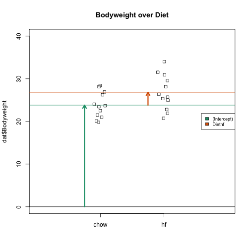

#### The mouse diet example

We will demonstrate how to analyze the high fat diet data using linear models instead of directly applying a t-test. We will demonstrate how, ultimately, these two approaches are equivalent. 

We start by reading in the data and creating a quick stripchart:


```r
dat <- read.csv("femaleMiceWeights.csv") ##previously downloaded
stripchart(dat$Bodyweight ~ dat$Diet, vertical=TRUE, method="jitter",
           main="Bodyweight over Diet")
```

 

We can see that the high fat diet group appears to have higher weights on average, although there is overlap between the two samples.

For demonstration purposes, we will build the design matrix {$$}\mathbf{X}{/$$} using the formula `~ Diet`. The group with the 1's in the second column is determined by the level of `Diet` which comes second; that is, the non-reference level. 


```r
levels(dat$Diet)
```

```
## [1] "chow" "hf"
```

```r
X <- model.matrix(~ Diet, data=dat)
head(X)
```

```
##   (Intercept) Diethf
## 1           1      0
## 2           1      0
## 3           1      0
## 4           1      0
## 5           1      0
## 6           1      0
```

## The Mathematics Behind lm()

The R markdown document for this section is available [here](https://github.com/genomicsclass/labs/tree/master/linear/linear_models_in_practice.Rmd).

Before we use our shortcut for running linear models, `lm`, we want to review what will happen internally. Inside of `lm`, we will form the design matrix {$$}\mathbf{X}{/$$}, and calculate the {$$}\boldsymbol{\beta}{/$$} which minimizes the sum of squares, as described in a previously. The formula for this solution is:

{$$} \hat{\boldsymbol{\beta}} = (\mathbf{X}^\top \mathbf{X})^{-1} \mathbf{X}^\top \mathbf{Y} {/$$}

We can calculate this in R using our matrix multiplication operator `%*%`, the inverse function `solve` and the transpose function `t`.


```r
Y <- dat$Bodyweight
X <- model.matrix(~ Diet, data=dat)
solve(t(X) %*% X) %*% t(X) %*% Y
```

```
##                  [,1]
## (Intercept) 23.813333
## Diethf       3.020833
```

These coefficients are the average of the control group and the difference of the averages:


```r
s <- split(dat$Bodyweight, dat$Diet)
mean(s[["chow"]])
```

```
## [1] 23.81333
```

```r
mean(s[["hf"]]) - mean(s[["chow"]])
```

```
## [1] 3.020833
```

Finally, we use our shortcut, `lm`, to run the linear model:


```r
fit <- lm(Bodyweight ~ Diet, data=dat)
summary(fit)
```

```
## 
## Call:
## lm(formula = Bodyweight ~ Diet, data = dat)
## 
## Residuals:
##     Min      1Q  Median      3Q     Max 
## -6.1042 -2.4358 -0.4138  2.8335  7.1858 
## 
## Coefficients:
##             Estimate Std. Error t value Pr(>|t|)    
## (Intercept)   23.813      1.039  22.912   <2e-16 ***
## Diethf         3.021      1.470   2.055   0.0519 .  
## ---
## Signif. codes:  0 '***' 0.001 '**' 0.01 '*' 0.05 '.' 0.1 ' ' 1
## 
## Residual standard error: 3.6 on 22 degrees of freedom
## Multiple R-squared:  0.1611,	Adjusted R-squared:  0.1229 
## F-statistic: 4.224 on 1 and 22 DF,  p-value: 0.05192
```

```r
(coefs <- coef(fit))
```

```
## (Intercept)      Diethf 
##   23.813333    3.020833
```

#### Examining the coefficients

The following plot provides a visualization of  the meaning of the coefficients with colored arrows (code not shown):

 

To make a connection with material presented earlier, this simple linear model is actually giving us the same result (the t-statistic and p-value) for the difference as a specific kind of t-test. This is the t-test between two groups with the assumption that the population standard deviation is the same for both groups. This was encoded into our linear model when we assumed that the errors {$$}\boldsymbol{\varepsilon}{/$$} were all equally distributed.

Note that although, in this case, the linear model is equivalent to a t-test, we will soon explore more complicated designs, where the linear model is a useful extension. Below we demonstrate that one does in fact get the exact same results:

Our `lm` estimates were:


```r
summary(fit)$coefficients
```

```
##              Estimate Std. Error   t value     Pr(>|t|)
## (Intercept) 23.813333   1.039353 22.911684 7.642256e-17
## Diethf       3.020833   1.469867  2.055174 5.192480e-02
```

And the t-statistic  is the same:


```r
ttest <- t.test(s[["hf"]], s[["chow"]], var.equal=TRUE)
summary(fit)$coefficients[2,3]
```

```
## [1] 2.055174
```

```r
ttest$statistic
```

```
##        t 
## 2.055174
```
