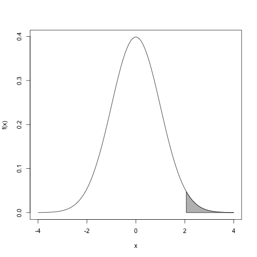

## Mathematical Notation

The R markdown document for this section is available [here](https://github.com/genomicsclass/labs/tree/master/intro/math_notation.Rmd).

This book focuses on teaching statistical concepts and data analysis programming skills. We avoid mathematical notation as much as possible, but we do use it.  We do not want readers to be intimidated by the notation though. Mathematics is actually the easier part of learning statistics. Unfortunately, many text books use mathematical notation in what we believe to be an over-complicated way. For this reason, we do try to keep the notation as simple as possible. However, we do not want to water down the material, and some mathematical notation facilitates a deeper understanding of the concepts. Here we describe a few specific symbols that we use often. If they appear intimidating to you, please take some time to read this section carefully as they are actually simpler than they seem. Because by now you should be somewhat familiar with R, we will make the connection between mathematical notation and R code.


#### Indexing

Those of us dealing with data almost always have a series of numbers. To describe the concepts in an abstract way, we use indexing. For example 5 numbers:


```r
x <- 1:5
```

can be generally represented like this {$$}x_1, x_2, x_3, x_4, x_5{/$$}. We use dots to simplify this {$$}x_1,\dots,x_5{/$$} and indexing to simplify even more {$$}x_i, i=1,\dots,5{/$$}. If we want to describe a procedure for a list of any size {$$}n{/$$} , we write {$$}x_i, i=1,\dots,n{/$$}. 

We sometimes have two indexes. For example, we may have several measurements (blood pressure, weight, height, age, cholesterol level) for 100 individuals. We can then use double indexes: {$$}x_{i,j}, i=1,\dots,100, j=1,\dots,5{/$$}. 


#### Summation

A very common operation in data analysis is to sum several numbers. This is comes up, for example, when we compute averages and standard deviations. If we have many numbers, there is a mathematical notation that makes it quite easy to express the following:


```r
n <- 1000
x <- 1:n
S <- sum(x)
```

and it is the {$$}\sum{/$$} notation (capital S in Greek):

{$$}
S = \sum_{i=1}^n x_i
{/$$}

Note that we make use of indexing as well. We will see that what is included inside the summation can become quite complicated. However, the summation part should not confuse you as it is a simple operation.

#### Greek letters

We would prefer to avoid Greek letters, but they are ubiquitous in the statistical literature so we want you to become used to them. They are mainly used to distinguish the unknown from the observed. Suppose we want to find out the average height of a population and we take a sample of 1,000 people to estimate this. The unknown average we want to estimate is often denoted with {$$}\mu{/$$}, the Greek letter for m (m is for mean). The standard deviation is often denoted with {$$}\sigma{/$$}, the Greek letter for s. Measurement error or other unexplained random variability is typically denoted with {$$}\varepsilon{/$$}, the Greek letter for e. Effect sizes, for example the effect of a diet on weight, are typically denoted with {$$}\beta{/$$}. We may use other Greek letters but those are the most commonly used. 

You should get used to these four Greek letters as you will be seeing them often: {$$}\mu{/$$}, {$$}\sigma{/$$}, {$$}\beta{/$$} and {$$}\varepsilon{/$$}. 

Note that indexing is sometimes used in conjunction with Greek letters to denote different groups. For example, if we have one set of numbers denoted with {$$}x{/$$} and another with {$$}y{/$$} we may use {$$}\mu_x{/$$} and {$$}\mu_y{/$$} to denote their averages.

#### Infinity

In the text we often talk about _asymptotic_ results. Typically, this refers to an approximation that gets better and better as the number of data points we consider gets larger and larger, with perfect approximations occurring when the number of data points is {$$}\inf{/$$}. In practice, there is no such thing as {$$}\infty{/$$}, but it is a convenient concept to understand. One way to think about asymptotic results is as results that become better and better as some number increases and we can pick a number so that a computer can't tell the difference between the approximation and the real number. Here is a very simple example that approximates 1/3 with decimals:


```r
onethird <- function(n) sum( 3/10^c(1:n))
1/3 - onethird(4)
```

```
## [1] 3.333333e-05
```

```r
1/3 - onethird(10)
```

```
## [1] 3.333334e-11
```

```r
1/3 - onethird(16)
```

```
## [1] 0
```

In the example above, 16 is practically {$$}\infty{/$$}.


#### Integrals

We only use these a couple of times so you can skip this section if you prefer. However, integrals are actually much simpler to understand than perhaps you realize. 

For certain statistical operations, we need to figure out areas under the curve. For example, for a function {$$}f(x){/$$} ... 

 

...we need to know what proportion of the total area under the curve is grey. 

The grey area can be thought of as many small grey bars stacked next to each other. The area is then just the sum of the areas of these little bars. The problem is that we can't do this for every number between 2 and 4 because there are an infinite number. The integral is the mathematical solution to this problem. In this case, the total area is 1 so the answer to what proportion is grey is the following integral:

{$$}
\int_2^4 f(x) \, dx
{/$$}

Because we constructed this example, we know that the grey area is 2.27% of the total. Note that this is very well approximated by an actual sum of little bars:


```r
width <- 0.01
x <- seq(2,4,width)
areaofbars <-  f(x)*width
sum( areaofbars )
```

```
## [1] 0.02298998
```

The smaller we make `width`, the closer the sum gets to the integral, which is equal to the area.


