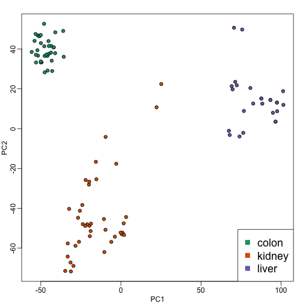
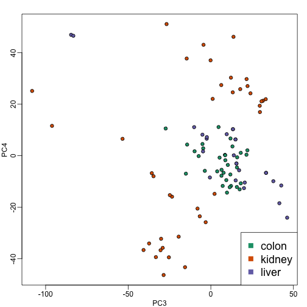

## Multi-Dimensional Scaling Plots

The R markdown document for this section is available [here](https://github.com/genomicsclass/labs/tree/master/highdim/mds.Rmd).

We will motivate multi-dimensional scaling (MDS) plots with a gene expression example. To simplify the illustration we will only consider three tissues:


```r
library(rafalib)
library(tissuesGeneExpression)
data(tissuesGeneExpression)
##show matrix
colind <- tissue%in%c("kidney","colon","liver")
mat <- e[,colind]
group <- factor(tissue[colind])
dim(mat)
```

```
## [1] 22215    99
```

As an exploratory step, we wish to know if gene expression profiles stored in the columns of `mat` show more similarity between tissues than across tissues. Unfortunately, as mentioned above, we can't plot multi-dimensional points. In general, we prefer two-dimensional plots, but making plots for every pair of genes or every pair of samples is not practical. MDS plots become a powerful tool in this situation.

### The Math Behind MDS

Now that we know about SVD and matrix algebra, understanding MDS is relatively straightforward. For illustrative purposes let's consider the SVD decomposition:

{$$}\mathbf{Y} = \mathbf{UDV}^\top{/$$}

and assume that the sum of squares of the first two columns {$$}\mathbf{U^\top Y=DV^\top}{/$$} is much larger than sum of squares of all other columns. This can be written as: 
{$$}d_1+ d_2 \gg d_3 +\ dots + d_n{/$$} with {$$}d_i{/$$} the i-th entry of the {$$}\mathbf{D}{/$$} matrix. When this happens then we have 

{$$}\mathbf{Y}\approx [\mathbf{U}_1 \mathbf{U}_2] 
  \begin{pmatrix}
    d_{1}&0\\
    0&d_{2}\\
  \end{pmatrix}
  [\mathbf{V}_1 \mathbf{V}_2]^\top  
{/$$}

This implies that column {$$}i{/$$} is approximately

{$$}
\mathbf{Y}_i \approx
[\mathbf{U}_1 \mathbf{U}_2] 
  \begin{pmatrix}
    d_{1}&0\\
    0&d_{2}\\
  \end{pmatrix}
  \begin{pmatrix}
    v_{i,1}\\
    v_{i,2}\\
     \end{pmatrix}
    =
    [\mathbf{U}_1 \mathbf{U}_2] 
  \begin{pmatrix}
    d_{1} v_{i,1}\\
    d_{2} v_{i,2}
 \end{pmatrix}
{/$$}

If we define the following two dimensional vector:

 {$$}\mathbf{Z}_i=\begin{pmatrix}
    d_{1} v_{i,1}\\
    d_{2} v_{i,2}
 \end{pmatrix}
 {/$$}

Then

{$$}
\begin{align*}
(\mathbf{Y}_i - \mathbf{Y}_j)^\top(\mathbf{Y}_i - \mathbf{Y}_j) &\approx \left\{ [\mathbf{U}_1 \mathbf{U}_2] (\mathbf{Z}_i-\mathbf{Z}_j) \right\}^\top \left\{[\mathbf{U}_1 \mathbf{U}_2]  (\mathbf{Z}_i-\mathbf{Z}_j)\right\}\\
&= (\mathbf{Z}_i-\mathbf{Z}_j)^\top [\mathbf{U}_1 \mathbf{U}_2]^\top [\mathbf{U}_1 \mathbf{U}_2] (\mathbf{Z}_i-\mathbf{Z}_j) \\
&=(\mathbf{Z}_i-\mathbf{Z}_j)^\top(\mathbf{Z}_i-\mathbf{Z}_j)\\
&=(Z_{i,1}-Z_{j,1})^2 + (Z_{i,2}-Z_{j,2})^2
\end{align*}
{/$$}

This derivation tells us that the distance between samples {$$}i{/$$} and {$$}j{/$$} is approximated by the distance between two dimensional points.

{$$} (\mathbf{Y}_i - \mathbf{Y}_j)^\top(\mathbf{Y}_i - \mathbf{Y}_j) \approx
 (Z_{i,1}-Z_{j,1})^2 + (Z_{i,2}-Z_{j,2})^2
{/$$}

Because {$$}Z{/$$} is a two dimensional vector and we can visualize the distances between each sample by plotting {$$}\mathbf{Z}_1{/$$} versus {$$}\mathbf{Z}_2{/$$} and visually inspect the distance between points. Here is this plot for our example dataset:


```r
s <- svd(mat-rowMeans(mat))
PC1 <- s$d[1]*s$v[,1]
PC2 <- s$d[2]*s$v[,2]
mypar(1,1)
plot(PC1,PC2,pch=21,bg=as.numeric(group))
legend("bottomright",levels(group),col=seq(along=levels(group)),pch=15,cex=1.5)
```

 

Note that the point separate by tissue type as expected. Now, the accuracy of the approximation above depends on the proportion of variance explained by the first two principal components. As we showed above, we can quickly see this by plotting the variance explained plot:


```r
plot(s$d^2/sum(s$d^2))
```

 

Although the first two PCs explain over 50% of the variability, there is plenty of information that this plot does not show. However, it is an incredibly useful plot for obtaining a general idea of the distance between points. Also note, that we can plot other dimensions as well to search for patterns. Here are the 3rd and 4th PCs


```r
PC3 <- s$d[3]*s$v[,3]
PC4 <- s$d[4]*s$v[,4]
mypar(1,1)
plot(PC3,PC4,pch=21,bg=as.numeric(group))
legend("bottomright",levels(group),col=seq(along=levels(group)),pch=15,cex=1.5)
```

 

Note that the 4th PC shows a strong separation within the kidney samples. Later we will learn about batch effects which might explain this finding. 


### `cmdscale`

Although above, we used the `svd` functions, there is a special function that is specifically made for MDS plots. It starts takes a distance object and then uses principal component analysis to provide the best approximation to this distance that can be obtained with {$$}k{/$$} dimensions. This function is more efficient because one does not have to perform the full SVD which can be time consuming. By default it returns a two dimensions but we can change that through the parameter `k`


```r
d <- dist(t(mat))
mds <- cmdscale(d)

mypar()
plot(mds[,1],mds[,2],bg=as.numeric(group),pch=21,xlab="First dimension",ylab="Second dimension")
legend("bottomleft",levels(group),col=seq(along=levels(group)),pch=15)
```

 
Note that these two approaches are equivalent up to an arbitrary sign change.


```r
mypar(1,2)
for(i in 1:2){
  plot(mds[,i],s$d[i]*s$v[,i],main=paste("PC",i))
  b = ifelse( cor(mds[,i],s$v[,i]) > 0, 1, -1)
  abline(0,b) ##b is 1 or -1 depending on the arbitrary sign "flip"
}
```

 


### Why the arbitrary sign?
Note that the SVD is not unique because we can multiply any column of {$$}\mathbf{V}{/$$} by -1 as long as we multiply the sample column of {$$}\mathbf{U}{/$$} by -1. We can see this immediately by noting that

{$$}
\mathbf{-1UD(-1)V}^\top = \mathbf{UDV}^\top
{/$$}


### Why we substract the mean

Note that in all calculations above we subtract the row means before we compute the singular value decomposition. Note that if what we are trying to do is approximate the distance between columns {$$}\mathbf{Y}_i{/$$} and {$$}\mathbf{Y}_j{/$$} is the same as the distance between {$$}\mathbf{Y}_i- \mathbf{\mu}{/$$} and {$$}\mathbf{Y}_j - \mathbf{\mu}{/$$} since the {$$}\mu{/$$} cancels out when computing said distance:

{$$}
\left\{ ( \mathbf{Y}_i- \mathbf{\mu} ) - ( \mathbf{Y}_j - \mathbf{\mu} ) \right\}^\top \left\{ (\mathbf{Y}_i- \mathbf{\mu}) - (\mathbf{Y}_j - \mathbf{\mu} ) \right\} = \left\{  \mathbf{Y}_i-  \mathbf{Y}_j  \right\}^\top \left\{ \mathbf{Y}_i - \mathbf{Y}_j  \right\}
{/$$}

And because removing the row means reduces the total variation it can only make the SVD approximation better.


