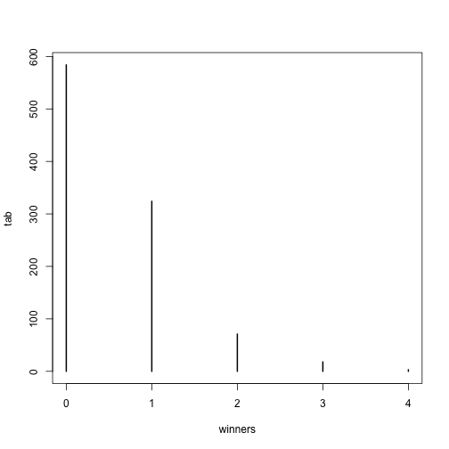
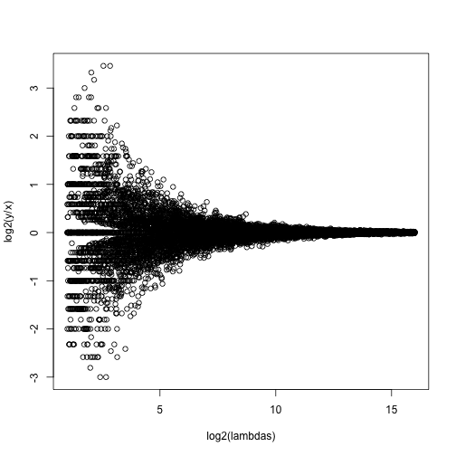
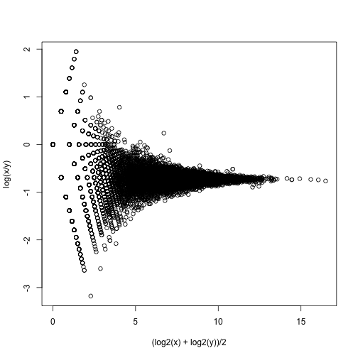
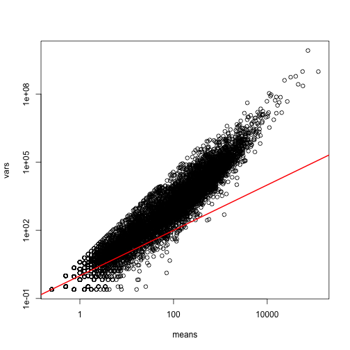
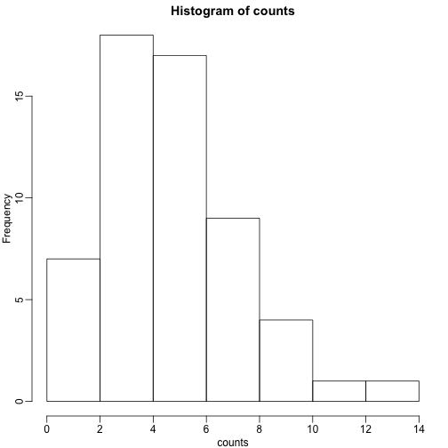
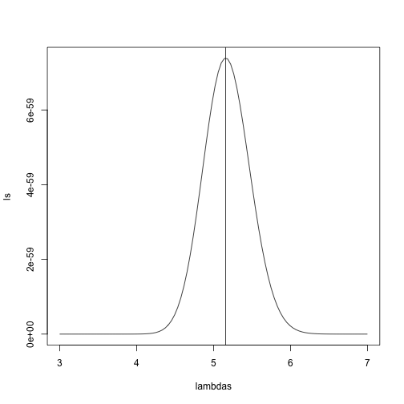
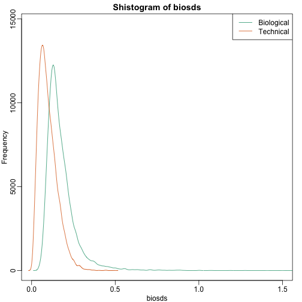
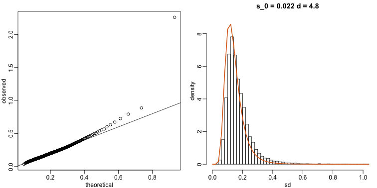

# Statistical Models

"All models are wrong, but some are useful" -George E. P. Box

When we see a p-value in the literature, it means a probability distribution of some sort was used to quantify the null hypothesis. Many times deciding which probability distribution to use is relatively straightforward. For example, in the tea tasting challenge we can use simple probability calculations to determine the null distribution. Most  p-values in the scientific literature are based on sample averages or least squares estimates from a linear model and make use of the CLT to approximate the null distribution of their statistic as normal.

The CLT is backed by theoretical results that guarantee that the approximation is accurate. However, we cannot always use this approximation, such as when our sample size is too small. Previously, we described how the sample average can be approximated as t-distributed when the population data is approximately normal. However, there is no theoretical backing for this assumption. We are now *modeling*. In the case of height, we know from experience that this turns out to be a very good model. 

But this does not imply that every dataset we collect will follow a normal distribution. Some examples are: coin tosses, the number of people who win the lottery, and US incomes. The normal is not the only parametric distribution that is available from modeling. Here we describe some of the most widely used parametric distributions and some of their uses in the life sciences. We also introduce the basics of Bayesian statistics then give a specific example of the use of hierarchical models. For much more on parametric distributions please consult a Statistics textbook such as [this one](https://www.stat.berkeley.edu/~rice/Book3ed/index.html). 

## The Binomial Distribution

The R markdown document for this section is available [here](https://github.com/genomicsclass/labs/tree/master/modeling/modeling.Rmd).

The first distribution we will describe is the binomial distribution. It reports the probability of observing {$$}S=k{/$$} successes in {$$}N{/$$} trails as

{$$}
\mbox{Pr}(S=k) = {N \choose k}p^k (1-p)^{N-k}
{/$$}

with {$$}p{/$$} the probability of success. The best known example are coin tosses with {$$}S{/$$} the number of heads when tossing {$$}N{/$$} coins. In this example {$$}p=0.5{/$$}.  

Note that {$$}S/N{/$$} is the average of independent random variables and thus the CLT tells us that {$$}S{/$$} is approximately normal when {$$}N{/$$} is large. This distribution has many applications in the life sciences. Recentely, it has been used by the variant callers and genotypers applied to next generation sequencing. A special case of this distribution is approximated by the Poisson distribution which we describe next. 

## The Poisson Distribution

The R markdown document for this section is available [here](https://github.com/genomicsclass/labs/tree/master/modeling/modeling.Rmd).

The becuase it is the sum of binary outcomes, the number of people that win the lottery follows a binomial distribution (we assume each person buys one ticket). The number of trials {$$}N{/$$} is the number of people that buy tickets and is usually very large. However, the number of people that win the lottery oscillates between 0 and 3 which implies the normal approximation does not hold. So why does CLT not hold? One can explain this mathematically, but the intuition is that with the sum of successes so close to and also constrained to be larger than 0, it is impossible for the distribution to be normal. Here is a quick simulation:


```r
p=10^-7 ##1 in 10,000,0000 chances of winning
N=5*10^6 ##5,000,000 tickets bought
winners=rbinom(1000,N,p) ##1000 is the number of different lotto draws
tab=table(winners)
plot(tab)
```

 

```r
prop.table(tab)
```

```
## winners
##     0     1     2     3     4 
## 0.573 0.330 0.082 0.014 0.001
```

For cases like this, where {$$}N{/$$} is very large, but {$$}p{/$$} is small enough to make {$$}N \times p{/$$} (call it {$$}\lambda{/$$}) a number between 0 and, for example, 10, then {$$}S{/$$} can be shown to follow a Poisson distribution which has a simple parametric form:

{$$}
\mbox{Pr}(S=k)=\frac{\lambda^k \exp{-\lambda}}{k!}
{/$$}

The Poisson distribution is commonly used in RNAseq analyses. Because we are sampling thousands of molecules and most genes represent a very small proportion of the totality of molecules, the Poisson distribution seems appropriate. 

So how does this help us? One way is that it provides insight about the statistical properties of summaries that are widely used in practice. For example, say we only have one sample from each of a case and control RNAseq experiment and we want to report the genes with larges fold-changes. One insight that the Poisson model provides is that under the null that there are no differences; the statistical variability of this quantity depends on the total abundance of the gene. We can show this mathematically, but here is a quick simulation to demonstrate the point:


```r
N=10000##number of genes
lambdas=2^seq(1,16,len=N) ##these are the true abundances of genes
y=rpois(N,lambdas)##note that the null hypothesis is true for all genes
x=rpois(N,lambdas) 
ind=which(y>0 & x>0)##make sure no 0s due to ratio and log

library(rafalib)
splot(log2(lambdas),log2(y/x),subset=ind)
```

 

Note that for lower values of lambda there is much more variability and if we were to report anything with a fold change of 2 or more, the number of false positives would be quite high for low.


#### NGS Experiments and the Poisson Distribution

In this section we will use the data stored in this dataset


```r
library(parathyroidSE) ##available from Bioconductor
data(parathyroidGenesSE)
se <- parathyroidGenesSE
```

The data is contained in a `SummarizedExperiment` object, which we do not describe here. The important thing to know is that it includes a matrix of data, where each row is a genomic feature, and each column is a sample. We can extract this data using the `assay` function. For this dataset, the value in single cell in the matrix is count of reads which aligned to a given gene for a given sample. Thus, a similar plot to the one we simulated above with of technical replicates reveals that the behavior predicted by the model is present in experimental data:


```r
x <- assay(se)[,23]
y <- assay(se)[,24]
ind=which(y>0 & x>0)##make sure no 0s due to ratio and log
splot((log2(x)+log2(y))/2,log(x/y),subset=ind)
```

 

Note that if we compute the standard deviations across four individuals, it is quite a bit higher than what is predicted by a Poisson model. Assuming most genes are differentially expressed across individuals, then if the Poisson model is appropriate there should be a linear relationship in this plot:


```r
library(rafalib)
library(matrixStats)

vars=rowVars(assay(se)[,c(2,8,16,21)]) ##we now these four are 4
means=rowMeans(assay(se)[,c(2,8,16,21)]) ##different individulsa

splot(means,vars,log="xy",subset=which(means>0&vars>0)) ##plot a subset of data
abline(0,1,col=2,lwd=2)
```

 

The reason for this is that the variability plotted here includes biological variability, which the motivation for the Poisson does not include.  The negative binomial distribution which combines the sampling variability of a Poisson and biological variability is a more appropriate distribution to model this type of experiments. The negative binomial has two parameters and permits more flexibility for count data. For more on the use of the negative binomial to model RNAseq data you can read [this paper](http://www.ncbi.nlm.nih.gov/pubmed/20979621). The Poisson is a special case of the negative binomial distribution.


## Maximum Likelihood Estimation

The R markdown document for this section is available [here](https://github.com/genomicsclass/labs/tree/master/modeling/modeling.Rmd).

To illustrate the concept of maximum likelihood estimates (MLE), we use a relatively simple dataset containing palindrome locations in the HMCV genome. We read in the locations of the palindrome and then count the number of palindromes in each 4,000 basepair segments.


```r
datadir="http://www.biostat.jhsph.edu/bstcourse/bio751/data"
x=read.csv(file.path(datadir,"hcmv.csv"))[,2]

breaks=seq(0,4000*round(max(x)/4000),4000)
tmp=cut(x,breaks)
counts=table(tmp)

library(rafalib)
mypar(1,1)
hist(counts)
```

 

The counts do appear to follow a Poisson distribution. But what is the rate {$$}\lambda{/$$} ? The most common approach to estimating this rate is _maximum likelihood estimation_. To find the maximum likelihood estimate (MLE) we note that these data are independent and the probability of observing the values we observed is:

{$$}
\Pr(X_1=k_1,\dots,X_n=k_n;\lambda) = \prod_{i=1}^n \lambda^{k_i} / k_i! \exp ( -\lambda)
{/$$}

The MLE is the value of {$$}\lambda{/$$} that maximizes the likeihlood:. 

{$$}
\mbox{L}(\lambda; X_1=k_1,\dots,X_n=k_1)=\exp\left\{\sum_{i=1}^n \log \Pr(X_i=k_i;\lambda)\right\}
{/$$}

In practice it is more convenient to maximize the log-likelihood which is the summation that is exponetiated in the expression above. Below we write code that computes the log-likelihood for any {$$}\lambda{/$$} and use the function `optimize` to find the value that maximizes this function (the MLE). We show a plot of the log-likelihood along with vertical line showing the MLE.


```r
l<-function(lambda) sum(dpois(counts,lambda,log=TRUE)) 

lambdas<-seq(3,7,len=100)
ls <- exp(sapply(lambdas,l))

plot(lambdas,ls,type="l")

mle=optimize(l,c(0,10),maximum=TRUE)
abline(v=mle$maximum)
```

 

If you work out the math and do a bit of calculus, you realize that this is a particularly simple example for which the MLE is the average.

```r
print( c(mle$maximum, mean(counts) ) )
```

```
## [1] 5.157894 5.157895
```

Note that a plot of observed counts versus counts predicted by the Poisson shows that the fit is quite good in this case:

```r
theoretical<-qpois((seq(0,99)+0.5)/100,mean(counts))

qqplot(theoretical,counts)
abline(0,1)
```

 

We therefore can model the palindrome count data with a Poisson with {$$}\lambda=5.16{/$$}. 

## Distributions for Positive Continuous Values

The R markdown document for this section is available [here](https://github.com/genomicsclass/labs/tree/master/modeling/modeling.Rmd).

Different genes vary differently across biological replicates. Later, in the hierarchical models chapter, we will describe one of the [most influential statistical methods](http://www.ncbi.nlm.nih.gov/pubmed/16646809) in the analysis of genomics data. This method provides great improvements over naive approaches to detecting differentially expressed genes. This is achieved by modeling the the distribution of the gene variances. Here we describe the parametric model used in this method.

We want to  model the distribution of the gene-specific standard errors. Are they normal? Note that we are modeling the population standard errors so CLT does not apply even though we have thousands of genes. 

As an example, we use an experimental data that included both technical and biological replicates for gene expression measurements on mice. We can load the data and compute the gene specific sample standard error for both the technical replicates and the biological replicates


```r
library(Biobase) ##available from Bioconductor
library(maPooling) ##available from course github repo

data(maPooling)
pd=pData(maPooling)

##determin which samples are bio reps and which are tech reps
strain=factor(as.numeric(grepl("b",rownames(pd))))
pooled=which(rowSums(pd)==12 & strain==1)
techreps=exprs(maPooling[,pooled])
individuals=which(rowSums(pd)==1 & strain==1)

##remove replicates
individuals=individuals[-grep("tr",names(individuals))]
bioreps=exprs(maPooling)[,individuals]

###now compute the gene specific standard deviations
library(matrixStats)
techsds=rowSds(techreps)
biosds=rowSds(bioreps)
```

We can now explore the sample standard deviation:


```r
###now plot
library(rafalib)
mypar()
shist(biosds,unit=0.1,col=1,xlim=c(0,1.5))
shist(techsds,unit=0.1,col=2,add=TRUE)
legend("topright",c("Biological","Technical"), col=c(1,2),lty=c(1,1))
```

 

An important observation here is that the biological variability is substantially higher than the technical variability. This provides strong evidence that genes do in fact have gene-specific biological variability. 

If we want to model this variability, we first notice that the normal distribution is not appropriate here since the right tail is rather large. Also, because SDs are strictly positive, there is a limitation to how symmetric this distribution can be.
A qqplot shows this very clearly:


```r
qqnorm(biosds)
qqline(biosds)
```

 

There are parametric distributions that posses these properties (strictly positive and _heavy_ right tails). Two examples are the _gamma_ and _F_ distributions. The density of the gamma distribution is defined by: 

{$$}
f(x;\alpha,\beta)=\frac{\beta^\alpha x^{\alpha-1}\exp{-\beta x}}{\Gamma(\alpha)}
{/$$}

It is defined by two parameters {$$}\alpha{/$$} and {$$}\beta{/$$} that can, indirectly, control location and scale. They also control the shape of the distribution. For more on this distribution please refer to [this book](https://www.stat.berkeley.edu/~rice/Book3ed/index.html). 

Two special cases of the gamma distribution are the chi-squared and exponential distribution. We used the chi-squared earlier to analyze a 2x2 table data. For chi-square we have {$$}\alpha=\nu/2{/$$} and {$$}\beta=2{/$$} with {$$}\nu{/$$} the degrees of freedom. For exponential we have {$$}\alpha=1{/$$} and {$$}\beta=\lambda{/$$} the rate.

The F-distribution comes up in analysis of variance (ANOVA). It is also always positive and has large right tails. Two parameters control its shape:

{$$}
f(x,d_1,d_2)=\frac{1}{B\left( \frac{d_1}{2},\frac{d_2}{2}\right)}
  \left(\frac{d_1}{d_2}\right)^{\frac{d_1}{2}}  
  x^{\frac{d_1}{2}-1}\left(1+\frac{d1}{d2}x\right)^{-\frac{d_1+d_2}{2}}
{/$$}  

with {$$}B{/$$} the _beta function_ and {$$}d_1{/$$} and {$$}d_2{/$$} are called the degrees of freedom for reasons having to do with how it arises in ANOVA. A third parameter is sometimes used with the F-distribution, which is a scale parameter.

#### Modeling the Variance

As mentioened, in a later section we will learn about a hierarchical model approach to improve estimates of variance. In these cases it is mathematically convenient to model the distribution of the variance {$$}\sigma^2{/$$}. The hierarchical model used [here](http://www.ncbi.nlm.nih.gov/pubmed/16646809) implies that the sample standard deviation of genes follows scaled F-statistics:

{$$}
s^2 \sim s_0^2 F_{d,d_0}
{/$$}

with {$$}d{/$$} the degrees of freedom involved in computing {$$}s^2{/$$} . For example, in a case comparing 3 versus 3, the degrees of freedom would be 4. This leaves two free parameters to adjust to the data. Here {$$}d{/$$} will control the location and {$$}s_0{/$$} will control the scale. Below are some examples of {$$}F{/$$} distribution plotted on top of the histogram from the sample variances:


```r
library(rafalib)
mypar(3,3)
sds=seq(0,2,len=100)
for(d in c(1,5,10)){
  for(s0 in c(0.1, 0.2, 0.3)){
    tmp=hist(biosds,main=paste("s_0 =",s0,"d =",d),xlab="sd",ylab="density",freq=FALSE,nc=100,xlim=c(0,1))
    dd=df(sds^2/s0^2,11,d)
    ##multiply by normalizing constant to assure same range on plot
    k=sum(tmp$density)/sum(dd) 
    lines(sds,dd*k,type="l",col=2,lwd=2)
    }
}
```

 

Now which {$$}s_0{/$$} and {$$}d{/$$} fit our data best? This is a rather advanced topic as the MLE does not perform well for this particular distribution (we refer to Smyth (2004)). The Bioconductor `limma` package provides a function to estimate these parameters:


```r
library(limma)
estimates=fitFDist(biosds^2,11)

theoretical<- sqrt(qf((seq(0,999)+0.5)/1000, 11, estimates$df2)*estimates$scale)
observed <- biosds
```

The fitted models does appear to provide a reasonable approximation as demonstrated by the qq-plot and histogram:


```r
mypar(1,2)
qqplot(theoretical,observed)
abline(0,1)
tmp=hist(biosds,main=paste("s_0 =", signif(estimates[[1]],2), "d =", signif(estimates[[2]],2)), xlab="sd", ylab="density", freq=FALSE, nc=100, xlim=c(0,1), ylim=c(0,9))
dd=df(sds^2/estimates$scale,11,estimates$df2)
k=sum(tmp$density)/sum(dd) ##a normalizing constant to assure same area in plot
lines(sds, dd*k, type="l", col=2, lwd=2)
```

 

