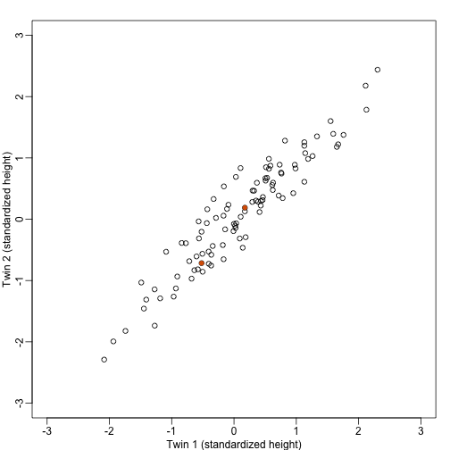
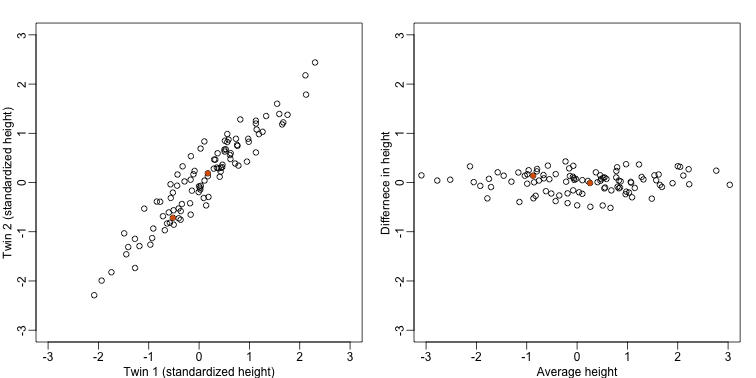

## Dimension Reduction Motivation

R markdown document for this section available [here](https://github.com/genomicsclass/labs/tree/master/course3/pca_motivation.Rmd).

Visualizing data is one of the most, if not the most, important step in the analysis of high throughput data. The right visualization method may reveal problems with the experimental data that can render the results from a standard analysis, that is typically appropriate, completely useless. 

We have shown methods for visualizing global properties of the columns of rows but plots that reveal relationships between columns or between rows are more complicated due to the high dimensionality of data. For example, to compare each of the 189 samples to each other we would have to create, for example, 17,766 MA-plots. Creating one single scatter plot of the data is impossible since points are very high dimensional. 

We will describe powerful technique for exploratory data analysis based on _dimension reduction_. The general idea is to reduce the dataset to have fewer dimensions yet approximately preserve imporat properties of that such as the distance between samples. If we are able to reduce down to, say, two dimensions, we can then easily make plots. The technique behind it all, the singular value decomposition (SVD), is also useful in other context. Before introducing the rather complicared mathematics behind the SVD, we will motivate the ideas behind it with a simple example.

### Example: reducing two dimensions to one

We consider an example with twin heights. Here we simulate 100 two dimensional points that represent the number of standard deviations each individual is from the mean height. Each pair of points is a pair of twins:

 

To help with the illustration, if this where high-throughput gene expression data, the twin pairs are the {$$}N{/$$} samples  and the two heights would represnet gene expresssion from 2 genes. Note that we can compute the distance between any two samples. For example, here is the distance between the two orange points above:


```r
d=dist(t(y))
as.matrix(d)[1,2]
```

```
## [1] 1.140897
```

What if we are only able to make 1 dimensional plots: 2 dimensions is too complex. Can we, for example, reduce the data to a one dimensional matrix that preserves distances between points?

If we look back at the plot, and visualize a line between any pair of points, the length of this line is the distance between the two points. Note that these lines tend to go along the direction of the diagonal. We have seen before that we can "rotate" the plot so that the diagonal is in the x-axis by making a  MA-plot instead:


```r
z1 = (y[1,]+y[2,])/2 #the sum 
z2 = (y[1,]-y[2,])   #the difference

z = rbind( z1, z2) #matrix now same dimensions as y

thelim <- c(-3,3)
mypar(1,2)

plot(y[1,],y[2,],xlab="Twin 1 (standardized height)",ylab="Twin 2 (standardized height)",xlim=thelim,ylim=thelim)
points(y[1,1:2],y[2,1:2],col=2,pch=16)

plot(z[1,],z[2,],xlim=thelim,ylim=thelim,xlab="Average height",ylab="Differnece in height")
points(z[1,1:2],z[2,1:2],col=2,pch=16)
```

 


Later we will start using linear algebra to represent transformation of the data such as this. Here we can see that to get `z` we multiplied `y` by the matrix

{$$}
A = \,
\begin{pmatrix}
1/2&1/2\\
1&-1\\
\end{pmatrix}
\implies
z = A y
{/$$}

Also note that can transform back by simply multiplying by {$$}A^{-1}{/$$} as follows:

{$$}
A^{-1} = \,
\begin{pmatrix}
1&1/2\\
1&-1/2\\
\end{pmatrix}
\implies
y = A^{-1} z
{/$$}

### Rotations 

Note in the plot above the distance between the two orange points remains roughly the same, relative to the other points. This actually true for all pairs of points. A simple re-scaling of the transformation we performed above will actually make the distances to be exactly the same. What we will do is multiply by a scalar so that the standard deviations of each point is preserved. If you think of the columns of `y` as indpendent random variables with standard deviation {$$}\sigma{/$$} then note that the standard deviations of of {$$}M{/$$} and {$$}A{/$$} are 

{$$}
\mbox{sd}[ Z_1 ] = \mbox{sd}[ (Y_1 + Y_2) / 2 ] = \frac{1}{\sqrt{2}} \sigma \mbox{ and } \mbox{sd}[ Z_2] = \mbox{sd}[ Y_1 - Y_2  ] = {\sqrt{2}} \sigma 
{/$$}

This impies that if we change the transformation above to 

{$$}
A = \frac{1}{\sqrt{2}}
\begin{pmatrix}
1&1\\
1&-1\\
\end{pmatrix}
{/$$}

then the SD of the columns of {$$}Y{/$$} are the same as the variance of the columsn {$$}Z{/$$}. Note that {$$}A^{-1}A=I{/$$} making {$$}A{/$$}. We call matrices with this properties _orthogonal_ and it guarantees the SD-preserving properties described above. The distances are now exactly preserved:


```r
A <- 1/sqrt(2)*matrix(c(1,1,1,-1),2,2)
z <- A%*%y
d <- dist(t(y))
d2 <- dist(t(z))
mypar(1,1)
plot(as.numeric(d),as.numeric(d2)) #as.numeric turns distnaces into long vector
abline(0,1,col=2)
```

 

We call this particular transformation a _rotation_ of `y`. 


```r
mypar(1,2)

thelim <- c(-3,3)
plot(y[1,],y[2,],xlab="Twin 1 (standardized height)",ylab="Twin 2 (standardized height)",xlim=thelim,ylim=thelim)
points(y[1,1:2],y[2,1:2],col=2,pch=16)

plot(z[1,],z[2,],xlim=thelim,ylim=thelim,xlab="Average height",ylab="Differnece in height")
points(z[1,1:2],z[2,1:2],col=2,pch=16)
```

 

The reason we applied this transformation in the first place was because we noticed that to compute the distances between points we followed a direction along the diagonal in the oritinal plot which after the rotation falls on the horizontal, or the the first dimension of `z`. So this rotation actually achieves what we orginally wanted: we can preserve the distances between points with just one dimension. Let's remove the second dimension of `z` and recompute distances:


```r
d3 = dist(z[1,]) ##distance computed using just first dimension
mypar(1,1)
plot(as.numeric(d),as.numeric(d3)) 
abline(0,1)
```

 

The distance computed with just the one dimensions provide a very good approximation to the actual distance provide a very useful dimension reduction: from 2 dimension to 1. This first dimension of the transformed data is acually the first _principal component_. This idea motivates the use of principal component analysis (PCA) and the singular value decomposition (SVD) to achieve dimension reduction more generally. 

### Important note on a difference to other explanations

If you search the web for descriptions of PCA you will notice a difference in notation to how we describe it here. This mainly stems from the fact that it more common to have rows represent units so in the example shown here {$$}Y{/$$} would be transposed to be an {$$}N \times 2{/$$} matrix. In statistics this is also the most common way to represent the data: individuals in the rows. However, for practical reasons, in genomics it is more common to represent units in the columns: for example, genes are rows and samples are columns. For this reason, in this book we explain PCA and all the math that goes with in a slightly different way than it is usually done. So for example, many of the explanations you find for PCA start out with the sample covariance matrix usually denoted with
{$$}\mathbf{X}^\top\mathbf{X}{/$$} and having cells represeting covaraince between two units. However for this to be the case we need the rows of {$$}\mathbf{X}{/$$} to represents units. So in our notation above you would have to compute, after scaling, {$$}\mathbf{Y}\mathbf{Y}^\top{/$$} instead.

Basically, if you want our explanations to match others you have to transpose the matrices we show here.


