## Plots To Avoid 

R markdown document for this section available [here](https://github.com/genomicsclass/labs/tree/master/course1/plots_to_avoid.Rmd).

This section is based on a talk by [Karl W. Broman](http://kbroman.org/) titled "How to Display Data Badly" in which he described how the default plots offered by Microsoft Excel "obscure your data and annoy your readers" ([here](http://kbroman.org/pages/talks.html) is a link to a collection of Karl Broman's talks). His lecture was inspired by the 1984 paper by H. Wainer: How to display data badly. American Statistician 38(2): 137--147. Dr. Wainer was the first to elucidate the principles of the bad display of data. However, according to Karl, "The now widespread use of Microsoft Excel has resulted in remarkable advances in the field." Here we show examples of "bad plots" and how to improve them in R.

### General Principles

General Principles

The aims of good data graphics is to display data accurately and clearly. Some rules for displaying data badly:

*  Display as little information as possible.
*  Obscure what you do show (with chart junk).
*  Use pseudo-3d and color gratuitously.
*  Make a pie chart (preferably in color and 3d).
*  Use a poorly chosen scale.
*  Ignore significant figures.


### Pie Charts


Say we want to report the results from a poll asking about browser preference (taken in August 2013). The standard way of displaying these is with a pie chart:


```r
pie(browsers,main="Browser Usage (August 2013)")
```

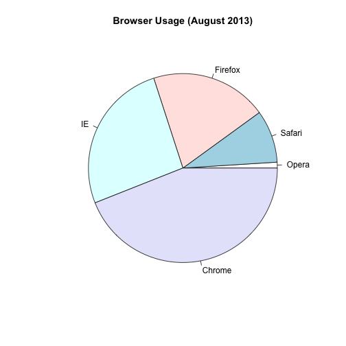 

Nonetheless, as stated by the help file for the `pie` function:


> Pie charts are a very bad way of displaying information. The eye is good at judging linear measures and bad at judging relative areas. A bar chart or dot chart is a preferable way of displaying this type of data.

To see this, look at the figure above and try to determine the percentages just from looking at the plot. Simply showing the numbers is not only clear, but also saves on printing costs.


```r
browsers
```

```
##   Opera  Safari Firefox      IE  Chrome 
##       1       9      20      26      44
```

If you do want to plot them, then a barplot is appropriate:


```r
barplot(browsers,main="Browser Usage (August 2013)")
```

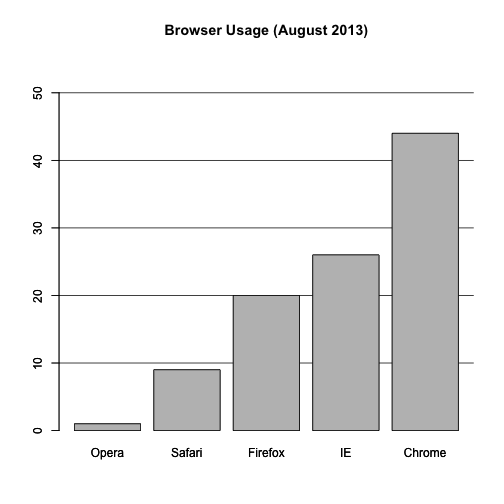 

Note that we can now pretty easily determine the percentages by following a horizontal line to the x-axis. Do avoid 3-D version since it obfuscates the plot and removes this particular advantage.

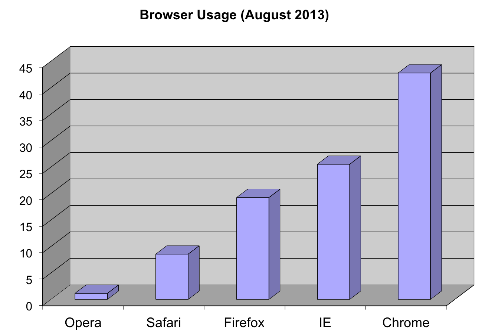


Even worse than pie charts are donut plots.

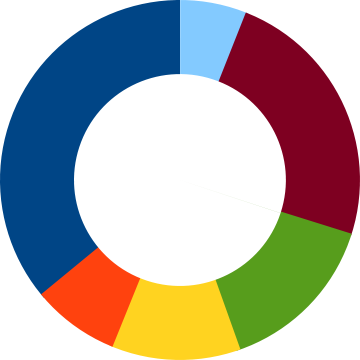

The reason is that by removing the center, we remove one of the visual cues for determining the different areas: the angles. There is no reason to ever use a donut to display data.

###  Barplots As Data Summaries

While barplots are useful for showing percentages, they are incorrectly used to display data from two groups being compared. Specifically, barplots are created with height equal to the group means; an antenna is added at the top to represent standard errors. This plot is simply showing two numbers per groups and the plot adds nothing:

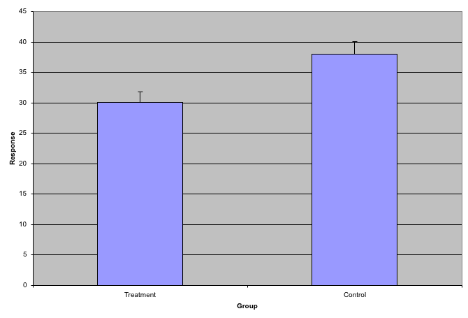

Much more informative is to summarize with a boxplot. If the number of points is small enough, we might as well add them to the plot. When the number of points is too large for us to see them, just showing a boxplot is preferable.

First let's download the data:

```r
library("downloader")
filename <- "fig1.RData"
url <- "https://github.com/kbroman/Talk_Graphs/raw/master/R/fig1.RData"
if (!file.exists(filename)) download(url,filename)
load(filename)
```

Now we can simply show the points and make simple boxplots:


```r
library(rafalib)
mypar()
dat <- list(Treatment=x,Control=y)
boxplot(dat,xlab="Group",ylab="Response",xlab="Group",ylab="Response",cex=0)
stripchart(dat,vertical=TRUE,method="jitter",pch=16,add=TRUE,col=1)
```

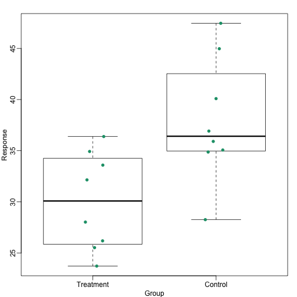 

Notice how much more we see here: the center, spread, range and the points themselves. In the barplot we only see the mean and the SE, and the SE has more to do with sample size than with the spread of the data.

This problem is magnified when our data has outliers or very large tails. In the plot below there appears to be very large and consistent differences between the two groups:

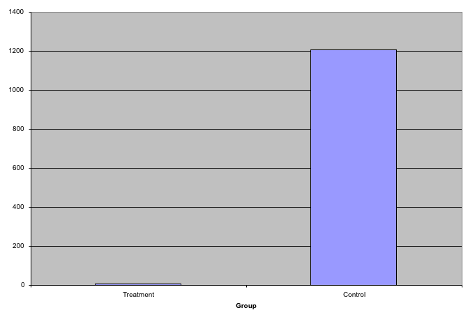

However, a quick look at the data demonstrates that this difference is mostly driven by just two points. A version showing the data in the log-scale is much more informative. 

Start by downloading data:

```r
library(downloader)
url <- "https://github.com/kbroman/Talk_Graphs/raw/master/R/fig3.RData"
filename <- "fig3.RData"
if (!file.exists(filename)) download(url, filename)
load(filename)
```

Now we can show data and boxplots in original scale and log-scale.

```r
library(rafalib)
mypar(1,2)
dat <- list(Treatment=x,Control=y)

boxplot(dat,xlab="Group",ylab="Response",xlab="Group",ylab="Response",cex=0)
stripchart(dat,vertical=TRUE,method="jitter",pch=16,add=TRUE,col=1)

boxplot(dat,xlab="Group",ylab="Response",xlab="Group",ylab="Response",log="y",cex=0)
stripchart(dat,vertical=TRUE,method="jitter",pch=16,add=TRUE,col=1)
```

 


### Show The Scatter Plot

The purpose of many statistical analyses is to determine relationships between two variables. Sample correlations are typically reported and sometimes plots are displayed to show this. However, showing just the regression line is one way to display your data badly as it hides the scatter. Surprisingly, plots such as the following are commonly seen.

Again start by loading data:

```r
url <- "https://github.com/kbroman/Talk_Graphs/raw/master/R/fig4.RData"
filename <- "fig4.RData"
if (!file.exists(filename)) download(url, filename)
load(filename)
```


```r
mypar(1,2)
plot(x,y,lwd=2,type="n")
fit <- lm(y~x)
abline(fit$coef,lwd=2)
b <- round(fit$coef,4)
text(78, 200, paste("y =", b[1], "+", b[2], "x"), adj=c(0,0.5))
rho <- round(cor(x,y),4) 
text(78, 187,expression(paste(rho," = 0.8567")),adj=c(0,0.5))

plot(x,y,lwd=2)
fit <- lm(y~x)
abline(fit$coef,lwd=2)
```


### High Correlation Does Not Imply Replication

When new technologies or laboratory techniques are introduced, we are often shown scatter plots and correlations from replicated samples. High correlations are used to demonstrate that the new technique is reproducible. Correlation, however, can be very misleading. Below is a scatter plot showing data from replicated samples run on a high throughput technology. This technology outputs 12,626 simultaneously measurements.

In the plot on the left, we see the original data which shows very high correlation. Yet the data follows a distribution with very fat tails. Furthermore, 95% of the data is below the green line. The plot on the right is in the log scale:


```r
##Both these libraries are available from Bioconductor
library(Biobase) 
library(SpikeInSubset) 
```


```r
data(mas95)
mypar(1,2)
r <- exprs(mas95)[,1] ##original measures were not logged
g <- exprs(mas95)[,2]
plot(r,g,lwd=2,cex=0.2,pch=16,
     xlab=expression(paste(E[1])),
     ylab=expression(paste(E[2])), 
     main=paste0("corr=",signif(cor(r,g),3)))
abline(0,1,col=2,lwd=2)
f <- function(a,x,y,p=0.95) mean(x<=a & y<=a)-p
a95 <- uniroot(f,lower=2000,upper=20000,x=r,y=g)$root
abline(a95,-1,lwd=2,col=1)
text(8500,0,"95% of data below this line",col=1,cex=1.2,adj=c(0,0))
r <- log2(r)
g <- log2(g)
plot(r,g,lwd=2,cex=0.2,pch=16,
     xlab=expression(paste(log[2], " ", E[1])),
     ylab=expression(paste(log[2], " ", E[2])),
     main=paste0("corr=",signif(cor(r,g),3)))
abline(0,1,col=2,lwd=2)
```

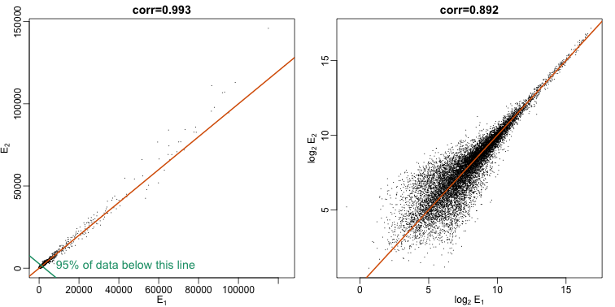 

Although the correlation is reduced in the log-scale, it is very close to 1 in both cases. Does this mean these data are reproduced? To examine how well the second vector reproduces the first, we need to study the differences. So we should instead plot that. In this plot, we plot the difference (in the log scale) versus the average:


```r
mypar(1,1)
plot((r+g)/2,(r-g),lwd=2,cex=0.2,pch=16,
     xlab=expression(paste("Ave{ ",log[2], " ", E[1],", ",log[2], " ", E[2]," }")),
     ylab=expression(paste(log[2]," { ",E[1]," / ",E[2]," }")),
     main=paste0("SD=",signif(sqrt(mean((r-g)^2)),3)))
abline(h=0,col=2,lwd=2)
```

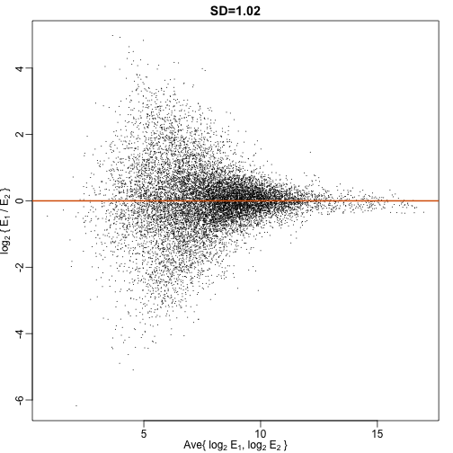 

These are referred to as Bland-Altman plots or MA plots in the genomics literature, and we will talk more about them later. In this plot we see that the typical difference in the log (base 2) scale between two replicated measures is about 1. This means that when measurements should be the same we will, on average, observe 2 fold difference. We can now compare this variability to the differences we want to detect and decide if this technology is precise enough for our purposes.

### Barplots For Paired Data

A common task in data analysis is the comparison of two groups. When the dataset is small and data are paired, for example the outcomes before and after a treatment, two color barplots are unfortunately often used to display the results:


There are better ways of showing these data to illustrate that there is an increase after treatment. One is to simply make a scatterplot, which shows that most points are above the identity line. Another alternative is to plot the differences against the before values.


```r
set.seed(12201970)
before <- runif(6, 5, 8)
after <- rnorm(6, before*1.05, 2)
li <- range(c(before, after))
ymx <- max(abs(after-before))

mypar(1,2)
plot(before, after, xlab="Before", ylab="After",
     ylim=li, xlim=li)
abline(0,1, lty=2, col=1)


plot(before, after-before, xlab="Before", ylim=c(-ymx, ymx),
     ylab="Change (After - Before)", lwd=2)
abline(h=0, lty=2, col=1)
```

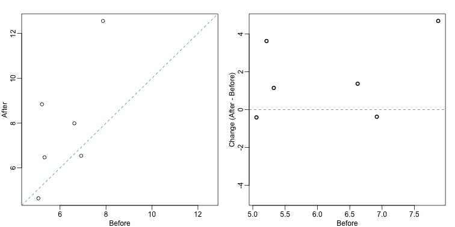 


Line plots are not a bad choice, although I find them harder to follow than the previous two. Boxplots show you the increase, but lose the paired information.


```r
z <- rep(c(0,1), rep(6,2))
mypar(1,2)
plot(z, c(before, after),
     xaxt="n", ylab="Response",
     xlab="", xlim=c(-0.5, 1.5))
axis(side=1, at=c(0,1), c("Before","After"))
segments(rep(0,6), before, rep(1,6), after, col=1)     

boxplot(before,after,names=c("Before","After"),ylab="Response")
```

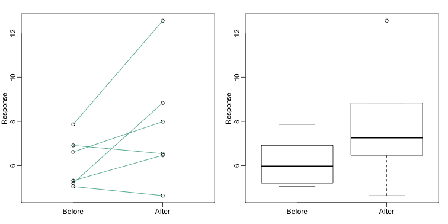 

###  Gratuitous 3D

The figure below shows three curves. Pseudo 3D is used, but it is not clear why. Maybe to separate the three curves? Notice how difficult it is to determine the values of the curves at any given point:

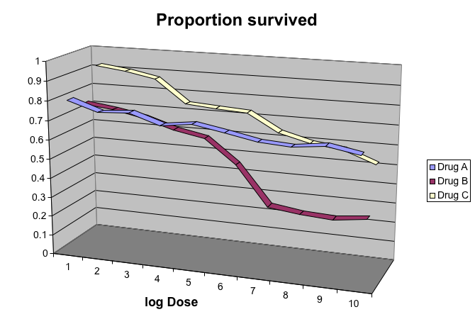

This plot can be made better by simply using color to distinguish the three lines:


```r
##First read data
library(downloader)
filename <- "fig8dat.csv"
url <- "https://github.com/kbroman/Talk_Graphs/raw/master/R/fig8dat.csv"
if (!file.exists(filename)) download(url, filename)
x <- read.table(filename, sep=",", header=TRUE)

##Now make alternative plot
plot(x[,1],x[,2],xlab="log Dose",ylab="Proportion survived",ylim=c(0,1),
     type="l",lwd=2,col=1)
lines(x[,1],x[,3],lwd=2,col=2)
lines(x[,1],x[,4],lwd=2,col=3)
legend(1,0.4,c("Drug A","Drug B","Drug C"),lwd=2, col=1:3)
```

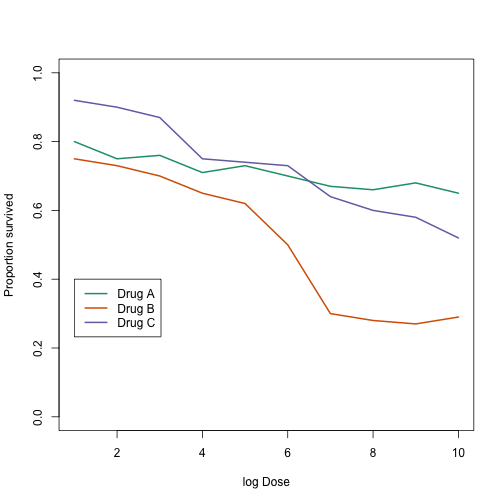 

### Ignoring Important Factors


In this example we generate data with a simulation. We are studying a dose response relationship between two groups: treatment and control. We have three groups of measurements for both control and treatment. Comparing treatment and control using the common barplot:

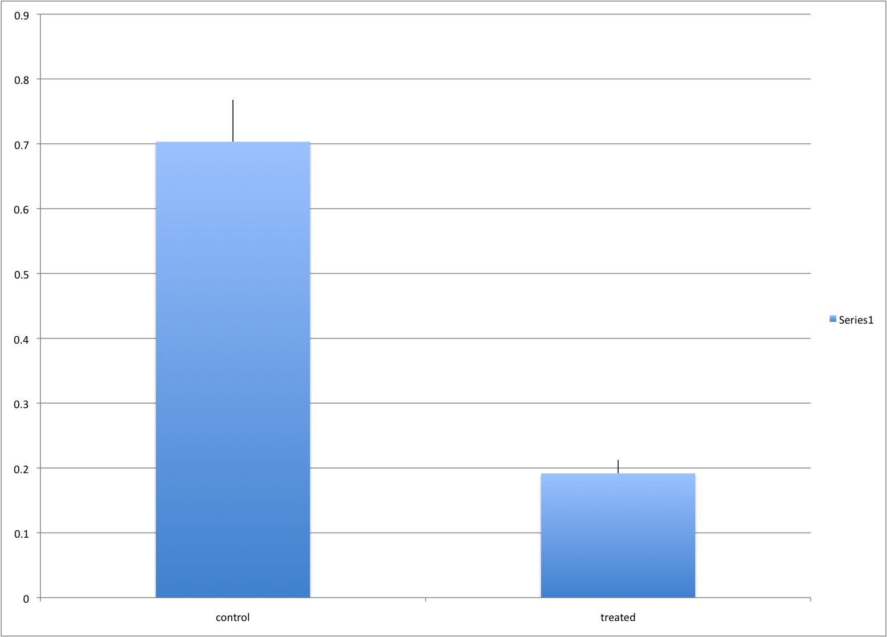

Instead we should show each curve. We can use color to distinguish treatment and control and dashed and solid lines to distinguish the original data from the mean of the three groups.


```r
plot(x, y1, ylim=c(0,1), type="n", xlab="Dose", ylab="Response") 
for(i in 1:3) lines(x, z[,i], col=1, lwd=1, lty=2)
for(i in 1:3) lines(x, y[,i], col=2, lwd=1, lty=2)
lines(x, ym, col=1, lwd=2)
lines(x, zm, col=2, lwd=2)
legend("bottomleft", lwd=2, col=c(1, 2), c("Control", "Treated"))
```

 


### Too Many Significant Digits

By default, statistical software like R return many significant digits. This does not mean we should report them. Cutting and pasting directly from R is a bad idea as you might end up showing a table like the one below comparing the heights of basketball players:


```r
heights <- cbind(rnorm(8,73,3),rnorm(8,73,3),rnorm(8,80,3),
                 rnorm(8,78,3),rnorm(8,78,3))
colnames(heights)<-c("SG","PG","C","PF","SF")
rownames(heights)<- paste("team",1:8)
heights
```

```
##              SG       PG        C       PF       SF
## team 1 76.39843 76.21026 81.68291 75.32815 77.18792
## team 2 74.14399 71.10380 80.29749 81.58405 73.01144
## team 3 71.51120 69.02173 85.80092 80.08623 72.80317
## team 4 78.71579 72.80641 81.33673 76.30461 82.93404
## team 5 73.42427 73.27942 79.20283 79.71137 80.30497
## team 6 72.93721 71.81364 77.35770 81.69410 80.39703
## team 7 68.37715 73.01345 79.10755 71.24982 77.19851
## team 8 73.77538 75.59278 82.99395 75.57702 87.68162
```

Note that we are reporting precision up to 0.00001 inches. Do you know of a tape measure with that much 
precision? This can be easily remedied:


```r
round(heights,1)
```

```
##          SG   PG    C   PF   SF
## team 1 76.4 76.2 81.7 75.3 77.2
## team 2 74.1 71.1 80.3 81.6 73.0
## team 3 71.5 69.0 85.8 80.1 72.8
## team 4 78.7 72.8 81.3 76.3 82.9
## team 5 73.4 73.3 79.2 79.7 80.3
## team 6 72.9 71.8 77.4 81.7 80.4
## team 7 68.4 73.0 79.1 71.2 77.2
## team 8 73.8 75.6 83.0 75.6 87.7
```

### Displaying Data Well

In general you should follow these principles:

* Be accurate and clear.
* Let the data speak.
* Show as much information as possible, taking care not to obscure the message.
* Science not sales: avoid unnecessary frills (esp. gratuitous 3D).
* In tables, every digit should be meaningful. Don't drop ending 0's.

Some further reading:

* ER Tufte (1983) The visual display of quantitative information.
Graphics Press.
* ER Tufte (1990) Envisioning information. Graphics Press.
*  ER Tufte (1997) Visual explanations. Graphics Press.
* WS Cleveland (1993) Visualizing data. Hobart Press.
* WS Cleveland (1994) The elements of graphing data. CRC Press.
* A Gelman, C Pasarica, R Dodhia (2002) Let's practice what we preach:
Turning tables into graphs. The American Statistician 56:121-130
* NB Robbins (2004) Creating more effective graphs. Wiley
* [Nature Methods columns](http://bang.clearscience.info/?p=546) 


## Misunderstanding Correlation (Advanced)

R markdown document for this section available [here](https://github.com/genomicsclass/labs/tree/master/course1/plots_to_avoid.Rmd).

The use of correlation to summarize reproducibility has become widespread in, for example, genomics. Despite its English language definition, mathematically, correlation is not necessarily informative with regards to reproducibility.  Here we briefly describe three major problems.

The most egregious related mistake is to compute correlations of data that is not approximated by bi-variate normal data. As described above, averages, standard deviations and correlations are popular summary statistics for two-dimensional data because, for the bivariate normal distribution, these five parameters fully describe the distribution. However, there are many examples of data that are not well approximated by bivariate normal data. 

The standard way to quantify reproducibility between two sets of replicated measurements, say {$$}x_1,\dots,x_n{/$$} and {$$}y_1,\dots,y_n{/$$}, is simply to compute the distance between them:

{$$}
\sqrt{
\sum_{i=1}^n d_i^2} \mbox{ with } d_i=x_i - y_i
{/$$}

This metric decreases as reproducibility improves and it is 0 when the reproducibility is perfect. Another advantage of this metric is that if we divide the sum by N, we can interpret the resulting quantity as the standard deviation of the {$$}d_1,\dots,d_N{/$$} if we assume the {$$}d{/$$} average out to 0. Furthermore, this quantity will have the same units as our measurements resulting in a more interpretable metric. Another limitation of the correlation is that it does not detect cases that are not reproducible due to average changes. The distance metric does detect these differences. We can rewrite:

{$$}\frac{1}{n} \sum_{i=1}^n (x_i - y_i)^2 = \frac{1}{n} \sum_{i=1}^n [(x_i-\mu_x) - (y_i - \mu_y)^2 + (\mu_x-\mu_y)]^2{/$$}

with {$$}\mu_x{/$$} and {$$}\mu_y{/$$} the average of each list. Then we have: 

{$$}\frac{1}{n} \sum_{i=1}^n (x_i - y_i)^2 = \frac{1}{n} \sum_{i=1}^n (x_i-\mu_x)^2 +  \frac{1}{n} \sum_{i=1}^n (y_i - \mu_y)^2 + (\mu_x-\mu_y)^2 + \frac{1}{n}\sum_{i=1}^n (x_i-\mu_x)(y_i - \mu_y)
{/$$}

For simplicity, if we assume that the variance of both lists is 1, then this reduces to: 

{$$}\frac{1}{n} \sum_{i=1}^n (x_i - y_i)^2 = 2 + (\mu_x-\mu_y)^2 - 2\rho{/$$}

with {$$}\rho{/$$} the correlation. So we see the direct relationship between distance and correlation. However, an important difference is that the distance contains the term {$$}(\mu_x-\mu_y)^2{/$$} and thus it can detect cases that are not reproducible due to large average changes. 

Yet another reason correlation is not an optimal metric for reproducibility is the lack of units. To see this we use a formula that relates the correlation of a variable with the correlation of that variable, plus what is interpreted here as deviation: {$$}x{/$$} and {$$}y=x+d{/$$}. The larger the variance of {$$}d{/$$}, the less {$$}x+d{/$$} reproduces {$$}x{/$$}. Here the distance metric would depend only on the variance of {$$}d{/$$} and would summarize reproducibility. However, correlation depends on the variance of {$$}x{/$$} as well:

{$$}
cor(x,x+d) = \frac{1}{\sqrt{1+\mbox{var}(d)/\mbox{var}(x)}}
{/$$}

This suggests that correlations near 1 do not necessarily imply reproducibility. Specifically, irrespective of the variance of {$$}d{/$$}, we can make the correlation arbitrarily close to 1 by increasing the variance of {$$}x{/$$}.


