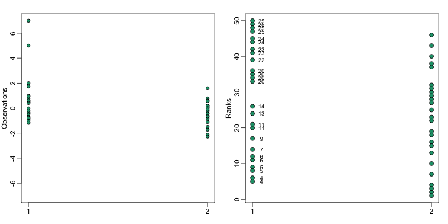

## Wilcoxon Rank Sum Test

The R markdown document for this section is available [here](https://github.com/genomicsclass/labs/tree/master/robust/ranktest.Rmd).

We learned how the sample mean and SD are susceptible to outliers. The
t-test is based on these measures and is susceptible as well. The
Wilcox rank test (equivalent to the Mann-Whitney test) provides an
alternative. In the code below we perform a t-test on data for which
the null is true. However, we change one sum observation by mistake
in each sample and the values incorrectly entered are different. Here
we see that the t-test results in a small p-value, while the Wilcoxon
test does not: 


```r
set.seed(779) ##779 picked for illustration purposes
N=25
x<- rnorm(N,0,1)
y<- rnorm(N,0,1)
```

Create outliers:


```r
x[1] <- 5
x[2] <- 7
cat("t-test pval:",t.test(x,y)$p.value)
```

```
## t-test pval: 0.04439948
```

```r
cat("Wilcox test pval:",wilcox.test(x,y)$p.value)
```

```
## Wilcox test pval: 0.1310212
```

The basic idea is to 1) combine all the data, 2) turn the values into ranks, 3) separate them back into their groups, and 4) compute the sum or average rank and perform a test.


```r
library(rafalib)
mypar(1,2)

stripchart(list(x,y),vertical=TRUE,ylim=c(-7,7),ylab="Observations",pch=21,bg=1)
abline(h=0)

xrank<-rank(c(x,y))[seq(along=x)]
yrank<-rank(c(x,y))[-seq(along=y)]

stripchart(list(xrank,yrank),vertical=TRUE,ylab="Ranks",pch=21,bg=1,cex=1.25)

ws <- sapply(x,function(z) rank(c(z,y))[1]-1)
text( rep(1.05,length(ws)), xrank, ws, cex=0.8)
```

 

```r
W <-sum(ws) 
```

`W` is the sum of the ranks for the first group relative to the second
group. We can compute an exact p-value for {$$}W{/$$} based on
combinatorics. But we can also use the CLT, as
statistical theory tells us that this `W` is approximated by the
normal distribution. We can construct a z-score as follows: 


```r
n1<-length(x);n2<-length(y)
Z <- (mean(ws)-n2/2)/ sqrt(n2*(n1+n2+1)/12/n1)
print(Z)
```

```
## [1] 1.523124
```

Note that here the `Z` is not large enough to give us a p-value less
than 0.05. These are part of the calculations performed by the R function
`wilcox.test`. 

