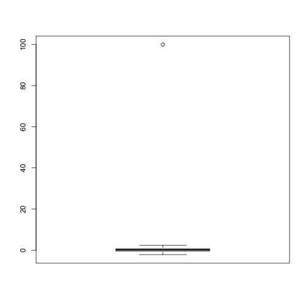
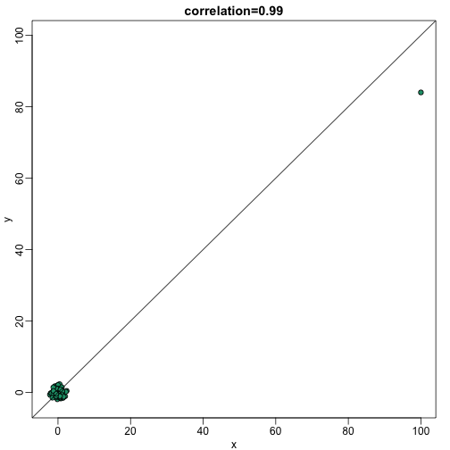
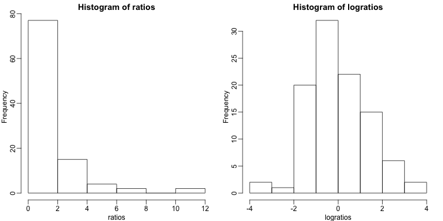
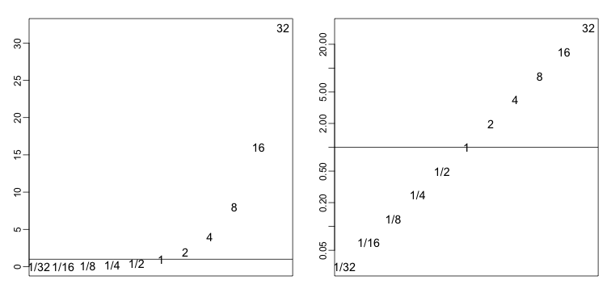

## Robust Summaries

R markdown document for this section available [here](https://github.com/genomicsclass/labs/tree/master/course1/robust_summaries.Rmd).

The normal approximation is often useful when analyzing life sciences data. However, due to the complexity of the measurement devices, it is also common to mistakenly observe data points generated by an undesired process. For example, a defect on a scanner can produce a handful of very high intensities or a PCR bias can lead to a fragment appearing much more often than others. Thus we may have situations that are approximated by, for example, 99 data points from a standard normal distribution and one very large number.


```r
set.seed(1)
x=c(rnorm(100,0,1)) ##real distribution
x[23] <- 100 ##mistake made in 23th measurement
boxplot(x)
```

 

In statistics we refer to these type of points as _outliers_. A small number of outliers can throw off an entire analysis. For example, notice how the following one point results in the sample mean and sample variance being very far from the 0 and 1 respectively.


```r
cat("The average is",mean(x),"and the SD is",sd(x))
```

```
## The average is 1.108142 and the SD is 10.02938
```

### The Median

The median, defined as the point having half the data larger and half the data smaller, is a summary statistic that is _robust_ to outliers. Note how much closer the median is to 0, the center of our actual distribution:

```r
median(x)
```

```
## [1] 0.1684483
```

### The Median Absolute Deviation

The median absolute deviation (MAD) is a robust summary for the standard deviation. It is defined by computing the differences between each point and the median and then taking the median of their absolute values:

{$$}
 1.4826 \times \mbox{median}\{| X_i - \mbox{median}(X_i)|\}
{/$$}

The number {$$}1.4826{/$$} is a scaling factor such that the MAD is an unbiased 
estimate of the standard deviation. Notice how much closer we are to 1 with the MAD:


```r
mad(x)
```

```
## [1] 0.8857141
```

### Spearman Correlation

Earlier we saw that the correlation is also sensitive to outliers. Here we construct a independent list of numbers, but for which a similar mistake was made for the same entry:


```r
set.seed(1)
x=c(rnorm(100,0,1)) ##real distribution
x[23] <- 100 ##mistake made in 23th measurement
y=c(rnorm(100,0,1)) ##real distribution
y[23] <- 84 ##similar mistake made in 23th measurement
library(rafalib)
mypar()
plot(x,y,main=paste0("correlation=",round(cor(x,y),3)),pch=21,bg=1,xlim=c(-3,100),ylim=c(-3,100))
abline(0,1)
```

 

The Spearman correlation follows the general idea of median and MAD, that of using quantiles.  The idea is simple: we convert each dataset to ranks and then compute correlation:


```r
mypar(1,2)
plot(x,y,main=paste0("correlation=",round(cor(x,y),3)),pch=21,bg=1,xlim=c(-3,100),ylim=c(-3,100))
plot(rank(x),rank(y),main=paste0("correlation=",round(cor(x,y,method="spearman"),3)),pch=21,bg=1,xlim=c(-3,100),ylim=c(-3,100))
abline(0,1)
```

 


So if these statistics are robust to outliers, why would we ever use
the non-robust version? In general, if we know there are outliers,
then median and MAD are recommended over the mean and standard
deviation counterparts. However, there are example in which robust
statistics are less powerful than the non-robust versions.

We also note that there is a [large statistical literature](#foot) on
Robust Statistics that go far beyond the median and the MAD. 

### Symmetry of Log Ratios

Ratios are not symmetric. To see this we will start by simulating the
ratio of two positive random numbers, which will represent the
expression of genes in two samples:


```r
x <- 2^(rnorm(100))
y <- 2^(rnorm(100)) 
ratios <- x / y 
```

Reporting ratios or fold changes are common in the life
science. Suppose you are studying ratio data showing, say, gene
expression before and after treatment. You are given ratio data so
values larger than 1 mean gene expression was higher after the
treatment. If the treatment has no effect, we should see as many
values below 1 as above 1. A histogram seems to suggest that the
treatment does in fact have an effect: 


```r
mypar(1,2)
hist(ratios)

logratios <- log2(ratios)
hist(logratios)
```

 

The problem here is that ratios are not symmetrical around 1. For example, 1/32 is much closer to 1 than 32/1. Taking logs takes care of this problem. The log of ratios are of course symmetric around 0 because:

{$$}\log(x/y) = \log(x)-\log(y) = -(\log(y)-\log(x)) = \log(y/x){/$$}

As demonstrated by these simple plots:

 


In the life science, the log transformation is also commonly used
because (multiplicative) fold changes are the most widely used quantification of
interest. Note that a fold change of 100 can be a ratio of 100/1 or
1/100. However, 1/100 is much closer to 1 (no fold change) than 100:
ratios are not symmetric about 1. 

### Footnotes <a name="foot"></a>

### Robust Statistics

Robust Statistics, Peter. J. Huber and Elvezio M. Ronchetti, Wiley, 2009.
Introduction to Robust Estimation and Hypothesis Testing, Rand R. Wilcox, 2012.
Robust Statistics: The Approach Based on Influence Functions, Frank R. Hampel, Elvezio M. Ronchetti, Peter J. Rousseeuw, Werner A. Stahel

