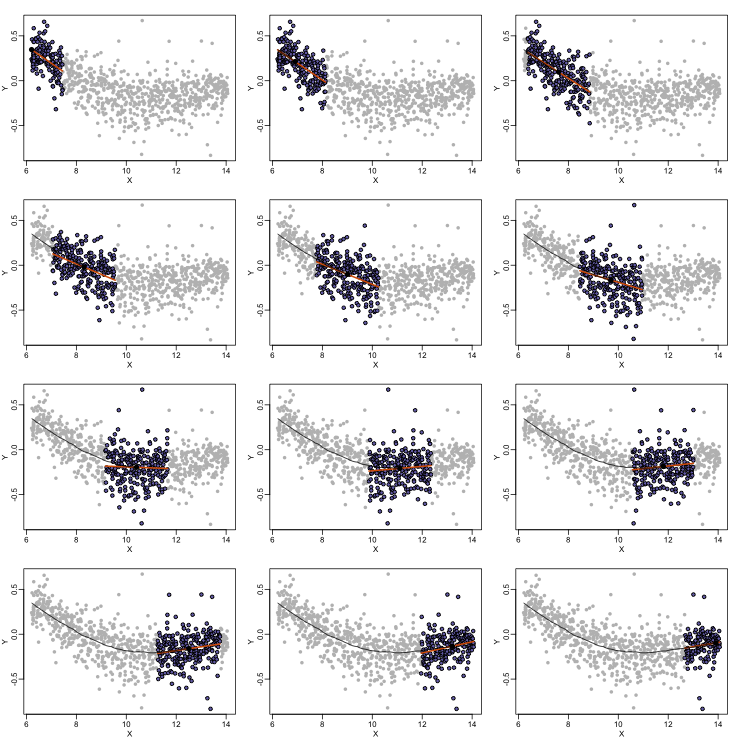

<a name="smoothing"></a>

## Smoothing 

R markdown document for this section available [here](https://github.com/genomicsclass/labs/tree/master/course3/smoothing.Rmd).

Smoothing is a very powerful technique used all across data analsysis. The general idea is to group data points that are expected to have similar expectations and 

The following data are from measurements from replicated RNA. We consider that data used in an the MA-plot ( {$$}Y{/$$} = log ratios and {$$}A{/$$} = averages) and take down-sample in a way that balances the number of points for different strata of {$$}A{/$$}:


```r
##Following three packages are available from Bioconductor
library(Biobase)
library(SpikeIn)
library(hgu95acdf)

data(SpikeIn95)

##Example with two columns
i=10;j=9

##remove the spiked in genes and take random sample
siNames<-colnames(pData(SpikeIn95))
ind <- which(!probeNames(SpikeIn95)%in%siNames)
pms <- pm(SpikeIn95)[ ind ,c(i,j)]

##pick a representative sample for A and order A
Y=log2(pms[,1])-log2(pms[,2])
X=(log2(pms[,1])+log2(pms[,2]))/2
set.seed(4)
ind <- tapply(seq(along=X),round(X*5),function(i)
  if(length(i)>20) return(sample(i,20)) else return(NULL))
ind <- unlist(ind)
X <- X[ind]
Y <- Y[ind]
o <-order(X)
X <- X[o]
Y <- Y[o]
```

In the MA plot we see that there {$$}Y{/$$} depends on {$$}X{/$$}. Note that this this dependence must be a bias because these are based on replicates which means {$$}Y{/$$} should be 0 on average regardless of {$$}X{/$$}. We want to predict {$$}f(x)=\mbox{E}(Y \mid X=x){/$$} so that we can remove this bias.


```r
library(rafalib)
mypar()
plot(X,Y)
```

 

Note that linear regression does not capture the apparent curvature in {$$}f(x){/$$}:


```r
mypar()
plot(X,Y)
fit <- lm(Y~X)
points(X,Y,pch=21,bg=ifelse(Y>fit$fitted,1,3))
abline(fit,col=2,lwd=4,lty=2)
```

 

Note for example that points above the fitted line (green) and those below (purple) are not evenly distributed.

## Bin Smoothing

R markdown document for this section available [here](https://github.com/genomicsclass/labs/tree/master/course3/smoothing.Rmd).

Instead of fitting a line, let's go back to the idea of stratifying and computing the mean. This is referred to as _bin smoothing_. Now, if we stratify by {$$}x{/$$} The general idea is that the underlying curve is "smooth" enough that in small bins it is approximately constant which implies all the {$$}Y{/$$} in that bin have the same expected value. For example, in the plot below we highlight points in a bin centered at 8.6 as well as the points of a bin centered at 12.1 if we us bins of size 1. We also show  and the fitted mean values for the {$$}Y{/$$} in those bin (dashed lines):


```r
mypar()
centers <- seq(min(X),max(X),0.1)
plot(X,Y,col="grey",pch=16)
windowSize <- .5
i <- 25
center<-centers[i]
ind=which(X>center-windowSize & X<center+windowSize)
fit<-mean(Y)
points(X[ind],Y[ind],bg=3,pch=21)
lines(c(min(X[ind]),max(X[ind])),c(fit,fit),col=2,lty=2,lwd=4)
i <- 60
center<-centers[i]
ind=which(X>center-windowSize & X<center+windowSize)
fit<-mean(Y[ind])
points(X[ind],Y[ind],bg=3,pch=21)
lines(c(min(X[ind]),max(X[ind])),c(fit,fit),col=2,lty=2,lwd=4)
```

 

By computing this mean for bins around every point we form an estimate of the underlying curve {$$}f(x){/$$} :


```r
windowSize<-0.5
smooth<-rep(NA,length(centers))
mypar (4,3)
for(i in seq(along=centers)){
  center<-centers[i]
  ind=which(X>center-windowSize & X<center+windowSize)
  smooth[i]<-mean(Y[ind])
  if(i%%round(length(centers)/12)==1){ ##we show 12
    plot(X,Y,col="grey",pch=16)
    points(X[ind],Y[ind],bg=3,pch=21)
    lines(c(min(X[ind]),max(X[ind])),c(smooth[i],smooth[i]),col=2,lwd=2)
    lines(centers[1:i],smooth[1:i],col="black")
    points(centers[i],smooth[i],col="black",pch=16,cex=1.5)
  }
}
```

 

The final result looks like this:


```r
mypar (1,1)
plot(X,Y,col="darkgrey",pch=16)
lines(centers,smooth,col="black",lwd=3)
```

 


## Loess

R markdown document for this section available [here](https://github.com/genomicsclass/labs/tree/master/course3/smoothing.Rmd).
 
Local weighted regression (loess) is similar to bin smoothing. The difference is that we approximate the local behavior with a line or a parabola. This permits us to expand the bin sizes as seen below:


```r
centers <- seq(min(X),max(X),0.1)
mypar (1,1)
plot(X,Y,col="darkgrey",pch=16)
windowSize <- 1.25

i <- 25
center<-centers[i]
ind=which(X>center-windowSize & X<center+windowSize)
fit<-lm(Y~X,subset=ind)
points(X[ind],Y[ind],bg=3,pch=21)
a <- min(X[ind]);b <- max(X[ind])
lines(c(a,b),fit$coef[1]+fit$coef[2]*c(a,b),col=2,lty=2,lwd=3)

i <- 60
center<-centers[i]
ind=which(X>center-windowSize & X<center+windowSize)
fit<-lm(Y~X,subset=ind)
points(X[ind],Y[ind],bg=3,pch=21)
a <- min(X[ind]);b <- max(X[ind])
lines(c(a,b),fit$coef[1]+fit$coef[2]*c(a,b),col=2,lty=2,lwd=3)
```

 

Here are 12 steps of the process:

```r
mypar (4,3)
windowSize<-1.25
smooth<-rep(NA,length(centers))
for(i in seq(along=centers)){
  center<-centers[i]
  ind=which(X>center-windowSize & X<center+windowSize)
  fit<-lm(Y~X,subset=ind)
  smooth[i]<-fit$coef[1]+fit$coef[2]*center

  if(i%%round(length(centers)/12)==1){ ##we show 12
    plot(X,Y,col="grey",pch=16)
    points(X[ind],Y[ind],bg=3,pch=21)
    a <- min(X[ind]);b <- max(X[ind])
    lines(c(a,b),fit$coef[1]+fit$coef[2]*c(a,b),col=2,lwd=2)
  
    lines(centers[1:i],smooth[1:i],col="black")
    points(centers[i],smooth[i],col="black",pch=16,cex=1.5)
  }
}
```

 

This results is a smoother fit since we use larger sample sizes to estimate our local parameters:


```r
mypar (1,1)
plot(X,Y,col="darkgrey",pch=16)
lines(centers,smooth,col="black",lwd=3)
```

 

The that function `loess` performs this analysis for us:


```r
fit <- loess(Y~X, degree=1, span=1/3)

newx <- seq(min(X),max(X),len=100) 
smooth <- predict(fit,newdata=data.frame(X=newx))

mypar ()
plot(X,Y,col="darkgrey",pch=16)
lines(newx,smooth,col="black",lwd=3)
```

 

