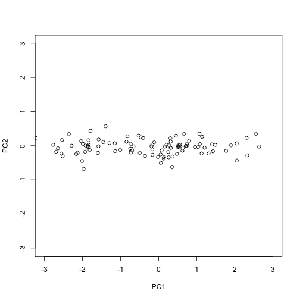
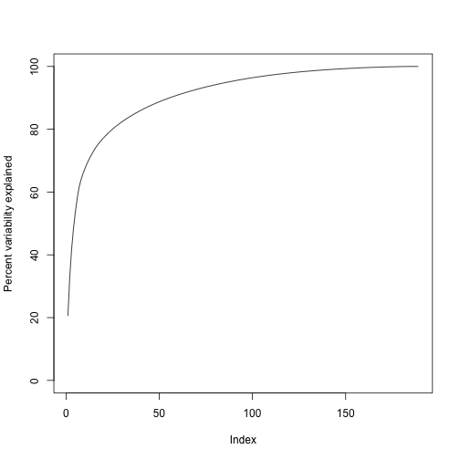
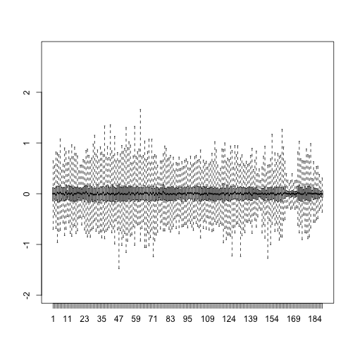

## Singular Value Decomposition

The R markdown document for this section is available [here](https://github.com/genomicsclass/labs/tree/master/highdim/svd.Rmd).

In the previous section, we motivated dimension reduction and showed a transformation that permitted us to approximate the distance between two dimensional points with just one dimension. The singular value decomposition (SVD) is a generalization of the algorithm we used in the motivational section. As in the example, the SVD provides a transformation of the original data. This transformation has some very useful properties. 

The main result SVD provides is that we can write an {$$}m \times n{/$$}, matrix {$$}\mathbf{Y}{/$$} as

{$$}\mathbf{U}^\top\mathbf{Y} = \mathbf{DV}^\top{/$$}

With:

* {$$}\mathbf{U}{/$$} is an {$$}m \times p{/$$} orthogonal matrix
* {$$}\mathbf{V}{/$$} is an {$$}p \times p{/$$} orthogonal matrix
* {$$}\mathbf{D}{/$$} is an {$$}n \times p{/$$} diagonal matrix 

with {$$}p=\mbox{min}(m,n){/$$}. {$$}\mathbf{U}^\top{/$$} provides a rotation of our data {$$}\mathbf{Y}{/$$} that turns out to be very useful because the variability (sum of squares to be precise) of the columns of {$$}\mathbf{U}^\top \mathbf{Y}=\mathbf{VD}{/$$} are decreasing.
Because {$$}\mathbf{U}{/$$} is orthogonal, we can write the SVD like this: 

{$$}\mathbf{Y} = \mathbf{UDV}^\top{/$$}

In fact, this formula is much more commonly used. We can also write the transformation like this:

{$$}\mathbf{YV} = \mathbf{UD}{/$$}

This transformation of {$$}Y{/$$} also results in a matrix with column of decreasing sum of squares.


Applying the SVD to the motivating example we have:


```r
library(rafalib)
library(MASS)
n <- 100
y <- t(mvrnorm(n,c(0,0), matrix(c(1,0.95,0.95,1),2,2)))
s <- svd(y)
```

We can immediately see that applying the SVD results in a transformation very similar to the one we used in the motivating example:

```r
round(sqrt(2) * s$u , 3)
```

```
##        [,1]   [,2]
## [1,] -1.012 -0.988
## [2,] -0.988  1.012
```

The plot we showed after the rotation, was showing what we call the _principal components_: the second plotted against the first. To obtain the principal components from the SVD, we simply need the columns of the rotation {$$}\mathbf{U}^\top\mathbf{Y}{/$$} :


```r
PC1 = s$d[1]*s$v[,1]
PC2 = s$d[2]*s$v[,2]
plot(PC1,PC2,xlim=c(-3,3),ylim=c(-3,3))
```

 


#### How is this useful?

It is not immediately obvious how incredibly useful the SVD can be, so let's consider some examples. In this example, we will greatly reduce the dimension of {$$}V{/$$} and still be able to reconstruct {$$}Y{/$$}.

Let's compute the SVD on the gene expression table we have been working with. We will take a subset of 100 genes so that computations are faster.

```r
library(tissuesGeneExpression)
data(tissuesGeneExpression)
set.seed(1)
ind <- sample(nrow(e),500) 
Y <- t(apply(e[ind,],1,scale)) #standardize data for illustration
```

The `svd` command returns the three matrices (only the diagonal entries are returned for {$$}D{/$$})

```r
s <- svd(Y)
U <- s$u
V <- s$v
D <- diag(s$d) ##turn it into a matrix
```

First note that we can in fact reconstruct y:


```r
Yhat <- U %*% D %*% t(V)
resid <- Y - Yhat
max(abs(resid))
```

```
## [1] 3.508305e-14
```

If we look at the sum of squares of {$$}\mathbf{UD}{/$$}, we see that the last few are quite close to 0 (perhaps we have some replicated columns).  


```r
plot(s$d)
```

 

This implies that the last columns of `V` have a very small effect on the reconstruction of `Y`. To see this, consider the extreme example in which the last entry of {$$}V{/$$} is 0. In this case the last column of {$$}V{/$$} is not needed at all. Because of the way the SVD is created, the columns of {$$}V{/$$}, have less and less influence on the reconstruction of {$$}Y{/$$}. You commonly see this described as "explaining less variance". This implies that for a large matrix, by the time you get to the last columns, it is possible that there is not much left to "explain" As an example, we will look at what happens if we remove the four last columns:


```r
k <- ncol(U)-4
Yhat <- U[,1:k] %*% D[1:k,1:k] %*% t(V[,1:k])
resid <- Y - Yhat 
max(abs(resid))
```

```
## [1] 3.508305e-14
```

The largest residual is practically 0, meaning that we `Yhat` is practically the same as `Y`, yet we need 4 less dimensions to transmit the information.

By looking at {$$}d{/$$}, we can see that, in this particular dataset, we can obtain a good approximation keeping only 94 columns. The following plots are useful for seeing how much of the variability is explained by each column:


```r
plot(s$d^2/sum(s$d^2)*100,ylab="Percent variability explained")
```

 

We can also make a cumulative plot:


```r
plot(cumsum(s$d^2)/sum(s$d^2)*100,ylab="Percent variability explained",ylim=c(0,100),type="l")
```

 

Although we start with 189 dimensions, we can approximate {$$}Y{/$$} with just 95:


```r
k <- 95 ##out a possible 189
Yhat <- U[,1:k] %*% D[1:k,1:k] %*% t(V[,1:k])
resid <- Y - Yhat
boxplot(resid,ylim=quantile(Y,c(0.01,0.99)),range=0)
```

 

Therefore, by using only half as many dimensions, we retain most of the variability in our data:


```r
var(as.vector(resid))/var(as.vector(Y))
```

```
## [1] 0.04076899
```

We say that we explain 96% of the variability.

Note that we can compute this proportion from {$$}D{/$$}:

```r
1-sum(s$d[1:k]^2)/sum(s$d^2)
```

```
## [1] 0.04076899
```
The entries of {$$}D{/$$} therefore tell us how much each PC contributes in term of variability explained.

#### Highly correlated data

To help understand how the SVD works, we construct a dataset with two highly correlated columns. 

For example:


```r
m <- 100
n <- 2
x <- rnorm(m)
e <- rnorm(n*m,0,0.01)
Y <- cbind(x,x)+e
cor(Y)
```

```
##           x         x
## x 1.0000000 0.9998873
## x 0.9998873 1.0000000
```
In this case, the second column adds very little "information" since all the entries of `Y[,1]-Y[,2]` are close to 0. Reporting `rowMeans(Y)` is even more efficient since `Y[,1]-rowMeans(Y)` and `Y[,2]-rowMeans(Y)` are even closer to 0. `rowMeans(Y)`  turns out to be the information represented in the first column on {$$}U{/$$}. The SVD helps us notice that we explain almost all the variability with just this first column:


```r
d <- svd(Y)$d
d[1]^2/sum(d^2)
```

```
## [1] 0.9999441
```

In cases with many correlated columns, we can achieve great dimension reduction:


```r
m <- 100
n <- 25
x <- rnorm(m)
e <- rnorm(n*m,0,0.01)
Y <- replicate(n,x)+e
d <- svd(Y)$d
d[1]^2/sum(d^2)
```

```
## [1] 0.9999047
```


